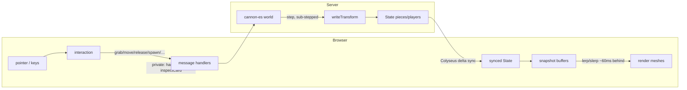

# Code Reference

A map of every module, data structure, and key function. For the *why*, see
`ARCHITECTURE.md`; this is the *what* — the API surface.

The codebase:

| File | Runtime | Role |
|------|---------|------|
| `shared/pieces.js` | both | Single source of truth: dimensions, masses, colours, dice verts, prop/board registries |
| `server.js` | Node | Authoritative physics + Colyseus room + HTTP + Postgres asset library |
| `db.js` | Node | Postgres pool + saved-library queries (deck/board/prop metadata) |
| `public/core.js` | browser | Scene/camera/renderer/controls + `CONFIG` & `LIGHTING` tunables |
| `public/graphics.js` | browser | Texture & mesh builders, model loading, `KIND` registry |
| `public/client.js` | browser | Runtime: networking, interaction, seats, render loop |
| `public/index.html` + `styles.css` | browser | Page shell + UI styling |

Client import chain (no cycles): `shared ← core ← graphics ← client`.

---

## Component diagram

```mermaid
classDiagram
    class Shared["shared/pieces.js"] {
        +TABLE {x, z}
        +COLORS {..., team{checker,go,chess}}
        +KINDS {die, card, prop, deck, board}
        +PROPS {shape → mass, collider, render|model, team, tint...}
        +PROP_LIST[] {id, name, team}
        +BOARDS {key → model, modelScale, box}
        +DECK_VISUAL / CARD_ROUND / DIE_RADIUS / DIE_SIDES / BOARD_SIZE
        +deckHeight(count) / dieVerts(sides, r) / timerLive(t, now)
    }
    class Server["server.js"] {
        +SIM config
        +buildWorld() / buildCollider(type,props) / dieShape(sides)
        +buildSimpleDeck() / saveAsset() / saveImageRef()
        +/upload  /upload-model  endpoints
    }
    class Db["db.js"] {
        <<Postgres>>
        +listDecks/getDeck/insertDeck/updateDeck
        +listBoards/getBoard/insertBoard
        +listProps/insertProp / close
    }
    class TableRoom {
        <<Colyseus Room>>
        world, state
        bodies, targets, flips: Map
        deckCards, cardData, hands, drafts, pendingInspect: Map
        notebooks, shows: Map
        +spawn() update() updateDeckCollider() removePiece()
        +saveDeckById() sendHand() clientBy() stopShow() advanceTurn()
        +onJoin/onLeave/onReconnect + message handlers
    }
    class Core["public/core.js"] {
        +CONFIG / LIGHTING / clamp
        scene camera renderer controls
    }
    class Graphics["public/graphics.js"] {
        +texture builders (cTex, cardFront, dice, text...)
        +measureGlb/fitModel/measureModel/measureBoard
        +uploadImage/uploadModel/resizeToCanvas
        +mesh builders + KIND registry
    }
    class Client["public/client.js"] {
        room, meshes, buffers, down, inspect
        +networking + UI wiring
        +interaction (pointer/inspect/wheel/keys)
        +seats/markers + render loop
    }
    Shared <.. Server
    Shared <.. Core
    Shared <.. Graphics
    Shared <.. Client
    Core <.. Graphics
    Core <.. Client
    Graphics <.. Client
    Server *-- TableRoom
    TableRoom ..> Db : saved-library queries
    TableRoom <..> Client : Colyseus sync + messages
```

## The core loop (intent up, state down)



---

## `shared/pieces.js` — single source of truth

Pure data + two functions, imported by both sides.

### Constants

- **`TABLE`** `{ x, z }` — half-extents of the play surface.
- **`COLORS`** — every piece colour: `neutralProp`, `cardSide`, `deckEdge`,
  `boardEdge`, `ivory`, `ink`, `felt[dark,light]`, and `team {checker, go,
  chess}` each `[color0, color1]`.
- **`KINDS`** `{ die, card, prop, deck, board }` — physics half `{ mass, shape }`.
  `shape` is `'die'`, `'prop'`, or `{ box:[hx,hy,hz] }`. `mass:0` ⇒ static.
- **`DECK_VISUAL`** / **`CARD_ROUND`** — deck box unit + card corner radius.
- **`PROPS`** `{ shapeId → spec }`. A spec has `mass`, `collider`
  (`{box}`/`{sphere}`), and **either** a built-in `render` (`prim`:
  box/sphere/cone/cyl/lens + params) **or** a bundled `model` path with
  `modelScale` (+ optional `modelRot`, `team`, `tintMaterial`, `ownMaterial`,
  `stand`).
- **`PROP_LIST`** `[{ id, name, team? }]` — ordered spawn-picker list;
  `team:true` shows the two-colour toggle, else the colour picker.
- **`BOARDS`** `{ key → { name, model, modelScale, box } }` — built-in model
  boards (colliders precomputed from `worldSize·scale/2`).
- **`BOARD_SIZE`** — target footprint width uploaded `.glb` boards normalize to.
- **`DIE_RADIUS`** `{ sides → r }`, **`DIE_SIDES`** `[4,6,8,10,12,20]`.

### Functions

- **`deckHeight(count) → number`** — clamps deck thickness; used by client visual
  *and* server collider so a flipped deck is solid.
- **`dieVerts(sides, radius?) → number[][] | null`** — polyhedron vertices scaled
  to `radius`; `null` for d6. One input for mesh (client) and collider (server).
- **`timerLive(t, now) → ms`** — the shared timer's current value from its synced
  anchor (`running/mode/base/since`): counts up from `base`, or down toward 0.
  Used by the server handler *and* every client, so the number is never synced tick
  by tick.

---

## `server.js` — authoritative simulation + room

### Config

- **`SIM`** — all physics tuning in one object: gravity, friction/restitution,
  damping, self-righting, `throwCap`, `solverIterations`, `contact`, `step`
  (`fixed`/`maxSub`), and **`cards`** (`colliderThick` — the invisible thicker
  card collider that stabilizes stacks — plus `linDamp`/`angDamp`/`maxThrow`/
  sleep).

### Asset files (disk) + library (Postgres)

The image/model **files** stay on disk; their **metadata** moved to Postgres (see
`db.js` below). Assets are keyed by a row **id**, not a filename slug.

- **`ASSETS_DIR`** = `process.env.ASSETS_DIR || './saved-assets'`, with category
  subfolders `uploads/ decks/ boards/ props/` — **files only** now.
- **`saveAsset(kind, buf, ext) → /assets/<kind>/<name>`** — writes a random-named
  file into a validated category folder (`assetKind`).
- **`saveImageRef(dataURL, kind)`** — an inline `data:` image → a disk file → URL.
- **`isDataURL`**, **`deckRefOk`** — ref validators (kept for the save paths).
  *(The old `slugify` / `metaFile` / `listSaved*` / `boardKindLabel` helpers are
  gone — that logic now lives in `db.js`.)*

### Physics helpers (module scope)

- **`buildCollider(type, props) → CANNON.Shape`** — dice → `dieShape`; props →
  model/precomputed box, else `PROPS` box/sphere scaled by `props.scale`; boards
  → built-in/uploaded box (by half-height) else procedural `w×d`.
- **`dieShape(sides)`** — convex hull of `dieVerts`, coplanar triangles merged,
  windings outward. d6 ⇒ box.
- **`buildSimpleDeck()`** — a standard 52-card deck of `rank:…` refs.
- **`buildWorld()`**, **`rnd()`**, **`shuffle()`**.
- Small shared helpers keep the handlers flat: **`clamp`**, **`addWall`** /
  **`cubeCollider`** (world + collider building), **`spawnCardFlat`** /
  **`besideDeck`** / **`addToHand`** (deal/hand placement), **`swapBoard`**,
  **`averagePoint`**.

### Schema (synced state)

- **`Piece`** — `type, owner, props` (strings), `count`, transform
  `x,y,z,qx,qy,qz,qw`.
- **`Player`** — `seat, hand`, `name, color, avatar`, **`showing`** (count of
  cards being revealed — the public badge), **`handBack`** (the hand's public back
  image).
- **`Timer`** — `running, mode` (`'up'`/`'down'`), `base, since, duration`; the
  synced anchor (`timerLive()` computes the live value).
- **`State`** — `pieces`, `players`, `turn`, **`timer`**.

### `TableRoom extends Room`

Private (never-synced) maps: `bodies`, `targets`, `flips`, `deckCards`,
`cardData`, `hands`, `drafts`, **`pendingInspect`** (a drawn-but-unplaced card),
**`notebooks`** (per-player private notes), **`shows`** (an active hold-to-show:
`{ to:Set, cards }`).

Methods: **`spawn(type,pos,props) → id`**, **`update(dt)`** (servo → step →
out-of-bounds net → write), **`updateDeckCollider(id)`**, **`removePiece(id)`**,
**`writeTransform`**, **`sendHand`** (also publishes `handBack`), **`clientBy(sid)`**,
**`stopShow(sid)`** (ends a hold-to-show, clears the badge + audience views),
**`saveDeckById(id,name)`** (async — inserts via `db`; shared by save-on-create
and the S key), **`advanceTurn`**, `onJoin/onLeave/onReconnect`.

Message handlers: `grab`, `move`, `release`, `flip`, `dealToTable`, `dealDrag`,
`takeCard`, `playCard`, `shuffle`, **`drawInspect`/`inspectPlace`** (private
draw-to-inspect), `deckBegin`/`deckAppend`/`deckFinish` (chunked build,
`deckFinish` optionally saves), `saveDeck`/`listDecks`/`loadDeck`/`editDeck`,
`saveProp`/`listProps`, `listBoards`/`saveBoard`/`loadBoard` (all **async**, via
`db`; load/edit key on a row **id**), `spawn` (boards swap + sit by half-height),
`roll`, `reset` (full clear — pieces, hands, shows, timer), `nextTurn`, `remove`,
`setName`, `setAvatar`, **`notebook`** (store private notes), **`timer`** (action:
`start`/`pause`/`reset`/`set`), **`showStart`/`showStop`** (hold-to-show),
**`ping`** (clamp to table + broadcast).

### HTTP (Express)

- `express.static` for `public/`, `/shared`; **`/assets`** serves category files
  but a guard 404s any `.json` (metadata stays private).
- **`POST /upload?kind=`** — one resized image → file → `{ url }`.
- **`POST /upload-model?kind=props`** — a raw `.glb` → file → `{ url }`.

---

## `db.js` — Postgres saved-library

The connection string comes from **`DATABASE_URL_FILE`** (a path to a secret file,
priority) or **`DATABASE_URL`** — no hardcoded fallback; missing config throws at
startup. Metadata only: a model's URL is the canonical `file_url` column, the rest
rides in a `props` jsonb bag, and reads splice them back into the record shape the
game expects (so nothing is stored twice). Assets are keyed by a bigint **`id`**
(pg returns it as a string).

- **Decks** — `listDecks() → [{id,name,count}]`, `getDeck(id) → {name,back,fronts}`,
  `insertDeck({name,back,fronts}) → id`, `updateDeck(id, {…})`.
- **Boards** — `listBoards() → [{id,name,kind}]`, `getBoard(id) → record`,
  `insertBoard(name, record) → id`. `record` is one of `{board}` / `{model,…}` /
  `{w,d,tex}`; `kind` is the load-menu label.
- **Props** — `listProps() → [{id,name,props}]`, `insertProp(name, props) → id`.
- **`close()`** — end the pool (for the one-off `import-assets.js`).

List functions swallow errors → `[]`; getters → `null`; inserts/updates throw
(handlers catch). `import-assets.js` is a one-time loader for pre-Postgres
`saved-assets/*.json`.

---

## `public/core.js` — setup + tunables

Exports `scene`, `camera`, `renderer`, `controls`, and the config:

- **`CONFIG`** — client feel, grouped: `grab` (height/scroll), `model.size`,
  `render.delay`, `ranges` (spawn clamps), `inspect`, `marker`, `label` (held-name
  tag), `ping` (attention-ping ring), `input` (click/drag thresholds), `tex`
  (die/board resolution).
- **`LIGHTING`** — `hemi` / `sun` / `env` (three numbers); `dimEnvironment`
  scales the baked `RoomEnvironment` for the env-map strength.
- **`clamp(value, min, max)`**.

---

## `public/graphics.js` — builders (pure)

### Textures → `THREE.CanvasTexture`

- **`cTex(canvas, srgb?)`** — wraps every canvas texture with **max anisotropy**
  (+ colour space) so text/numbers stay sharp. All builders route through it.
  Builders allocate their canvas via a shared **`makeCanvas(w,h)`**, and the
  filtering is centralized in **`maxAnisotropy()`**.
- **`cardFront(rank,suite,color)`** (corner index + centre rank), **`cardBack()`**,
  **`boardTex()`** (procedural checkerboard).
- **`drawNumber` / `digitTexture` / `numberFaceTexture` / `numberLabel`** — die
  numbering (resolution `CONFIG.tex.die`).
- **`splitColorText` / `wrapLines` / `drawWrapped` / `textFaceTexture` /
  `textBackTexture`** — procedural text cards.
- **`resolveTexture(ref)`** (cached) — resolves a card ref: `back`,
  `rank:…`, `text:…`, `tback:…`, or a `data:`/URL image.

### Models & uploads

- **`resizeToCanvas(file,w,h,fit)`** — cover-fit (or stretch) an image onto a
  canvas; **`imgToBlob`** and the avatar path wrap it.
- **`uploadImage(file,…,kind)`** → POST `/upload`; **`uploadModel(file)`** → POST
  `/upload-model`.
- **`measureGlb(url)`** → `{ size, center }` (true loaded bounds). **`fitModel(obj,
  {scale|target})`** — centre at origin + scale (fixed or normalize). **`measureModel`**
  / **`measureBoard`** build on `measureGlb` to return collider boxes.
- The two model-mesh builders (`propMesh`, `boardMesh`) share a single
  **`loadModelGroup`** loader, and image-backed textures a **`loadImageTexture`**.

### Mesh builders + `KIND`

- **`dieMesh` / `convexDie` / `numberedD4`** — numbered dice.
- **`cardMesh`** (rounded, thin, alpha-masked corners), **`deckMesh`**
  (rounded extruded prism), **`boardMesh`** (procedural box **or** a loaded model).
- **`propColor` / `propMat` / `propShapeMesh`** — built-in shape props.
- **`propMesh(p)`** — the dispatcher: loads a `.glb` (built-in fixed scale, or
  custom normalize) with the tint logic (team / full / `tintMaterial` one-slot /
  `ownMaterial`), else builds a shape and applies `props.scale`.
- **`KIND`** `{ die, card, prop, deck, board }` — each `{ mesh, grab, ldrag,
  lclick, rclick }`; the interaction layer dispatches off this, no type switches.

---

## `public/client.js` — runtime

### Networking

Connects to the `table` room (reconnect token in `sessionStorage`). State
listeners create/update/remove `meshes` and player UI; also tracks `boardTopY`
(for the drop marker). Direct messages: `hand` → `renderHand`, `dealt` (adopt a
dealt card), `inspectCard` → open draw-to-inspect, `notebook` (restore your private
notes), `showFan` (cards someone is showing you → face-up in their fan), `ping`
(spawn an attention marker), `deckList`/`boardList`/`propList` (library listings,
keyed by **id**). All modal/button wiring lives here (prop, custom-model, deck,
board, edit dialogs, plus the notebook / timer / show-cards panels), plus
**`sendDeck`** (chunked build). Shared UI helpers cut the repetition:
**`byId`/`qs`/`qsa`** (DOM shorthands), **`renderSavedList`** (one builder for the
deck/prop/board library lists), and **`withBusyButton`** (wraps an async upload so
the button shows busy then restores). Snapshot buffering runs through
**`snapshot`** (build a timestamped record) and **`applyTransform`** (copy it onto
a mesh), shared by the add, card-rebuild, and render paths.

### Interaction (`meshes`, `buffers`, `down`, `inspect`)

- **`setPointer` / `pickId`** — pointer → NDC → raycast → id (walks up to the
  id-stamped root so nested model meshes pick correctly).
- **`pointerdown/move/up` + `endGesture`** — click vs. drag; dispatch grab/deal/
  click via `KIND`; **wheel** raises/lowers a held piece; the drag plane height is
  the scroll-adjustable grab height, and a translucent ring previews the landing.
  **Middle-click** snaps a held piece's facing, or — with nothing held — drops a
  ping (`sendPing` → raycast to the table).
- **Inspect** — `inspectMesh` parks an enlarged copy in front of the camera;
  double-click a piece to inspect (rotate-drag), double-click a deck to
  draw-to-inspect with F/D/H/R placement.
- **`keydown`** — Delete removes, U toggles keep-upright, S saves a hovered deck
  (each acts on **`heldOrHoveredId`** — the held piece, else whatever's hovered);
  F/D/H/R place a drawn card; **P** drops a ping at the cursor.

### Seats, hands, turns

Seat layout, standing avatar/name markers (with a public **"SHOWING n"** badge
via `makePlayerTexture` when a player is revealing), other players' fanned hands —
face-down using the player's own **`handBack`**, with any **revealed** cards drawn
face-up in the leading fan slots (`refreshFan` + the `revealed` map), height-
staggered to avoid z-fighting. The turn panel, and **`renderHand(cards)`** for
your own bar (left = face-down, right = face-up; also a **select mode** while the
show panel is picking cards). **`nameTag(name,color)`** builds the pill texture
shared by held-piece labels and pings.

### Render loop

Each piece keeps a small `buffers` queue of timestamped snapshots; the loop
renders every piece as it was `CONFIG.render.delay` in the past (lerp/slerp
between the bracketing snapshots), parks the drop-marker ring under a held piece
at the current board's surface height, keeps each held-piece **name tag**
(`heldLabels`) hovering over its mesh, and expands + fades + disposes active
**pings**. One uniform path for held, thrown, and resting pieces.
