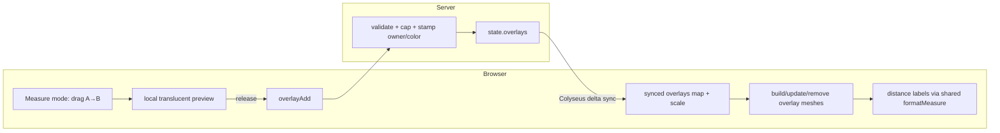

# Design note — measurement, templates & the units model

*Status: proposed (not yet built). Written in the `ARCHITECTURE.md` voice — the
**why** first, then the shapes. This is the foundation the "measurement +
templates" roadmap item and the later "snap-to-grid" item both stand on.*

## The one decision everything else follows: annotations, not pieces

A tape measure and a blast circle are not physical objects. They have no mass, no
collider, they don't get thrown, they don't sleep, and they must never shove a mini
across the felt. So they do **not** go through the piece pipeline
(`KINDS`/`PROPS` → cannon-es body → servo-drag → sync) — routing them there means
fighting it the whole way (`mass:0`, no collider, special-casing drag so it isn't a
physics target).

The precedent is already in the codebase: the **whiteboard** and **pings** —
non-physical shared visuals that live *outside* the cannon-es world, as public
geometry in synced state, rendered client-side as flat meshes. Measurement wants
exactly that shape. We call these **overlays**: flat, translucent shapes laid just
above the felt (reuse the drop-marker's surface-height offset to dodge z-fighting),
carrying no secret information, so they sit safely in synced state.

This also keeps the philosophy intact. A ruler knows no rules — it's the purest
possible game-agnostic aid. The engine reports **geometry**, never a game's reading
of that geometry (see "The grid trap" below).

## The units model is an additive display layer, not a rescale

The world-unit scale is fixed. Gravity, throw caps, damping, and every piece
dimension in `shared/pieces.js` are tuned around it; you can't move it without
re-tuning the feel of the whole table. So the units model does **not** change what a
world unit means. It's a **display-and-snap layer on top of a fixed world scale** —
a scalar that converts world distance into whatever players call it, plus (later) a
grid size for snapping. Purely additive: it cannot destabilise anything that already
works.

The core is one number and one label:

```
worldPerUnit : number   // how many world units make "1 unit"
unitLabel    : string   // freeform: "in" / "cm" / "hex" / "□" / …
```

A measured world distance `d` displays as `d / worldPerUnit`, rounded, with
`unitLabel` appended. **Freeform on purpose** (decided): the engine does not enumerate
inch-vs-cm as a hardcoded enum — it knows a scalar and a string, multiplies and
appends. Inch/cm/mm are just **preset buttons** in the UI that fill in a sensible
`worldPerUnit` + label. Same instinct as the rest of the project: the engine
simulates and reports; it holds no opinion about measurement systems.

### Precision is a *step*, not a digit count

Dividing raw world distance by `worldPerUnit` yields an ugly real number
(`5.3719`). Precision is only: how do we round that into the shown label? It touches
**display text only**, never the stored measurement.

The expressive control is a **round step** in display units, because "nearest
half-inch" is a step size, not a number of digits — and a decimal-places knob can't
express it. The digits to print fall out of the step automatically (step `0.5`
prints one decimal; step `1` prints none). One field does both jobs.

```
raw world distance
   ÷ worldPerUnit         → 5.3719   (exact, stays in state / geometry)
   round to nearest step  → 5.5      (roundStep = 0.5)
   + unitLabel            → "5.5 in" (displayed only)
```

This is the timer instinct exactly: store the exact thing, compute the presented
thing locally. Rounding never mutates an overlay. `roundStep` is a per-room setting
(one agreed number for everyone), default `0.1`; when a grid is on it may default to
`1` (whole cells), so most people never touch it and a half-inch wargamer sets `0.5`
once.

### Grid rides on the same root — reserved now, dormant until snap-to-grid

A grid is one more field on the same object:

```
cellWorld : number   // size of one grid cell, in world units (0 = no grid)
gridStyle : "square" | "hex" | "off"
```

Snap-to-grid, when built, reads `cellWorld` and nothing else; if `worldPerUnit` is
also set, one cell is `cellWorld / worldPerUnit` units, so "6 squares = 30 ft" falls
out for free. **Define these fields now** even though only the measurement half ships
first, so the schema isn't migrated twice. They stay inert until the grid feature
lands.

### The grid trap (why we report Euclidean truth)

The moment you show distance "in squares" you're one step from encoding a rule:
D&D 5e counts diagonals 5-5-5, 3.5e 5-10-5, 40k measures true Euclidean, hex games
have their own metric. Pick one and you've baked a specific game into a "generic"
tool. So the engine **always reports honest straight-line (Euclidean) distance**.
When a grid exists and a player wants a cell readout, the *distance metric* is a
neutral, player-chosen option — **Euclidean / Chebyshev (king-move) / Manhattan** —
named as geometry, never after a game. Default Euclidean; the other two are deferred
with the grid work. You're letting a player say "my game uses king-move distance,"
not shipping "D&D mode."

## Calibration reuses the measurement tool

Nobody knows what a world unit is, so typing `worldPerUnit = 12` is a non-starter.
The measurement tool *is* the calibration tool. Three entry points, all writing the
**single** `worldPerUnit` scalar:

1. **Drag-calibrate** — drag a reference length, type what it represents ("this =
   1 inch"); derive `worldPerUnit` from the dragged world distance.
2. **Preset** — a button fills `worldPerUnit` + `unitLabel` for inch/cm/mm.
3. **Table-width** — "my table is ___ inches wide" derives
   `worldPerUnit = currentTableWorldWidth / that` (players think in board size).

One scalar stored; three ways to set it.

**Honest limitation to record up front:** this measures *table space*, not
piece-relative scale. Pieces are fixed sizes in world units and don't rescale with
the ruler, so measurement gives everyone a consistent shared ruler across the felt —
which is what measurement games actually need — but *not* a guarantee that a mini is
"true 28 mm" against a "true 4 ft table." True-to-scale minis is a separate, deeper
problem, deliberately out of scope.

## Schema

A cohesive group like `Timer`/`Whiteboard`, so it's a nested schema on state, not
loose fields:

- **`RoomScale`** (`state.scale`) — `worldPerUnit` (default `1`), `unitLabel`
  (default `"u"`, i.e. uncalibrated shows raw world units), `roundStep`
  (default `0.1`), `cellWorld` (default `0` = no grid, dormant), `gridStyle`
  (default `"off"`, dormant). GM-set, durable.
- **`Overlay`** (entries in an `overlays` MapSchema, `id → Overlay`) — every overlay
  is **two points plus optional scalars**, which unifies both storage and
  interaction (every overlay is "click A, drag to B"):
  - `kind` — `"ruler" | "circle" | "cone" | "line"`.
  - `color` — hex, copied from the creator's seat colour at creation (so it
    survives the creator leaving; not an owner reference for rendering).
  - `owner` — creator `sessionId`, for the remove/clear permission check only.
  - `x, z` — point A (origin), in world units.
  - `x2, z2` — point B (the drag-out point). Derived on render: `length =
    dist(A,B)`, `angle = atan2(...)`. Ruler = the two endpoints; cone/line = origin
    + facing/length; circle = origin + radius.
  - `w` — line width (cone/line); `null`/unused for ruler and circle.
  - `ang` — cone half-angle (default from `MEASURE` in `shared`).

`overlays` is public synced state — no privacy routing needed, unlike hands. It
rides in `serializeScene`/`serializeGame` for free if we want placed templates to
survive save/load (they're already public state; just include the map).

## Message protocol (intent up, state down)

Mirrors the whiteboard: the picture is rebuilt from a small synced collection, never
diffed as a texture, and the live drag is a local preview until committed.

- **Up (client → server):**
  - `overlayAdd { kind, x, z, x2, z2, w?, ang? }` — place a committed overlay
    (seated players; the *live drag* before this is **local-only preview**, not
    synced — same "sync the minimum" call as syncing a ruler on release, not every
    frame). Server validates ranges, stamps `owner` + `color`, enforces caps.
  - `overlayMove { id, x?, z?, x2?, z2?, w?, ang? }` — nudge an existing overlay
    (owner or GM).
  - `overlayRemove { id }` — owner or GM.
  - `overlayClear` — wipe all overlays (GM), or all of your own (owner of each).
  - `scaleSet { worldPerUnit?, unitLabel?, roundStep?, cellWorld?, gridStyle? }` —
    GM-only; the durable room-scale setting, persisted via `scheduleSave`.
- **Down (server → client):** just synced state — the `overlays` map and
  `state.scale` — via the normal Colyseus delta sync. No new direct messages; a late
  joiner gets both in the initial state, no replay request needed (simpler than the
  whiteboard, which needs `wbStrokes` because strokes aren't in state).

Caps mirror `scores`/`strokes`: a per-player count and a total ceiling (a named dial,
e.g. `OVERLAY_MAX_PER_PLAYER` / `OVERLAY_MAX`), so the map can't be spammed unbounded.



## Where the code lands (`shared ← core ← graphics ← client`, + server)

- **`shared/pieces.js`** (the single source of truth both sides import) —
  - **`MEASURE`** constants: default cone half-angle, min/max radius & length, label
    offset, template opacity target, min drag distance to count as a placement.
  - **`formatMeasure(worldDist, scale) → string`** — the display pipeline
    (`÷ worldPerUnit → round to roundStep → append unitLabel`), the pure function
    **both** the client label renderer and any server-side display use, so the number
    is computed identically on every screen. Direct parallel to `timerLive`.
  - **`roundToStep(value, step)`** — the rounding primitive `formatMeasure` uses.
  - Grid helpers (`cellsBetween`, metric selectors) are stubbed/reserved here for the
    later grid work, not implemented now.
- **`server.js`** —
  - Schema: `RoomScale` + `Overlay`, `state.scale`, `state.overlays` (MapSchema).
  - Handlers: `overlayAdd`/`overlayMove`/`overlayRemove`/`overlayClear` (validate
    ranges, gate by rank/owner, enforce caps) and `scaleSet` (GM, `scheduleSave`).
  - Persistence: include `scale` (+ optionally `overlays`) in
    `serializeScene`/`serializeGame` and `getRoomState`/`saveRoomState`.
  - No `SIM` involvement — overlays have no physics.
- **`public/core.js`** — a `CONFIG.measure` block for client *feel*: label sprite
  scale, template fill opacity/outline weight, preview colour. (Client-feel tunables
  live here by convention; the geometric truths live in `shared`.)
- **`public/graphics.js`** — flat overlay builders, registered in an `OVERLAY`
  registry keyed by `kind` (mirroring the `KIND` registry so the sync layer
  dispatches with no type switches): `rulerMesh` (a thin line/quad + a midpoint label
  sprite via `cTex`), `circleTemplate` (ring outline + faint fill), `coneTemplate`
  (a flat sector), `lineTemplate` (a width×length quad). Labels reuse the
  `nameTag`/`cTex` text-texture path.
- **`public/client.js`** —
  - A modal **Measure** tool (a Tools entry) that captures the pointer like
    whiteboard draw — disables `OrbitControls` and piece-grab for the duration, so it
    doesn't fight the existing gesture code. **Invisible when unused** (the
    "everyone generically" brief: a board-gamer never sees a template on their felt).
  - Drag A→B lays a live **local** preview; release sends `overlayAdd`.
  - Sync `state.overlays` → meshes (create/update/remove, exactly like the piece
    mesh reconciliation) through the `OVERLAY` registry; re-render labels through
    `formatMeasure(worldDist, state.scale)` and re-format on any `state.scale` change.
  - The **calibration + scale** panel (drag-calibrate / preset / table-width), all
    writing `scaleSet`.
- **`public/styles.css`** — the Measure tool panel + calibration UI (same pop-out
  pattern as the Sound/Whiteboard panels).
- **`postgres/`** — a migration (`010_room_scale.sql`). Recommend a single
  **`scale jsonb`** column on `rooms` rather than five discrete columns, since the
  grid fields are dormant and this avoids a second migration when they wake up;
  `getRoomState`/`saveRoomState` splice it like the existing room settings. (Trade-off
  vs. the discrete-column style used for `felt_color`: jsonb is looser but far more
  forgiving to evolve — appropriate for a group still growing a grid half.)

## Invariants (keep these true)

- **Overlays are public geometry.** They carry no hidden information and always live
  in synced state; nothing about measurement ever needs the private-map / `sendHand`
  routing.
- **The world scale is never rescaled.** `worldPerUnit` and friends are a display/snap
  layer; physics and piece dimensions are untouched.
- **Rounding is display-only.** Stored points and distances stay exact; `roundStep`
  changes text, never geometry.
- **The engine reports geometry, not rules.** Euclidean by default; grid metrics are
  neutral, player-chosen, and never named after a game.

## Deferred (explicitly out of MVP)

Live-drag sync of an in-progress measurement (throttled, like piece `move`);
snap-to-grid and the `cellWorld`/`gridStyle` behaviour; grid distance metrics
(Chebyshev/Manhattan); per-player *private* measurement; multi-segment / waypoint
rulers; saved named templates in the library; true-to-scale piece sizing.

## First build order

1. `RoomScale` schema + `scaleSet` handler + the calibration/scale panel — the
   foundation, useless-looking alone but everything reads from it.
2. `formatMeasure`/`roundToStep` in `shared`.
3. The **ruler** overlay end-to-end (schema entry, `overlayAdd`, `rulerMesh` + label,
   sync reconciliation) — proves the whole path with one kind.
4. `circle` / `cone` / `line` as three more `OVERLAY` registry entries — cheap once
   the ruler path exists.
5. Caps, `overlayClear`, and snapshot persistence.
