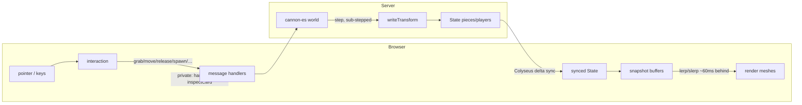

# Code Reference

A map of every module, data structure, and key function. For the *why*, see
`ARCHITECTURE.md`; this is the *what* — the API surface.

The codebase:

| File | Runtime | Role |
|------|---------|------|
| `shared/pieces.js` | both | Single source of truth: dimensions, masses, colors, dice verts, prop/board registries |
| `server.js` | Node | Composition root: authoritative physics, Colyseus rooms, remaining handlers, HTTP/security setup |
| `db.js` | Node | Postgres pool + all queries: library, users, rooms, membership |
| `auth.js` | Node | Password hashing (scrypt) + device-token hashing |
| `migrate.js` | Node | Owner-role startup migration runner for `postgres/NNN_*.sql` |
| `server/game/handlers/*.js` | Node | Extracted card, movement, piece/group, room-state/persistence, overlay/whiteboard, chat/tray/sharing, membership, and saved-library message handlers |
| `server/http/*.js` + `server/http/routes/*.js` | Node | HTTP auth/error seams and auth/room/admin/upload routers |
| `server/{auth-validation,permissions,message-validation,deck-state}.js` + `server/game/props-codec.js` | Node | Shared validation/rules, state helpers, canonical piece-props codec |
| `server/{database-config,session-config,bootstrap-admin}.js` | Node | DB config, session lifetime, and first-boot admin provisioning |
| `server/assets/upload-validation.js` | Node | Image magic-byte and self-contained GLB validation |
| `server/{rate-limit,redis-config}.js` | Node | Redis/memory token-bucket stores, fail-closed HTTP middleware, Redis URL and trusted-proxy configuration |
| `server/library-queries.js` | Node | Testable saved-library read queries; successful empty/not-found results stay distinct from PostgreSQL rejection |
| `server/user-queries.js` | Node | Testable auth/user/admin reads; successful absence stays distinct from PostgreSQL rejection |
| `server/room-queries.js` | Node | Testable room/membership/state reads and idempotent joins; domain absence/defaults stay distinct from PostgreSQL rejection |
| `server/game/safe-message.js` | Node | `safeMessage`/`safeRoomTask` Colyseus boundaries: catch sync/async message and lifecycle failures, log payload-free room/user context, and send sanitized client errors when a client is present |
| `public/core.js` | browser | Scene/camera/renderer/controls + `CONFIG` & `LIGHTING` tunables |
| `public/graphics.js` | browser | Texture & mesh builders, model loading, `KIND` registry |
| `public/client.js` | browser | Game-table runtime: networking, interaction, seats, render loop |
| `public/controls.js` | browser | Mouse/touch profiles translated into device-neutral intents |
| `public/audio.js` | browser | Web Audio SFX manager + HTML5 background-music player (per-player, unsynced) |
| `public/credits.js` | browser | Attribution manifest: `MUSIC` playlist + SFX/library credits (feeds player *and* credits panel) |
| `public/icons.js` / `public/equalize.js` | browser | Icon/tooltip helpers, UI preference boot, grouped-button sizing |
| `public/{landing,admin,editor-panel}.js` | browser | Lobby, admin console, library-editor UI (HTTP + room) |
| `public/*.html` + `styles.css` | browser | Page shells (table/editor/index/admin) + UI styling |

The main client import chain has no cycles: `shared ← core ← graphics ← client`,
with `client` also importing `controls` and `audio ← credits`.

---

## Component diagram

```mermaid
classDiagram
    class Shared["shared/pieces.js"] {
        +TABLE {x, z}
        +COLORS {..., team{checker,go,chess}}
        +KINDS {die, card, prop, deck, board}
        +PROPS {shape → mass, collider, render|model, team, tint...}
        +PROP_LIST[] {id, name, team}
        +BOARDS {key → model, modelScale, box}
        +DECK_VISUAL / CARD_ROUND / DIE_RADIUS / DIE_SIDES / BOARD_SIZE
        +deckHeight(count) / dieVerts(sides, r) / timerLive(t, now)
    }
    class Server["server.js"] {
        +SIM config
        +buildWorld() / buildCollider(type,props) / dieShape(sides)
        +buildSimpleDeck() / saveAsset() / saveImageRef()
        +compose extracted message handlers and HTTP routers
    }
    class Auth["auth.js"] {
        +hashPassword / verifyPassword (scrypt)
        +makeToken / hashToken (device tokens)
    }
    class Db["db.js"] {
        <<Postgres>>
        +library: list/get/insert/update + asset-admin
        +users/sessions: create/find/createSession/revoke/admin/host/purge
        +rooms: createRoom/find/list/policy/softDelete/purge
        +members: joinRoom/admit/kick/setRole/listMembers
    }
    class TableRoom {
        <<Colyseus Room>>
        world, state, RANK
        bodies, deckCards, cardData, hands, drafts: Map
        notebooks, shows, pendingInspect: Map
        pendingHands, pendingTurn, chatLog
        +onAuth() rank() isAdmin()
        +spawn() update() sendHand() saveDeckById() advanceTurn()
        +serializeScene/serializeGame/applyScene
        +sendMembers/broadcastMembers/sendAssetList/closeAndDispose
        +gameplay + library + member handlers
    }
    class EditorRoom {
        <<admin-only>>
        onAuth rejects non-admins
    }
    class Core["public/core.js"] {
        +CONFIG / LIGHTING / clamp
        scene camera renderer controls
    }
    class Graphics["public/graphics.js"] {
        +texture builders (cTex, cardFront, dice, text...)
        +measureGlb/fitModel/measureModel/measureBoard
        +uploadImage/uploadModel/resizeToCanvas
        +mesh builders + KIND registry
    }
    class Client["public/client.js"] {
        room, meshes, buffers, down, inspect, myIsAdmin
        +networking + UI wiring (whoami-gated)
        +interaction (pointer/inspect/wheel/keys)
        +seats/markers + render loop
    }
    class Audio["public/audio.js"] {
        +playSfx() resumeAudio()
        +SFX + music volume/mute (localStorage)
        +toggleMusic/nextTrack/playTrack/shuffle
    }
    class Credits["public/credits.js"] {
        +MUSIC[] MUSIC_CREDIT
        +SFX_CREDITS[] LIB_CREDITS[]
    }
    class Pages["landing.js · admin.js · editor-panel.js"] {
        +lobby / admin console / library editor UI
        +fetch to the HTTP API
    }
    Shared <.. Server
    Shared <.. Core
    Shared <.. Graphics
    Shared <.. Client
    Core <.. Graphics
    Core <.. Client
    Graphics <.. Client
    Credits <.. Audio
    Audio <.. Client
    Server *-- TableRoom
    TableRoom <|-- EditorRoom
    Server ..> Auth
    Server ..> Db
    TableRoom ..> Db : library / rooms / members
    TableRoom <..> Client : Colyseus sync + messages
    Pages ..> Server : HTTP + lobby/table sockets
```

## The core loop (intent up, state down)



---

## `shared/pieces.js` — single source of truth

Pure constants and helpers imported by both sides.

### Constants

- **`TABLE`** `{ x, z }` — half-extents of the play surface.
- **`COLORS`** — every piece color: `neutralProp`, `cardSide`, `deckEdge`,
  `boardEdge`, `ivory`, `ink`, `felt[dark,light]`, and `team {checker, go,
  chess}` each `[color0, color1]`.
- **`KINDS`** `{ die, card, prop, deck, board }` — physics half `{ mass, shape }`.
  `shape` is `'die'`, `'prop'`, or `{ box:[hx,hy,hz] }`. `mass:0` ⇒ static.
- **`DECK_VISUAL`** / **`CARD_ROUND`** — deck box unit + card corner radius.
- **`PROPS`** `{ shapeId → spec }`. A spec has `mass`, `collider`
  (`{ box:[hx,hy,hz], type? }` — `type` is `sphere`/`cylinder`/`cone`/`flat`,
  omitted = box), and **either** a built-in `render` (`prim`:
  box/sphere/cone/cyl/lens + params) **or** a bundled `model` path with
  `modelScale` (+ optional `modelRot`, `team`, `tintMaterial`, `ownMaterial`,
  `stand`).
- **`PROP_LIST`** `[{ id, name, team? }]` — ordered spawn-picker list;
  `team:true` shows the two-color toggle, else the color picker.
- **`BOARDS`** `{ key → … }` — built-in boards, either a **model** board
  (`{ name, model, modelScale, box, grid? }`, collider precomputed from
  `worldSize·scale/2`) or a **procedural** board (`{ name, proc, box, grid, paint }`)
  whose top a `BOARD_PAINTERS` painter draws from data (no `.glb`).
- **`BOARD_SIZE`** — target footprint width uploaded `.glb` boards normalize to.
- **`TILES`** `{ key → { w, h, t, round } }` — named tile geometries (half-extents,
  thickness, corner radius): the standard `card`, plus `domino`, `letter`, `mahjong`.
  A card resolves to one of these (or an explicit `props.geom`) via `cardGeom`.
- **`HEX_HH`** — √3/2; a regular pointy-top hexagon's half-width ÷ half-height (circumradius).
- **`WORDY_PREMIUM`** / **`WORDY_COLORS`** — the 15×15 word-board premium layout (one char per
  cell) + its palette, read by the `wordgrid` painter (`BOARDS.wordy`).
- **`LETTER_DIST`** `{ letter → [count, value] }` — the 100-tile word-game bag (blank = `''`).
- **`MAHJONG`** `{ base, suits, honors, bonus }` — the 144-tile wall's face lists (faces are
  bundled images under `base`).
- **`DECK_MODELS`** `{ key → { name, model, modelScale, box } }` — 3D deck *skins* (a bag/box
  `.glb` a deck wears instead of the card stack); a deck opts in via `props.model`.
- **`DIE_RADIUS`** `{ sides → r }`, **`DIE_SIDES`** `[4,6,8,10,12,20]`.
- **`TRAY`** — the personal dice tray's geometry, one source for the server floor+walls,
  the client mesh, and the tests: `hx`/`hz` (floor half-extents), `wall` (wall half-height),
  `thick` (wall half-thickness), `floorThick` (floor half-height, its top at `y=0`), `lid`
  (half-thickness of the invisible physics-only ceiling), `margin` (gap from the table edge to
  the track the tray centre rides).
- **`SEAT_ANGLES`** `[6]` + **`seatAngle(seat)`** — each seat's angle on the whiteboard/tray
  track (θ = `atan2(outX, outZ)`, matching `seatLayoutFor`), so a seat's tray sits directly
  behind that player.

### Functions

- **`deckHeight(count) → number`** — clamps deck thickness; used by client visual
  *and* server collider so a flipped deck is solid.
- **`cardGeom(props) → { hw, hh, th, round, shape }`** — the single card/tile geometry
  resolver both the client mesh and the server collider read (so they can't drift).
  Resolves, in order: an explicit `props.geom` (`{w,h,t?,round?,shape?}`, custom image
  decks) → a named `props.tile` (a `TILES` entry) → the standard card. `shape` is
  `'rect'` or `'hex'` (a regular pointy-top hexagon; half-extents pinned via `HEX_HH` so
  the mesh and the 6-gon collider stay regular and aligned).
- **`geomFromImage(pw, ph, round?) → geom`** — size a fit-to-image card to its art's pixel
  aspect (longer side = the card's length), keeping card thickness and the corner radius
  measured from the art's alpha.
- **`sanitizeGeom(g) → geom | null`** — clamp/validate an uploaded `geom` (bounds on
  `w,h,t,round`, carries `shape`); `null` if unusable. Applied server-side before a deck's
  geometry is trusted.
- **`dieVerts(sides, radius?) → number[][] | null`** — polyhedron vertices scaled
  to `radius`; `null` for d6. One input for mesh (client) and collider (server).
- **`timerLive(t, now) → ms`** — the shared timer's current value from its synced
  anchor (`running/mode/base/since`): counts up from `base`, or down toward 0.
  Used by the server handler *and* every client, so the number is never synced tick
  by tick.
- **`roundToStep(value, step) → number`** — rounds `value` to the nearest multiple
  of `step` (a *size*, so "nearest 0.5" works where a digit count can't); `step ≤ 0`
  returns `value` unchanged. Clears binary-float dust. The primitive behind
  measurement display and grid snapping.
- **`gridActive(scale) → bool`** — `scale.gridStyle !== 'off' && cellWorld > 0`; the
  one guard both render and snap gate on, so the grid draws and snaps together.
- **`snapToCell(x, z, scale) → {x, z}`** — the nearest cell position on the grid, the
  single quantiser the client preview and the server authority both call so they can't
  drift. Square only (`hex`/`off`/zero-cell return the point unchanged). Honours
  per-axis spacing (`cellZ`), the `gridX`/`gridZ` offset, and `snapAnchor` (`center`
  lands in cell middles, `cross` on line intersections). Uses exact rounding, not
  `roundToStep`'s display rounding, so a non-round cell size lands on true multiples.
- **`formatMeasure(worldDist, scale) → string`** — a world distance as a display
  label: `worldDist ÷ scale.worldPerUnit → roundToStep(·, roundStep) → + unitLabel`
  (e.g. `"5.5 in"`). Rounding is display-only; the caller keeps exact geometry. Pure
  and shared, so a ruler reads identically on every screen — the `timerLive` instinct
  applied to distance. A missing/invalid `scale` falls back to raw world units.
- **`trayCenter(angle, tableX, tableZ) → {x, z}`** — a tray's centre on the track for a seat
  angle and table size (radius `max(tableX,tableZ) + TRAY.margin`, the whiteboard formula), so
  the tray hugs the edge at any size.
- **`trayParts(T?) → [{hx,hy,hz,x,y,z, noMesh?}]`** — the floor + four walls + an invisible
  physics-only lid, as *tray-local* box specs (centred at origin, floor top at `y=0`,
  unrotated); the lid carries `noMesh:true` so the mesh builder skips it. Both the collider and
  the mesh build from this list.
- **`trayPlace(local, center, angle) → {x, y, z}`** — rotate a tray-local point by `angle`
  about Y and offset to `center`; the one transform the physics bodies and render meshes both
  apply so they land together.
- **`inTray(x, z, center, angle, slack?) → bool`** — is a world point inside a tray's footprint
  (+ slack)? The out-of-bounds net uses it to contain tray dice in the tray rather than yanking
  them home.
- **`MEASURE`** — overlay-layer constants both sides agree on: `lift`/`labelLift`
  (draw + label heights above the felt), `minDrag` (shortest drag that counts as a
  placement), `maxLen` (clamp on any overlay coordinate/dimension), `coneAngle`
  (default cone half-angle), `lineWidth` (default `line` template width).

---

## `server.js` — authoritative simulation + room

### Config

- **`SIM`** — all physics tuning in one object: gravity, friction/restitution,
  damping, self-righting, `throwCap`, `solverIterations`, `contact`, `step`
  (`fixed`/`maxSub`), and **`cards`** (`colliderThick` — the invisible thicker
  card collider that stabilizes stacks — plus `linDamp`/`angDamp`/`maxThrow`/
  sleep).

### Asset files (disk) + library (Postgres)

The image/model **files** stay on disk; their **metadata** moved to Postgres (see
`db.js` below). Assets are keyed by a row **id**, not a filename slug.

- **`ASSETS_DIR`** = `process.env.ASSETS_DIR || './saved-assets'`, with category
  subfolders `uploads/ decks/ boards/ props/` — **files only** now.
- **`saveAsset(kind, buf, ext) → /assets/<kind>/<name>`** — writes a random-named
  file into a validated category folder (`assetKind`).
- **`saveImageRef(dataURL, kind)`** — an inline `data:` image → a disk file → URL.
- **`isDataURL`**, **`deckRefOk`** — ref validators (kept for the save paths).
  *(The old `slugify` / `metaFile` / `listSaved*` / `boardKindLabel` helpers are
  gone — that logic now lives in `db.js`.)*

### Physics helpers (module scope)

- **`buildCollider(type, props) → CANNON.Shape`** — dice → `dieShape`; boards →
  built-in/uploaded box (by half-height) else procedural `w×d`; props run through
  one shared **`colliderShape`** builder — an uploaded `.glb` passes its measured
  box + a string `props.collider`, a built-in shape passes its authored
  `collider.box` (× `props.scale`) + `collider.type`. Off-centre shapes (flat)
  return `{shape, offset}`, which `spawn` attaches accordingly.
- **`colliderShape(type, hx, hy, hz, opts?)`** — the single builder for prop
  colliders: `box` (default) / `sphere` / `cylinder` / `cone` / `flat` (a thin
  base-offset footprint so pieces slide over it). For cylinder/cone, `opts.sides`
  sets the segment count (`3`/`6`/… → prisms & N-gon pyramids; default `16` = round)
  and `opts.top` a partial top radius (truncated cone). Shared by the uploaded and
  built-in paths, so a new built-in shape is just
  `collider: { box:[...], type:'cylinder', sides:6 }` — no `buildCollider` change.
- **`dieShape(sides)`** — convex hull of `dieVerts`, coplanar triangles merged,
  windings outward. d6 ⇒ box.
- **`buildSimpleDeck()`** — a standard 52-card deck of `rank:…` refs (`jokers` ⇒ 54).
- **`buildDominoSet()` / `buildScrabbleBag()` / `buildMahjongWall()`** — the tile sets, each a
  shuffled "deck" (28 / 100 / 144) carrying a `tile` kind, a back, and (for tiles) `snap` /
  `deckModel`. Spawned via `props.set` (`'domino'`/`'letter'`/`'mahjong'`) or a `STARTERS` entry.
- **`geoOf(o)`** — the public geometry/behavior a card/tile inherits from its deck (`tile`, `geom`,
  `snap`), threaded through deck → hand → played tile so a face-down tile keeps its true shape while
  its face stays private. **`dropSfx(type, props)`** picks the tile vs. card/deck drop cue.
- **`buildWorld()`**, **`rnd()`**, **`shuffle()`**.
- Small shared helpers keep the handlers flat: **`clamp`**, **`addWall`** /
  **`cubeCollider`** (world + collider building), **`spawnCardFlat`** /
  **`besideDeck`** / **`addToHand`** (deal/hand placement), **`swapBoard`**,
  **`averagePoint`**.

### Schema (synced state)

- **`Piece`** — `type, owner, props` (strings), `count`, transform
  `x,y,z,qx,qy,qz,qw`. Cosmetic tints ride in the `props` JSON, not the schema:
  `color` (die body / prop tint) and `textColor` (die numbers).
- **`Player`** — `seat, hand`, `name, color, avatar`, **`showing`** (count of
  cards being revealed — the public badge), **`handBack`** (the hand's public back
  image), **`role`** (the per-room owner/gm/helper/player rank).
- **`Timer`** — `running, mode` (`'up'`/`'down'`), `base, since, duration`; the
  synced anchor (`timerLive()` computes the live value).
- **`ScoreRow`** — `label, score`; one scoreboard entry (in the `scores` map).
- **`Whiteboard`** — `enabled, angle, owner, dark`; the shared tilt-up sketch
  surface's *public* state. Strokes themselves are **not** synced — they're sent
  as messages and replayed onto a texture (see the protocol below).
- **`RoomScale`** — the per-room measurement + grid layer over the fixed world scale
  (a display/snap layer, never a rescale). Measurement half: `worldPerUnit, unitLabel,
  roundStep`. Grid half (live since 0.7.0): `gridStyle` (`off|square`), `cellWorld` (cell
  width in world units), `cellZ` (cell depth; `0` = square, falls back to `cellWorld`),
  `gridX`/`gridZ` (lattice offset), `snapAnchor` (`center|cross`), `gridColor`, `gridLift`
  (height above the felt). Durable (persisted via `saveRoomState`, **and** carried in the
  scene snapshot — see `serializeScene`).
- **`Overlay`** — `kind` (`ruler|circle|cone|line`), `color`, `owner` (creator
  `sessionId`, for the remove/clear gate), `x, z` (origin A), `x2, z2` (drag point
  B), `w` (line width), `ang` (cone half-angle); one flat measurement/template
  annotation in the `overlays` map. Two points + two optional scalars cover all four
  kinds. Public geometry: wiped on reset, but **persisted** in the scene snapshot
  (`serializeScene` includes them by value, sans `owner`; `applyScene` restores them
  as table-owned `owner:''`). Capped `OVERLAY_MAX` per room / `OVERLAY_MAX_PER_PLAYER`
  per creator. Rendered via the client's `OVERLAY` registry.
- **`State`** — `pieces`, `players`, `turn`, **`timer`**, **`scores`** (map),
  **`notes`** (GM room notes), **`tableX`/`tableZ`** (table half-extents),
  **`whiteboard`**, **`trays`** (a `MapSchema<boolean>` keyed by seat index `"0".."5"` —
  presence = that seat's *personal* dice tray is out; the tray dice are ordinary `die` pieces
  tagged `props.traySeat`, not schema here), **`skybox`** (empty, a `/assets/sky/…` equirect URL, or a
  `{"t":"cube","f":[…6…]}` cubemap descriptor), **`feltColor`** (table surface
  color), **`roomName`** (synced table-header label; empty in the workshop),
  **`scale`** (a `RoomScale`), **`overlays`** (map `id → Overlay`, the
  measurement/template annotations), and the resumed-game public labels
  **`turnPending`** (name of an absent turn-holder) + **`unclaimed`** (map
  `userId → name` of saved hands awaiting their owner — the GM's reassign UI reads
  it; never the cards themselves).

### `TableRoom extends Room`

**`onAuth(client, options)`** resolves the device token → user and the room code →
room (via `db`), admits only *admitted* members (an admin gets `gm` in any room),
and returns `{ userId, username, avatar, role, isAdmin }` onto `client.auth`.
Roles rank in **`RANK`** (`player < helper < gm < owner`); **`rank(client)`** and
**`isAdmin(client)`** back the gates.

Private (never-synced) maps: `bodies`, `targets`, `flips`, `deckCards`,
`cardData`, `hands`, `drafts`, **`groups`** (a group drag: `sessionId → Map(id → offset)`,
each selected piece's offset from the anchor), **`pendingInspect`** (a drawn-but-unplaced card),
**`notebooks`** (per-player private notes), **`shows`** (an active hold-to-show:
`{ to:Set, cards }`), **`strokes`** (the whiteboard's stroke history, capped
at `WHITEBOARD_MAX_STROKES`, replayed to late joiners), **`chatLog`** (the rolling
public-chat history, last 80, replayed to late joiners), and — for resumable games —
**`pendingHands`** (map `userId → {name,cards}`: saved hands awaiting their owner's
return) + **`pendingTurn`** (the `userId` whose turn a loaded game paused on).
Module-scope **`LIVE_ROOMS`** (a Set of live rooms) lets the orphan-cleanup scan
see in-play asset references.

Methods: **`spawn(type,pos,props) → id`**, **`update(dt)`** (servo → step →
out-of-bounds net → write), **`updateDeckCollider(id)`**, **`removePiece(id)`**,
**`writeTransform`**, **`sendHand`** (also publishes `handBack`), **`clientBy(sid)`**,
**`stopShow(sid)`**, **`saveDeckById(id,name,ownerId)`** (async — inserts via `db`),
**`advanceTurn`**, **`serializeScene`** (portable template: table size + pieces +
deck order + face-down fronts + overlays + the room **`scale`** (measurement + grid),
no player identity), **`serializeGame`** (a scene *plus* account-keyed `hands` + `turn`,
session→`userId` resolved), **`applyScene`** (rebuild pieces + overlays, **apply the
scene's `scale`** via `applyScale`, then *stage* the private layer into
`pendingHands`/`pendingTurn` + the public `unclaimed`/`turnPending`), **`sendMembers`/`broadcastMembers`** (push the
member list to GMs), **`sendAssetList(client,kind)`** (a library listing,
private-inclusive for admins), **`swapBoard`**, **`saveStateNow`/`scheduleSave`**
(persist the room's durable settings — scoreboard, notes, table size, skybox, felt
color, and the saved game snapshot — now / debounced via `db.saveRoomState`),
**`closeAndDispose`** (broadcast `roomClosed`, then dispose — invoked by
`matchMaker.remoteRoomCall`), `onJoin`/`onLeave` (on join, an account reclaims its
`pendingHands`/`pendingTurn`; on leave, after the reconnect window, a departing
hand is parked back into `pendingHands` + `unclaimed`, **and the leaver's tray is put away and
its dice cleared**).

Dice-tray methods (personal, one per seat): **`buildTrays()`** (rebuild every enabled seat's
floor+walls at its `seatAngle`, bodies tagged `__traySeat`; called from `buildBounds` and on
toggle), **`trayCenterFor(seat)`** (→ `trayCenter` at the seat angle + live table size),
**`repositionTrayDice()`** (carry each tray's dice to the new centre on rebuild/resize),
**`trayDropPos(seat)`** (a spawn point inside the seat's tray), **`seatOf(client)`** (the
caller's seat index, or `null`), **`clearTraySeat(seat)`** (remove that seat's tray dice), and
**`applyTrays(seats)`** (scene restore: set which seats' trays are out, then `buildTrays`).
`serializeScene` adds a **`trays`** array of enabled seat indices (the dice ride as ordinary
`traySeat`-tagged pieces); `applyScene` calls `applyTrays` before the dice respawn.

Gameplay handlers (rank-gated): `grab`, `move`, `release`, `flip`, `dealToTable`,
`dealDrag`, **`drawToHand`** (left-click a deck → its top card to your hand),
`takeCard`, `playCard`, `shuffle`, **`splitDeck`** (deal a deck in
two — original keeps the top half, a new ephemeral deck gets the rest),
**`drawInspect`/`inspectPlace`** (private draw-to-inspect; the `inspectCard` message carries the
deck's `geo` so the preview shows the tile's real proportions), **`loadStarter`** →
**`setupStarter(game)`** (one-click Games: board + pieces/bowls/deck + deal), **`recolor`**
(`{id,color,textColor?}` — tint a die body+numbers or a prop), `spawn` (helper+;
a `props.tray:true` die is placed in the caller's tray via `trayDropPos`, any player),
**`roll`** (now flings only the *caller's* tray dice, gentle `SIM.trayRoll` impulse) /
**`rollOne`** (`{id}` — right-click one die; `SIM.trayRoll` in a tray, `SIM.roll` on the
table), `reset` (gm+ — full clear), `nextTurn`, `remove`, `setName`, `setAvatar`,
**`notebook`**, **`handSync`** (re-send my private hand after a reconnect),
**`timer`** (action: `start`/`pause`/`reset`/`set`), **`showStart`/`showStop`**,
**`ping`**, **`chat`** (post a public line; sanitized, appended to `chatLog`,
broadcast as `chatMsg`) / **`chatLog`** (request the backlog), and **`stateSave`**
(gm+ — checkpoint the live game via `serializeGame` into the room's `scene`; replies
`stateSaved`). Room settings (gm+, persisted via `scheduleSave`): **`score`**
(scoreboard add/set/clear), **`roomNotes`**, **`table`** (resize the felt),
**`tableColor`** (felt color), **`scaleSet`** (measurement + grid — a partial update
of any `RoomScale` field: `worldPerUnit`/`unitLabel`/`roundStep`/`gridStyle`/
`cellWorld`/`cellZ`/`gridX`/`gridZ`/`snapAnchor`/`gridColor`/`gridLift`, each
clamped), **`calibrateGrid`** (fit a square grid to the board on the table — sets
`gridStyle`, per-axis cell size from the collider ÷ cell count, and the anchor),
**`skybox`** (apply a background).

Dice-tray handlers (personal, keyed on the caller's seat — **no rank gate**):
**`trayShow`** (`{on}` — toggle *your* seat's tray in `State.trays`; on off it also clears the
tray dice; both call `buildTrays`), **`trayScoop`** (re-rack your tray's dice to its centre),
**`trayClear`** (remove just your tray's dice). Stocking and rolling reuse `spawn`/`roll`/
`rollOne` above.

Multi-select group handlers (act on a client-supplied `ids` list, mirroring the singles;
**not rank-gated** except `removeGroup`): move reuses the servo — **`grabGroup`**
(`{ids, anchor}` — claim every *free* piece and store each one's offset from the anchor body in
`groups`), **`moveGroup`** (`{x,y,z}` — set each owned piece's target to `point + offset`, one
message/frame), **`releaseGroup`** (`{v}` — release each via the shared **`releasePiece(id,v)`**,
factored out of single `release`). Batch ops: **`removeGroup`** (`{ids}` — delete the selection,
helper+), **`setStandGroup`** / **`setSnapGroup`** (`{ids}` — **U** / **G**, toggled as a unit),
**`rollGroup`** (`{ids}` — **R**, dice only), **`flipGroup`** (`{ids}` — **F**, cards only),
**`takeGroup`** (`{ids}` — **H**, cards to the caller's hand), **`rotateGroup`** (`{ids,dir}` —
**`[`** / **`]`**, rotate the whole formation ±45° about its centroid — each position *and* each
body's facing; skips boards).

All payload-bearing handlers treat the socket as an untrusted boundary and normalize
their input through `server/message-validation.js` before lookup or mutation. The
normalizers accept plain objects with only the documented keys, require finite values
without string coercion, bound text and batch sizes, validate identifiers/enums/nested
asset records, and return fresh trusted values or `null`. Payloadless messages are the
only handlers without a normalizer. Invalid messages fail closed without a partial
state change or database call.

All extracted and inline table handlers register through **`safeMessage(room,
type, handler, options)`**. It contains synchronous throws and promise rejections,
logs only operation/room/user/session context (never the payload), and sends a
sanitized `serverError` by default. Library and membership handlers select narrower
public messages/error types. **`safeRoomTask(room,type,client,task,options)`** extends
the same boundary to join-time and detached lifecycle work; `notify:false` keeps
clientless saves log-only. The browser displays generic `serverError` messages at
most once per five seconds.

Per-piece flags (rank-gated, mirror each other): **`setStand`** (`{id}` — toggle
keep-upright; **U**), **`setSnap`** (`{id}` — toggle snap-to-grid, snapping the piece
to its cell immediately when a grid is active; **G**), **`snap`** (`{id}` — step a held
piece's facing by 45°; middle-click). A snapped piece is dropped throw-free on
`snapToCell` and, once it settles, **pinned** to a `STATIC` body so a bump can't nudge
it off-cell; a grab, or turning the flag/grid off, unpins it.

Overlay handlers (measurement/templates; persisted in the scene snapshot):
**`overlayAdd`** (`{kind, x, z, x2, z2, w?, ang?}` — any seated player places one;
server validates the kind against `OVERLAY_KINDS`, enforces the `OVERLAY_MAX` /
`OVERLAY_MAX_PER_PLAYER` caps, clamps coords to `MEASURE.maxLen`, stamps
`owner`+`color`), **`overlayMove`** (`{id, x?, z?, x2?, z2?, w?, ang?}` — reposition,
owner or gm+), **`overlayRemove`** (`{id}` — owner or gm+), **`overlayClear`**
(`{scope}` — `'all'` is GM-gated and wipes the map; anything else clears only your
own). No down-messages — the `overlays` map delta-syncs, so a late joiner gets them in
the initial state.

Whiteboard handlers: **`wbEnable`** (raise/lower the surface, gm+),
**`wbClaim`/`wbRelease`** (take/free the single drawing owner), **`wbSet`**
(tilt angle / dark toggle), **`wbStroke`** (one stroke — appended to `strokes`,
capped, and broadcast to everyone else to replay), **`wbClear`** (wipe),
**`wbStrokes`** (a late joiner requests the full history).

Scene & skybox library handlers: **`sceneSave`/`sceneLoad`/`listScenes`** (a whole
table snapshot — pieces + settings — as an admin-curated library asset) and
**`saveSkybox`/`listSkyboxes`** (equirect URL or a 6-face cubemap, admin-curated).

Library handlers (all async, via `db`; keyed on a row **id**): creation —
`deckBegin`/`deckAppend`/`deckFinish`, `saveDeck`, `saveBoard`, `saveProp` — is
**admin-only** and stamps `owner_id` + private; `loadDeck`/
`loadBoard` and the `listDecks`/`listBoards`/`listProps` listings are
**visibility-gated** (public for GMs/helpers, everything for admins); the admin
curation verbs are `assetPublic`/`assetRename`/`assetDelete`.

Member-management handlers (gm+, keyed on the DB room): `members` (send the list),
`admit`, `kick` (also disconnects the live client), `setRole` (owner is
untouchable; managing a GM is owner-only), **`reassignHand`** (`{userId,
toSessionId}` — give an `unclaimed` saved-game hand to a present player).

On join the room also sends each client **`whoami`** (`{ isAdmin }`), which the
client uses to hide creation UI from non-admins.

### `EditorRoom extends TableRoom`

The library **editor** — the same engine with an admin-only `onAuth` (non-admins
rejected) that seats the admin at `owner` role with `isAdmin`. It has no DB room
row, so `roomId` is null and the member-management handlers no-op; it's a shared
admin sandbox for building and testing library assets live. Registered as the
`editor` room type (`table` stays `filterBy(['code'])`).

### HTTP (Express)

- `express.static` for `public/`, `/shared`; **`/assets`** serves category files
  but a guard 404s any `.json` (metadata stays private).
- **Uploads:** `POST /upload?kind=` (one resized image → `{ url }`),
  `POST /upload-model?kind=props` (a raw `.glb` → `{ url }`).
- **Auth:** `POST /auth/signup` (with a password → host, pending approval; without
  → passwordless player), `POST /auth/login` (creates a device session),
  `POST /auth/token` (resolve a token → current user), `POST /auth/logout`
  (revoke this session), and `POST /auth/logout-all` (revoke every session for the
  authenticated account). `requireUser` is the
  Bearer-token guard; `clientUser` is the safe projection sent to clients
  (`isAdmin`, `canOwnRooms`, `hostStatus`, `hasPassword`).
- **Rooms:** `GET /rooms` (your rooms), `POST /rooms` (create — approved-host or
  admin only, with a pending-aware 403), `POST /rooms/join` (join or waitlist by
  code), `PATCH /rooms/:id` (rename / approval — owner or admin), `DELETE
  /rooms/:id` (soft-delete + dispose the live room).
- **Profile:** `POST /me/avatar` (bounded image data URL for the authenticated user).
- **Host:** `POST /host/request` (request host access; sets a password first if
  the account is passwordless → `pending`).
- **Admin** (`requireAdmin`): `GET /admin/rooms`, `GET /admin/users`,
  `GET /admin/pending-count`, `POST /admin/rooms/:id/restore`, `DELETE
  /admin/rooms/:id` (purge), `POST /admin/users/:id/admin` (grant/revoke — can't
  revoke your own), `POST /admin/users/:id/host` (approve/reject/revoke),
  `DELETE /admin/users/:id` (purge, cascades owned rooms + memberships),
  `POST /admin/users/:id/kick` (disconnect that account from every live table),
  **`GET /admin/orphans`** (dry-run: `/assets` files no library row, room, or live
  table references — old enough to be safe), **`POST /admin/orphans/purge`**
  (re-scan, move them to `saved-assets/.trash/`).
- **Rate limiting:** auth and upload middleware use atomic Redis token buckets
  namespaced by purpose and resolved IP. TTL is the time to refill a bucket, so
  inactive IP keys expire. Redis errors fail closed with `503` and `Retry-After`;
  the memory store is for local development/tests only. `TRUST_PROXY_HOPS` must
  equal the deployment's proxy depth before forwarded addresses are accepted.

---

## `db.js` — Postgres (library · users · rooms)

The connection string comes from **`DATABASE_URL_FILE`** (a complete URL secret,
highest priority), **`DATABASE_URL`**, or `DATABASE_HOST` / `DATABASE_PORT` /
`DATABASE_NAME` / `DATABASE_USER` plus **`DATABASE_PASSWORD_FILE`**. Migration
credentials accept the same keys with a `MIGRATE_` prefix. There is no hardcoded
credential fallback; missing or partial config throws at startup. For the library,
a model's URL is the canonical `file_url` column and the
rest rides in a `props` jsonb bag, spliced back on read; bigint **`id`**s come back
as strings (nullable `owner_id` via the `idOrNull` helper).

**Library.** Assets carry `owner_id` (the creating admin) and `is_public`. List
functions take `{ includePrivate }` (admins pass true; otherwise public-only) and
return the flag:

- **Decks** — `listDecks({includePrivate}) → [{id,name,count,isPublic,ownerId}]`,
  `getDeck(id) → {name,back,fronts,isPublic,ownerId}`,
  `insertDeck({name,back,fronts,geom,ownerId,isPublic}) → id`,
  `updateDeck(id,name,back,fronts,geom)`.
- **Boards** — `listBoards({includePrivate}) → [{id,name,kind,isPublic,ownerId}]`,
  `getBoard(id) → {rec,name,isPublic,ownerId}` (`rec` is one of `{board}` /
  `{model,…}` / `{w,d,tex}`), `insertBoard(name, rec, {ownerId,isPublic}) → id`.
- **Props** — `listProps({includePrivate}) → [{id,name,props,isPublic,ownerId}]`,
  `insertProp(name, props, {ownerId,isPublic}) → id`.
- **Scenes** (whole-table snapshots) — `listScenes`, `getScene(id)`,
  `insertScene({name,payload,ownerId,isPublic})`.
- **Skyboxes** — `listSkyboxes`, `insertSkybox({name,url,ownerId,isPublic})`
  (`url` is an equirect `/assets/sky/…` or a cubemap descriptor).
- **Asset admin** (generic over the tables via an `ASSET_TABLE` whitelist,
  `kind ∈ deck|board|prop|scene|sky`) — `setAssetPublic(kind,id,isPublic)`,
  `renameAsset(kind,id,name)`, `deleteAsset(kind,id)`.
- **Orphan cleanup** — `allAssetRefBlobs()` returns every stored row (all asset
  tables + `rooms.skybox`) as JSON strings, the reference set the orphan scan
  greps for `/assets/…` paths.

**Per-room durable state.** A room's non-piece settings survive restarts:
`getRoomState(roomId) → {scoreboard, notes, tableX, tableZ, skybox, feltColor,
scene, scale}` (where `scene` is the GM/auto-save game snapshot and `scale` the
per-room measurement scale) and
`saveRoomState(roomId, {…})` (called by the room's `saveStateNow`/`scheduleSave`).

**Users.** `publicUser` shape: `{id,username,email,avatar,isAdmin,hostStatus,
hasPassword,canOwnRooms}` where `canOwnRooms = host_status='approved' || is_admin`;
`authUser` adds the hashes (used only on the password-verify path).

- `createUser({username,email,passwordHash,loginTokenHash,sessionExpiresAt,isAdmin}) → user` (a
  password ⇒ `host_status='pending'`; throws with `err.conflict = 'username' |
  'email'` on a taken field; normal signup never infers admin), `bootstrapAdmin`
  (advisory-locked, empty-table-only first-boot provisioning),
  `changeAdminByLogin` (CLI recovery with final-admin protection), `findUserByLogin`, `findUserByToken`,
  `findUserById`, `createSession`, `revokeSession`, `revokeUserSessions`,
  `setPassword`, `setUserAvatar`, `listUsers`,
  `setAdmin`, `setHostStatus`, `countPendingHosts` (excludes admins),
  `roomsOwnedBy`, `purgeUser` (one transaction: null-out the user's asset
  ownership, delete their owned rooms, delete the user — cascades memberships).

**Rooms & membership.** `createRoom({ownerId,code,name,requireApproval}) → room`
(atomic room + owner-membership CTE), `findRoomByCode`, `getRoom`,
`listRoomsForUser`, `listRoomsForAdmin`, `listRooms({includeDeleted})`, `setRoomPolicy`, `renameRoom`,
`softDeleteRoom`, `restoreRoom`, `purgeRoom`; `joinRoom` (idempotent — a returning
member keeps their standing), `getMembership`, `admitMember`, `kickMember` (hard
delete), `setMemberRole`, `listMembers`.

- **`close()`** — end the pool (for one-off scripts).

Successful absence keeps its domain shape: list reads return `[]`, getters return
`null`, counts may return `0`, and missing durable room state receives documented
defaults. PostgreSQL connection/query failures are never converted to those values;
library, user, and room read helpers reject into the HTTP or Colyseus boundary just
like writes. This distinction prevents an outage from looking like ordinary empty
data, invalid credentials, or a missing room.

---

## `auth.js` — credentials (no dependencies)

Node `crypto` only. Passwords: **`hashPassword(pw)`** / **`verifyPassword(pw,
stored)`** — salted scrypt in a `scrypt$salt$hash` string, compared in constant
time. Device tokens (for passwordless players and "remember me"): **`makeToken()`**
mints a 256-bit base64url token; **`hashToken(token)`** sha256-hashes it for
storage and lookup, so a DB leak never exposes a live token. Their hashes and
expiry timestamps live in `user_sessions`; `SESSION_TTL_DAYS` controls the
lifetime (30 days by default, bounded to 1–365).

---

## `public/core.js` — setup + tunables

Exports `scene`, `camera`, `renderer`, `controls`, **`resizeTable(x,z)`** (rebuild
the felt + walls at a new half-extent) and **`setTableColor(hex)`** (recolor the
felt), and the config:

- **`CONFIG`** — client feel, grouped: `grab` (height/scroll), `model.size`,
  `render.delay`, `ranges` (spawn clamps), `inspect`, `marker`, `label` (held-name
  tag), `ping` (attention-ping ring), `input` (click/drag thresholds), `tex`
  (die/board resolution).
- **`LIGHTING`** — `hemi` / `sun` / `env` (three numbers); `dimEnvironment`
  scales the baked `RoomEnvironment` for the env-map strength.
- **`clamp(value, min, max)`**.

---

## `public/graphics.js` — builders (pure)

### Textures → `THREE.CanvasTexture`

- **`cTex(canvas, srgb?)`** — wraps every canvas texture with **max anisotropy**
  (+ color space) so text/numbers stay sharp. All builders route through it.
  Builders allocate their canvas via a shared **`makeCanvas(w,h)`**, and the
  filtering is centralized in **`maxAnisotropy()`**.
- **`cardFront(rank,suite,color)`** (corner index + centre rank), **`cardBack()`**,
  **`boardTex()`** (procedural checkerboard).
- **`jokerFace(color)`**, **`dominoFace(a,b)` / `dominoBack()` / `drawPips`**,
  **`letterTileFace(letter,value)` / `letterBack()`**, **`mahjongBack()`** — the procedural
  tile/joker faces. **`wordGridTex(paint)`** paints a procedural board (registered in
  **`BOARD_PAINTERS`**; **`procBoardTexURL(key)`** makes its library preview).
- **`drawNumber` / `digitTexture` / `numberFaceTexture` / `numberLabel`** — die
  numbering (resolution `CONFIG.tex.die`).
- **`splitColorText` / `wrapLines` / `drawWrapped` / `textFaceTexture` /
  `textBackTexture`** — procedural text cards.
- **`resolveTexture(ref)`** (cached) — resolves a card/tile ref: `back`, `rank:…`,
  `text:…`, `tback:…`, `joker:…`, `domino:a:b` / `domback`, `letter:L:v` / `lback`,
  `mjback`, or a `data:`/URL image (mahjong faces + custom art).
- **`makePlayerTexture(player)` / `nameTag(name,color)` / `makeYouChipTexture(color)`**
  (+ the `roundRect` path helper) — the table's player chrome: the standing seat-marker
  card (avatar + name + a "SHOWING n" badge), the floating held-piece name-tag pill, and
  the flat "YOU" felt chip. `client.js` imports these and places the sprites/planes they
  return; the drawing lives here with the other canvas texture builders.

### Models & uploads

- **`resizeToCanvas(file,w,h,fit)`** — cover-fit (or stretch) an image onto a
  canvas; **`imgToBlob`** and the avatar path wrap it.
- **`uploadImage(file,…,kind)`** → POST `/upload`; **`uploadModel(file)`** → POST
  `/upload-model`.
- **`measureGlb(url)`** → `{ size, center }` (true loaded bounds). **`fitModel(obj,
  {scale|target})`** — centre at origin + scale (fixed or normalize). **`measureModel`**
  / **`measureBoard`** build on `measureGlb` to return collider boxes.
- The two model-mesh builders (`propMesh`, `boardMesh`) share a single
  **`loadModelGroup`** loader, and image-backed textures a **`loadImageTexture`**.

### Mesh builders + `KIND`

- **`dieMesh` / `convexDie` / `numberedD4`** — numbered dice.
- **`cardMesh`** — a card *or tile*, from `cardGeom(props)`: a thin card (a box with
  alpha-cut faces, so the art's own rounded/transparent corners define the silhouette), a
  **hexagon** (a regular pointy-top hex prism), or a **thick tile** (a rounded solid with
  real sides, e.g. dominoes). **`deckMesh`** — the matching stack (rounded/hex extrude), **or
  a `DECK_MODELS` skin** (a `.glb` bag/box) when `props.model` is set. **`boardMesh`** — a
  loaded model, a **procedural** painter (`BOARDS[·].proc`), or a plain textured box. Shared
  extrude helpers: **`extrudeShape` / `tileGeo` / `roundedRectShape` / `hexShape` / `hexGeo`**
  (true circular-arc corners; the hex matches its 6-gon collider).
- **`propColor` / `propMat` / `propShapeMesh`** — built-in shape props.
- **`propMesh(p)`** — the dispatcher: loads a `.glb` (built-in fixed scale, or
  custom normalize) with the tint logic (team / full / `tintMaterial` one-slot /
  `ownMaterial`), else builds a shape and applies `props.scale`.
- **`KIND`** `{ die, card, prop, deck, board }` — each `{ mesh, grab, ldrag,
  lclick, rclick }`; the interaction layer dispatches off this, no type switches.
- **`OVERLAY`** `{ ruler, circle, cone, line }` — the overlay registry, parallel to
  `KIND`: each `{ build(o) }` returns a flat `THREE.Group` in table space from an
  `Overlay`'s two points (+ `w`/`ang`). `rulerMesh` (bar + end dots), `circleTemplate`
  (disc + ring, radius `|A→B|`), `coneTemplate` (a flat `sectorGeometry` sector, apex
  A, half-angle `ang`), `lineTemplate` (a width-`w` band + centre line). Fill opacity
  and edge weight come from `CONFIG.measure`. The measure *label* is not built here —
  it's a client sprite (needs the room scale). Adding a kind = one entry here + one
  string in the server's `OVERLAY_KINDS`.
- **`gridMesh(scale, tableX, tableZ) → THREE.LineSegments | null`** — the table grid: a
  single line mesh drawn from the same lattice `snapToCell` quantises to (per-axis
  `cellWorld`/`cellZ`, `gridX`/`gridZ` offset), tinted `scale.gridColor`, `depthWrite:false`
  so pieces occlude it. `null` for `off`/`hex`/zero-cell, and skips a hair-fine grid
  (>300 lines/axis). The client's **`rebuildGrid`** builds/replaces it at `gridLift` above
  the felt and re-runs on the relevant `scale`/table-size changes.
- **`trayMesh(feltColor) → THREE.Group`** — a felt-lined open box built from the shared
  `trayParts()` in tray-local space (so the mesh matches the collider), skipping the `noMesh`
  lid so it never blocks the top-down view. The client's **`syncTrays`** places one per enabled
  seat at its `trayCenter`/`seatAngle`.

---

## `public/client.js` — runtime

### Networking

Connects to the `table` room — or the admin-only **`editor`** room when
`table.html?workshop=1` sets `window.OTT_EDITOR`, handing the live room to the panel via
`window.onOttRoom`. Reconnect token in `sessionStorage`. State listeners
create/update/remove `meshes` and player UI; also tracks `boardTopY` (for the drop
marker), and listens for `feltColor` (→ `setTableColor`), `tableX/tableZ`
(→ `resizeTable` + `rebuildGrid`), the `scale` grid fields (→ `rebuildGrid` /
`syncScalePanel`), `trays` (→ `syncTrays` — one tray mesh per enabled seat), and
`roomName` (→ the Room Info header), plus
`unclaimed`/`turnPending` (→ the Members "Unclaimed hands"
list and the "Waiting on {name}" turn row). Direct messages: `hand` → `renderHand`,
`dealt` (adopt a dealt card), `inspectCard` → open draw-to-inspect, `notebook`
(restore your private notes), `showFan` (cards someone is showing you → face-up in
their fan), `ping` (spawn an attention marker), **`sfx`** (a shared sound cue →
`playSfx`) / **`shuffled`** (riffle animation + shuffle cue), **`chatMsg`** (append
a chat line) / **`chatLog`** (replay the backlog), **`stateSaved`** (flash the Save
Table State button), `memberList` → the Members panel (with the pending-join pulse),
`whoami` → sets `myIsAdmin` and toggles `body.not-admin` (hides library-creation
UI), `roomClosed`/`kicked` → the exit screen, `deckList`/`boardList`/`propList`
(library listings, keyed by **id**; also fanned out to the editor panel via
`window.onLibraryList`). **`applyRole`** hides tools by rank (spawn helper+,
reshape/reset/members gm+). Game-play + Room Controls wiring lives here (spawn,
grab/inspect, whiteboard, table size, scene load, skybox apply, plus the
notebook / timer / show-cards panels); asset **creation** and the View Library /
Built-Ins / Skybox pickers now live in `editor-panel.js`, handed the live room via
`window.onOttRoom`. Shared UI helpers: **`byId`/`qs`/`qsa`** (DOM shorthands) and
**`renderSavedList`** (the scenes list). Snapshot buffering runs through
**`snapshot`** (build a timestamped record) and **`applyTransform`** (copy it onto
a mesh), shared by the add, card-rebuild, and render paths.

### Interaction (`meshes`, `buffers`, `down`, `inspect`)

- **`setPointer` / `pickId`** — pointer → NDC → raycast → id (walks up to the
  id-stamped root so nested model meshes pick correctly).
- **`pointerdown/move/up` + `endGesture`** — click vs. drag; dispatch grab/deal/
  click via `KIND`; **wheel** raises/lowers a held piece; the drag plane height is
  the scroll-adjustable grab height, and a translucent ring previews the landing.
  **Middle-click** steps a held piece's facing by 45°, or — with nothing held — drops a
  ping (`sendPing` → raycast to the table). A grid piece being dragged tracks cell-to-cell
  (`snapXZ` snaps the `move` target sent to the server). A left-drag on a piece that's *in*
  the selection sends `grabGroup`/`moveGroup`/`releaseGroup` (moves the whole clump); a drag on
  an unselected piece clears the selection first.
- **Multi-select** (local; see below) — `selection` (Set of ids), the `selMode` Select tool,
  the `marquee` box, `selGesture`, and the `selRings` highlight pool. Shift-click toggles a
  piece (`selToggle`); Shift-drag or the Select tool paints a screen-space `#marquee` div and
  `finalizeMarquee` adds every piece whose projected centre lands inside; empty-click / Esc
  clears. `selectable(id)` excludes static (mass 0) boards. Highlight rings and the marquee are
  tinted with **my** `--accent` via `selColor()`.
- **Dice tray** (local camera) — **`openTray()`** (bound to the Roll button) hops your camera to
  *your* seat's tray (placing it via `trayShow` first if it isn't out), an over-the-shoulder
  pose from `seatAngle(mySeat)` via `trayCamPose`/`TRAY_CAM`; the **`#trayTools`** toolbar
  (d4–d20 palette → `spawn {tray:true}`, Roll all → `roll`, Scoop → `trayScoop`, Clear →
  `trayClear`, Put away → `trayShow {on:false}`, Back → restore camera).
- **Inspect** — `inspectMesh` parks an enlarged copy in front of the camera;
  double-click a piece to inspect (rotate-drag), double-click a deck to
  draw-to-inspect with F/D/H/R placement.
- **`keydown`** — with a **non-empty selection** the keys act on the whole group first
  (U/G stand/snap, R roll dice, F flip cards, H take cards, `[`/`]` rotate ±45°, Delete removes
  it) and only otherwise fall through to the single-piece behavior: Delete removes, U toggles
  keep-upright, G toggles snap-to-grid, S saves a hovered deck (each acts on
  **`heldOrHoveredId`** — the held piece, else whatever's hovered); F/D/H/R place a drawn card;
  **P** drops a ping at the cursor. Esc exits the Select tool, then clears the selection.

### Seats, hands, turns

Seat layout, standing avatar/name markers (with a public **"SHOWING n"** badge
via `makePlayerTexture`, a `graphics.js` builder, when a player is revealing), other players' fanned hands —
face-down using the player's own **`handBack`**, with any **revealed** cards drawn
face-up in the leading fan slots (`refreshFan` + the `revealed` map), height-
staggered to avoid z-fighting. The turn panel, and **`renderHand(cards)`** for
your own bar (left = face-down, right = face-up; also a **select mode** while the
show panel is picking cards). Held-piece labels and pings share the **`nameTag`**
pill texture (a `graphics.js` builder). **`renderPlayers`** also draws a **"⏳
Waiting on {name}"** row when `turnPending` is set (a resumed turn whose owner
hasn't returned), and **`renderUnclaimed`** builds the Members panel's **Unclaimed
hands** list — each saved player gets a **"Give to…"** picker that sends
`reassignHand`.

### Chat, sound & music

- **`addChatMsg(m)`** appends a public-chat line (auto-scroll if at bottom, unread
  dot on the Chat button); the input sends `chat` and the panel requests `chatLog`
  on open. Sender names render via `textContent`, so a name can't inject markup.
- The top-right **Music** pane provides playback, next, shuffle, and track picking;
  **Settings → Sounds** holds SFX/music volume and mute, while its credits view is
  built from `MUSIC_CREDIT` + `SFX_CREDITS` + `LIB_CREDITS`. `resumeAudio` is armed on the
  first `pointerdown`; pickup cues are played locally, landing/flip/deal/shuffle
  cues arrive as server `sfx`/`shuffled` messages.

### Render loop

Each piece keeps a small `buffers` queue of timestamped snapshots; the loop
renders every piece as it was `CONFIG.render.delay` in the past (lerp/slerp
between the bracketing snapshots), parks the drop-marker ring under a held piece
at the current board's surface height, keeps each held-piece **name tag**
(`heldLabels`) hovering over its mesh, and expands + fades + disposes active
**pings**. One uniform path for held, thrown, and resting pieces.

---

## `public/audio.js` — sound effects + music

Two independent systems, neither ever synced; all volumes/mutes/shuffle persist
per-player in `localStorage` (`tabletop.sfxVolume`, `tabletop.sfxMuted`,
`tabletop.musicVolume`, `tabletop.musicMuted`, `tabletop.musicShuffle`).

### Sound effects (Web Audio)

- **`SOUNDS`** — a map of logical cue → *list* of files under `/sounds/`. A bare
  string is treated as a one-item list. On first use each file is fetched and
  decoded into a per-cue pool; a 404/decode error just drops that variant. Cues
  include the card/die/deck/object drop+pickup families plus **`tile-*`** and
  **`tiledeck-*`** — tiles (domino/word/mahjong) and their wooden decks get their
  own cues; the server's `dropSfx(type, props)` and the client's pickup path pick
  the tile variant when a piece carries a `tile` kind.
- **`ensureCtx()`** — lazily builds the `AudioContext` + a `master` gain
  (SFX volume, or 0 when muted) and kicks off the tolerant preload.
- **`resumeAudio()`** — resumes a suspended context; armed on the first
  `pointerdown` (browsers gate audio behind a gesture).
- **`playSfx(name, {volume?})`** — plays a **random variant** from the pool
  fire-and-forget through `master` (optional per-shot gain); a no-op if nothing's
  decoded yet.
- **`getSfxVolume`/`setSfxVolume`**, **`getSfxMuted`/`setSfxMuted`** — persisted
  master controls (`applyGain` re-applies).

### Background music (HTML5 `<audio>`)

A separate streaming player (long tracks, not buffers), fed by `MUSIC`.

- **`toggleMusic()`** (play/pause), **`nextTrack()`** (auto-advances on `ended`;
  shuffle avoids repeating the current track), **`playTrack(i)`**,
  **`currentTrackIndex()`**, **`isMusicPlaying()`**.
- **`getShuffle`/`setShuffle`**, **`getMusicVolume`/`setMusicVolume`**,
  **`getMusicMuted`/`setMusicMuted`** — persisted.
- **`onMusicTrack(cb)`** — a `(track, index)` callback the Sound panel uses for its
  now-playing line.

## `public/credits.js` — attribution manifest

One place for all baked-in-asset credits; drives *both* the music player and the
credits panel.

- **`MUSIC`** `[{ title, file }]` — the playlist (files under `/music/`).
- **`MUSIC_CREDIT`** `{ by, url, license, licenseUrl }` — the shared attribution
  applied to every track (Kevin MacLeod, **CC BY 4.0** — the visible credit is a
  licence obligation, not decoration).
- **`SFX_CREDITS`** `[{ title, by, url, license }]`, **`LIB_CREDITS`**
  `[{ title, url, license }]` — sound-effect and third-party-library attributions.

---

## Lobby, admin, and workshop pages

The lobby and admin use `fetch`; the lobby also opens a small Colyseus `lobby`
socket while a join request is pending. The workshop panel rides the full Three.js /
Colyseus table client. API helpers attach the Bearer token and unwrap errors; the
device token lives in `localStorage`.

- **`public/landing.js`** (index.html) — the lobby. `setView('quick'|'auth'|
  'home')` switches between quick-join (passwordless signup + join), login/
  password signup, and the signed-in home. `showHome(user)` renders the room list
  and picks one of three host states from `canOwnRooms` / `hostStatus` (create
  form · pending note · **Request host access** button → `onRequestHost`, which
  prompts for a password if the account is passwordless). Owners get
  rename/approval/close controls; a pending joiner holds a per-code lobby socket
  for immediate admission/decline and retains a 15-second `/rooms` poll as fallback.
  Logout revokes the current server-side session before returning to quick join.
  Admins see an **Admin** link with a pending-host
  count badge (`updateAdminBadge`). A **Full labels** toggle by Log out
  flips `body.ui-full` and saves `ott-ui-full` (mirrors the in-room Settings › UI toggle).
- **`public/admin.js`** (admin.html) — the admin console. Guards on `/auth/token`
  → `isAdmin`, then renders the rooms table (rename / approval / close / restore /
  purge) and the users table (grant/revoke admin, **approve/reject/revoke host**,
  kick from all live rooms, delete). Admins host implicitly, so they're kept out of the host queue and the
  header's pending badge.
- **`public/editor-panel.js`** (`table.html?workshop=1`; `editor.html` redirects there) — the library-management panel. Rides
  on the game client's room via `window.onOttRoom`, and gets listings through
  `window.onLibraryList` (client.js fans `deckList`/`boardList`/`propList` to it).
  Each asset row shows a public/private badge with **Spawn · Publish/Unpublish ·
  Rename · Delete**, sending `loadDeck`/`loadBoard`/`spawn` and the
  `assetPublic`/`assetRename`/`assetDelete` curation messages.
- **`public/equalize.js`** (all pages, `defer`) — unifies grouped button widths to the widest in each
  `.actions` group, and applies the saved interface preference on load: reads
  `localStorage['ott-ui-full']` and toggles `body.ui-full` before the module scripts run. Kept as an
  external file because CSP hash-gates inline scripts (see ARCHITECTURE › CSP).
