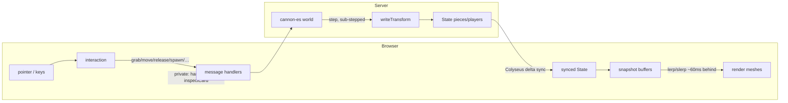

# Code Reference

A map of every module, data structure, and key function. For the _why_, see
`ARCHITECTURE.md`; this is the _what_ — the API surface.

For staged implementation status and **remaining proposed** work, see [DESIGN_next_features.md](DESIGN_next_features.md)
(participation restrictions, deck browsing, collections) and
[DESIGN_future_backlog.md](DESIGN_future_backlog.md) (discovery briefs for other open items).
The participation foundation, durable GM time-outs, self-service spectators and private deck browsing are implemented; the remaining suggested messages,
modules and schemas are not current API contracts.

The codebase:

| File                                                                                                   | Runtime | Role                                                                                                                                                                                             |
| ------------------------------------------------------------------------------------------------------ | ------- | ------------------------------------------------------------------------------------------------------------------------------------------------------------------------------------------------ |
| `shared/pieces.js`                                                                                     | both    | Single source of truth: dimensions, masses, colors, dice verts, table containment, and prop/board registries                                                                                     |
| `shared/collider-spec.js`                                                                              | both    | Renderer-neutral descriptions of authoritative box, sphere, cylinder/cone, flat, convex-die, deck, board, prop, and dispenser colliders                                                         |
| `shared/board-geometry.js` | both | Board outline validation, presets, dimensions, and shared convex-prism geometry |
| `public/editor/board-outline-editor.js` | browser | Top-down board outline tracing, GLB outline fitting, aspect-correct previews, undo/clear, and form state |
| `shared/lighting.js`                                                                                   | both    | Factory room lighting, six authored presets, normalization/clamping, and durable snapshot shaping                                                                                               |
| `server.js`                                                                                            | Node    | Composition root: authoritative simulation, Colyseus rooms, remaining handlers, HTTP/security setup                                                                                              |
| `server/game/schema.js`                                                                                | Node    | Synchronized Colyseus classes, ordered field declarations, defaults, and root-state collection construction                                                                                      |
| `server/game/starters.js`                                                                              | Node    | Injected starter-layout orchestration: reset, board/grid placement, decks, initial dealing, bowls/stacks, and capacity                                                                           |
| `server/game/table-bounds.js`                                                                          | Node    | Injected Cannon floor and containment-ring construction for every table shape, including boundary-body replacement and tray rebuilding                                                           |
| `server/game/table-scale.js`                                                                           | Node    | Injected measurement-scale snapshots, validated restoration, and square/hex board-grid calibration                                                                                              |
| `server/game/trays.js`                                                                                 | Node    | Personal dice-tray physics and lifecycle: bounds, resize repositioning, drops, size-aware Scoop placement, clearing, and scene restoration                                                        |
| `server/game/piece-lifecycle.js`                                                                       | Node    | Injected authoritative body/state creation, complete piece removal, release snapping/throws, landing cues, and deck/dispenser absorption                                                        |
| `server/game/collider-maintenance.js`                                                                  | Node    | Deck and finite-stack collider reconstruction using shared geometry, count-derived heights, and authored modeled colliders                                                                      |
| `server/game/placement-operations.js`                                                                  | Node    | Transform publication, snapped-body pin/unpin transitions, and active-grid snap eligibility                                                                                                     |
| `server/game/physics-update.js`                                                                        | Node    | Ordered pre-step motion plus post-step tray/table recovery and authoritative transform publication                                                                                              |
| `server/game/library.js`                                                                               | Node    | Injected table-deck persistence and authorization-safe asset-list delivery                                                                                                                       |
| `server/game/member-service.js`                                                                        | Node    | Injected member-list delivery/broadcasting and waiting-lobby matchmaker notifications                                                                                                            |
| `server/physics.js`                                                                                    | Node    | Cannon world setup and collider construction for dice, cards, props, boards, and dispensers                                                                                                      |
| `server/game/scene-persistence.js`                                                                     | Node    | Portable scene/game snapshot serialization and validated restoration                                                                                                                             |
| `db.js`                                                                                                | Node    | Production Postgres pool composition and compatibility exports                                                                                                                                   |
| `server/database.js`                                                                                   | Node    | Pool-injected database factory: library, users, rooms, membership                                                                                                                                |
| `scripts/test-database.mjs`                                                                            | Node    | Guarded disposable-PostgreSQL lifecycle and integration-test runner                                                                                                                              |
| `scripts/measure-colliders.mjs`                                                                        | Node    | Dependency-free GLB bounds scanner for validating and retuning registered bundled model scales and collider half-extents                                                                        |
| `auth.js`                                                                                              | Node    | Password hashing (scrypt) + device-token hashing                                                                                                                                                 |
| `migrate.js`                                                                                           | Node    | Owner-role startup migration runner for `postgres/NNN_*.sql`                                                                                                                                     |
| `server/game/handlers/*.js`                                                                            | Node    | Extracted card, movement, piece/group, room-state/persistence, overlay/whiteboard, chat/tray/sharing, membership, and saved-library message handlers                                             |
| `server/http/*.js` + `server/http/routes/*.js`                                                         | Node    | HTTP auth/error seams and auth/room/admin/upload routers, including on-demand card/tile texture derivatives                                                                                      |
| `server/{auth-validation,permissions,message-validation,deck-state}.js` + `server/game/props-codec.js` | Node    | Shared validation/rules, state helpers, canonical piece-props codec                                                                                                                              |
| `server/{database-config,session-config,bootstrap-admin}.js`                                           | Node    | DB config, session lifetime, and first-boot admin provisioning                                                                                                                                   |
| `server/assets/upload-validation.js`                                                                   | Node    | Image magic-byte and self-contained GLB validation                                                                                                                                               |
| `server/{rate-limit,redis-config}.js`                                                                  | Node    | Redis/memory token-bucket stores, fail-closed HTTP middleware, Redis URL and trusted-proxy configuration                                                                                         |
| `server/library-queries.js`                                                                            | Node    | Testable saved-library read queries; successful empty/not-found results stay distinct from PostgreSQL rejection                                                                                  |
| `server/user-queries.js`                                                                               | Node    | Testable auth/user/admin reads; successful absence stays distinct from PostgreSQL rejection                                                                                                      |
| `server/room-queries.js`                                                                               | Node    | Testable room/membership/state reads and idempotent joins; domain absence/defaults stay distinct from PostgreSQL rejection                                                                       |
| `server/game/interaction-policy.js` | Node | Explicit table-request capabilities, `guardedMessage` registration and live `allowRoomCapability` checks |
| `server/game/safe-message.js`                                                                          | Node    | `safeMessage`/`safeRoomTask` Colyseus boundaries: catch sync/async message and lifecycle failures, log payload-free room/user context, and send sanitized client errors when a client is present |
| `server/static-assets.js` | Node | Bundled asset directory setting, trusted filesystem resolution, and stable URL mounts |
| `server/http/routes/static-assets.js` | Node | Static asset HTTP serving with existing Mahjong cache and media range behavior |
| `public/rendering/core.js`                                                                                       | browser | Scene/camera/renderer/controls, visual-asset readiness + `CONFIG` & `LIGHTING` tunables                                                                                                         |
| `public/rendering/graphics.js`                                                                                   | browser | Texture and mesh builders, shared immutable card/tile geometry caches, model loading, `KIND` registry                                                                                            |
| `public/client.js`                                                                                     | browser | Game-table composition root: networking, controller wiring, scene/input adapters, loading gate, render loop                                                             |
| `public/table/table-shell.js` | browser | Table-specific UI composition, local panels/toasts, drawer and roster/hand surfaces |
| `public/table/preferences.js` | browser | Audio/theme settings, help tabs, credits, and track controls |
| `public/table/dice-preferences.js` | browser | Per-device dice defaults, uploaded finish data, and tray finish controls |
| `public/table/piece-ui.js` | browser | Contextual control guide, hover counts, piece menus, and hold-button visibility |
| `public/table/effects.js` | browser | Ping/shuffle visuals, landing marker, and cached board collider surfaces |
| `public/table/input-router.js` | browser | Semantic intent dispatch, modal priority, Escape/typing guards, and camera-pan gating |
| `public/table/piece-drag.js` | browser | Piece gestures, click/deal/dispense flow, grid/group transforms, throw estimation, and dealt-response binding |
| `public/table/piece-view.js`                                                                           | browser | Safe piece props, room lifecycle bindings, mesh replacement, patch snapshots/interpolation, and current-mesh deck-height synchronization                                                                             |
| `public/table/collider-debug.js`                                                                        | browser | GM-gated local collider-shell construction, refresh, transform following, preference, and disposal                                                                                              |
| `public/table/hand.js`                                                                                 | browser | Private hand state, rendering, Show audience/selection, rearrangement/sorting, collapse preference, inspection entry, and card pointer gestures                                                  |
| `public/table/inspection.js`                                                                           | browser | Enlarged-piece/card previews, appearance controls, deferred double-clicks, placement, and pointer rotation |
| `public/table/presence.js`                                                                            | browser | Seats/cameras, public fans, markers, held labels, roster/turn display, avatar controls, and player bindings |
| `public/table/selection.js`                                                                            | browser | Local selection, marquee gestures, highlight rings, batch commands, recolor toolbar, and compose/gather planning |
| `public/table/room-settings.js`                                                                        | browser | Table/grid presentation, scale and lighting controls, local drafts, graphics-quality UI, and room bindings |
| `public/table/skybox.js`                                                                               | browser | Built-in sky catalog, background texture loading/disposal, and local resolution controls |
| `public/table/overlays.js`                                                                             | browser | Measurement shapes, board-surface height, selection, previews, movement, and room bindings |
| `public/table/whiteboard.js`                                                                           | browser | Whiteboard mesh, strokes, ownership, camera/drawing mode, controls, and room messages |
| `public/table/trays.js`                                                                                | browser | Personal tray meshes, seat placement, camera travel, dice actions, and controls |
| `public/table/chat.js` | browser | Public chat replay, unread/autoscroll behavior, and send controls |
| `public/table/notebook.js` | browser | Private notebook replay and debounced edits |
| `public/table/scoreboard.js` | browser | Score rows, shared room notes, edit affordances, and state/control bindings |
| `public/table/timer.js` | browser | Shared-anchor timer display, controls, and touch mini-readout |
| `public/table/membership.js` | browser | Membership lists, pending indicator, role actions, and unclaimed-hand assignment |
| `public/table/library-bindings.js` | browser | Library response routing, asset errors, and Save Table feedback |
| `public/ui/ui-surfaces.js`                                                                          | browser | Shared dialogs, responsive sheets, clusters, drawer, radial menus, and hold-repeat controls |
| `public/rendering/asset-texture-url.js`                                                                          | browser | Pure saved-image URL mapping to standard or High versioned WebP derivatives                                                                                                                      |
| `public/table/controls.js`                                                                                   | browser | Mouse/touch/keyboard profiles translated into device-neutral intents, including contextual object axes and camera panning                                                                        |
| `public/table/audio.js`                                                                                      | browser | Web Audio SFX manager + HTML5 background-music player (per-player, unsynced)                                                                                                                     |
| `public/credits.js`                                                                                    | browser | Attribution manifest: `MUSIC` playlist + SFX/library credits (feeds player _and_ credits panel)                                                                                                  |
| `public/ui/icons.js` / `public/ui/equalize.js`                                                               | browser | Icon/tooltip helpers, UI preference boot, grouped-button sizing                                                                                                                                  |
| `public/{landing,admin}.js`                                                               | browser | Lobby and admin console (HTTP)                                                                                                                                            |
| `public/editor/editor-panel.js` | browser | Library workshop, asset forms, previews, and room-backed pickers |
| `public/editor/{compound-collider-editor,collider-outline-drawing,collider-groups,collider-presets}.js` | browser | 3D collider authoring, outline drawing, group transforms, and saved presets |
| `public/rendering/collider-surface.js` | browser | Shared collision-surface geometry, height queries, and disposal |
| `public/rendering/perf.js` | browser | Optional render-cost overlay |
| `public/ui/rows.js` | browser | Shared DOM row, button, and toast builders |
| `public/table/{clicks,drag}.js` | browser | Pure click routing and drag-anchor math |
| `public/*.html` + `styles.css`                                                                         | browser | Page shells plus token-driven shared button, form-control, checkbox, panel, and feature styling                                                                                                  |

Browser modules are grouped by responsibility: `editor/` for workshop authoring, `rendering/`
for graphics support, `ui/` for shared DOM behavior, and `table/` for table features/input/audio.
The three page entry points and central attribution manifest stay at the public root.
`ui/equalize.js` keeps its early classic `defer` loading order; the other modules use ES imports.

The main client composition has no cycles: `shared` feeds `core`/`graphics`, `client` imports the
focused `table` modules and injects their mutable dependencies, and the remaining side branches are
`controls` plus `audio ← credits`. `collider-debug` imports only static rendering dependencies and
the safe mesh-props helper from `piece-view`; neither feature module imports `client` or a room.

---

## Component diagram

```mermaid
classDiagram
    class Shared["shared/pieces.js"] {
        +TABLE {x, z}
        +COLORS {..., team{checker,go,chess}}
        +KINDS {die, card, prop, deck, board}
        +PROPS {shape → mass, collider, render|model, team, tint...}
        +PROP_LIST[] {id, name, team}
        +BOARDS {key → model, modelScale, box}
        +DECK_VISUAL / CARD_ROUND / DIE_RADIUS / DIE_SIDES / BOARD_SIZE
        +deckHeight(count) / dieVerts(sides, r) / timerLive(t, now)
    }
    class SharedLighting["shared/lighting.js"] {
        +LIGHTING_PRESETS / FACTORY_LIGHTING
        +normalizeLighting(value) / lightingSnapshot(value)
    }
    class SharedColliders["shared/collider-spec.js"] {
        +COLLIDER_TYPES[]
        +primitiveColliderSpec(type, hx, hy, hz, options)
        +colliderSpec(type, props, options)
    }
    class Server["server.js"] {
        +SIM config
        +saveAsset() / saveImageRef()
        +compose extracted message handlers and HTTP routers
    }
    class SyncedSchema["server/game/schema.js"] {
        +Piece / Player / Timer / ScoreRow
        +Whiteboard / RoomScale / Overlay / Lighting
        +State root + ordered defineTypes
    }
    class StarterSetup["server/game/starters.js"] {
        +createStarterSetup(dependencies)
        +setupStarter(room, game)
    }
    class TableBounds["server/game/table-bounds.js"] {
        +createTableBounds({tableThickness, wall})
        +buildTableBounds(room, hx, hz, shape)
    }
    class TrayOperations["server/game/trays.js"] {
        +createTrayOperations({random})
        +scoopTrayDice(room, seat)
        +buildTrays(room) / repositionTrayDice(room)
        +trayDropPos(room, seat) / clearTraySeat(room, seat)
        +applyTrays(room, seats)
    }
    class Physics["server/physics.js"] {
        +buildWorld(simulation)
        +buildCollider(type, props, options)
        +colliderFromSpec(spec)
        +attachCollider(body, collider)
        +colliderShape(type, hx, hy, hz, options)
        +dieShape(sides)
    }
    class ScenePersistence["server/game/scene-persistence.js"] {
        +serializeScene(room, options)
        +serializeGame(room, options)
        +applyScene(room, scene, options)
    }
    class Auth["auth.js"] {
        +hashPassword / verifyPassword (scrypt)
        +makeToken / hashToken (device tokens)
    }
    class Db["db.js"] {
        <<Postgres>>
        +library: list/get/insert/update + asset-admin
        +users/sessions: create/find/createSession/revoke/admin/host/purge
        +rooms: createRoom/find/list/policy/softDelete/purge
        +members: joinRoom/admit/kick/setRole/listMembers
    }
    class TableRoom {
        <<Colyseus Room>>
        world, state, RANK
        bodies, deckCards, cardData, hands, drafts: Map
        notebooks, shows, pendingInspect: Map
        pendingHands, pendingTurn, chatLog
        +onAuth() rank() isAdmin()
        +spawn() update() sendHand() saveDeckById() advanceTurn()
        +serialization/restoration facade methods
        +sendMembers/broadcastMembers/sendAssetList/closeAndDispose
        +gameplay + library + member handlers
    }
    class EditorRoom {
        <<admin-only>>
        onAuth rejects non-admins
    }
    class Core["public/rendering/core.js"] {
        +CONFIG / LIGHTING / clamp
        +applyLighting(value, options) / getLighting()
        scene camera renderer controls
    }
    class Graphics["public/rendering/graphics.js"] {
        +texture builders (cTex, cardFront, dice, text...)
        +measureGlb/fitModel/measureModel/measureBoard
        +uploadImage/uploadModel/resizeToCanvas
        +mesh builders + KIND registry
    }
    class Client["public/client.js"] {
        room, meshes, buffers, myIsAdmin
        +controller composition + networking + UI wiring
        +raycasting + camera pan math
        +table/track resize orchestration + render loop
    }
    class TableShell["public/table/table-shell.js"] {
        +createTableShell() / prepare() / toast()
        +bindRoomControls/bindInteractionControls/bindControls
    }
    class Preferences["public/table/preferences.js"] {
        +bindPreferences()
    }
    class DicePreferences["public/table/dice-preferences.js"] {
        +createDicePreferences()
        +myDieProps/saveDiceDefault/clearDiceDefault
        +setTextures/syncTextures/buildTextureChips/bindControls
    }
    class PieceUi["public/table/piece-ui.js"] {
        +createPieceUi()
        +openPieceMenu/syncControlGuide/update/updateHoldControls
    }
    class Effects["public/table/effects.js"] {
        +createTableEffects()
        +bindPings/bindTableEffects/sendPing
        +applyAnim/updatePings/updateDropMarker/disposeSurface
    }
    class InputRouter["public/table/input-router.js"] {
        +createInputRouter(dependencies)
        +press/move/release/command + semantic intents
    }
    class PieceDrag["public/table/piece-drag.js"] {
        down, armedMove, dragHeight, targets, throwVel
        +createPieceDrag(dependencies)
        +bindRoom/press/move/release/current
        +beginMoveFromMenu/sendAction + transforms
    }
    class PieceView["public/table/piece-view.js"] {
        +piecePropsOf() / meshPropsOf() / pieceProperty()
        +snapshot() / applyTransform() / syncDeckMeshHeight()
        +createPieceView() → rebuildCard/rebuildPiece/rebuildDeck/sample
        +setOriginalVisible(id, visible)
        +bindRoom/recordState
    }
    class ColliderDebug["public/table/collider-debug.js"] {
        +createColliderDebug()
        +refresh/remove/sync/update/dispose
        +setEnabled/isEnabled
    }
    class Hand["public/table/hand.js"] {
        +createHand(dependencies)
        +setCards/setRevealed/revealedFor/clearRevealed
        +render/cancelGesture/bindShowControls/bindRoom
        +isDragging/drag/hoverCard/controlRows
    }
    class Inspection["public/table/inspection.js"] {
        +createInspection(dependencies)
        +inspectMesh/enterInspect/releaseInspect/placeDrawn
        +handleDeferredClick/beginPointer/movePointer/endPointer
        +bindRoom
    }
    class Overlays["public/table/overlays.js"] {
        +createOverlays(dependencies)
        +bindRoom/bindControls + measure/move/select
    }
    class Presence["public/table/presence.js"] {
        +seatLayoutFor(hx, hz)
        +createPresence(dependencies)
        +bindRoom/bindMessages/bindControls/rebuildSeats
        +getSeat/seatName/handDropPosition
        +updateHeldLabel/update
    }
    class Selection["public/table/selection.js"] {
        +createSelection(dependencies)
        +size / ids / has / remove / clear / isActive
        +beginPointer/movePointer/endPointer/escape/command
        +removeSelected/update/bindModeControls/bindActions
        +cardFamilySig/dispenserSig/composeState/gatherPlan
        +selColorDesc/selectionPalette
    }
    class Whiteboard["public/table/whiteboard.js"] {
        +createWhiteboard(dependencies)
        +sync/bindRoom/bindControls + stroke gestures
    }
    class RoomSettings["public/table/room-settings.js"] {
        +createRoomSettings(dependencies)
        +bindRoom/hydrate/bindControls
    }
    class Skybox["public/table/skybox.js"] {
        +BUILTIN_SKIES
        +createSkybox(dependencies)
        +sync/bindControls
    }
    class Trays["public/table/trays.js"] {
        +createTrays(dependencies)
        +sync/open/close/putAway/updateCamera
    }
    class Chat["public/table/chat.js"] {
        +createChat(dependencies)
        +bindRoom/bindControls
    }
    class Notebook["public/table/notebook.js"] {
        +createNotebook(dependencies)
        +bindRoom/bindControls
    }
    class Scoreboard["public/table/scoreboard.js"] {
        +createScoreboard(dependencies)
        +bindRoom/hydrate/bindControls/applyRole/render
    }
    class Timer["public/table/timer.js"] {
        +createTimer(dependencies)
        +bindControls
    }
    class Membership["public/table/membership.js"] {
        +createMembership(dependencies)
        +bindMessages/bindRoom/renderUnclaimed
    }
    class LibraryBindings["public/table/library-bindings.js"] {
        +bindLibraryMessages(dependencies)
    }
    class UiSurfaces["public/ui/ui-surfaces.js"] {
        +createUiSurfaces(dependencies)
        +wireDialog/wireCluster/wireDrawer/createRadialMenu
    }
    class Audio["public/table/audio.js"] {
        +playSfx() resumeAudio()
        +SFX + music volume/mute (localStorage)
        +toggleMusic/nextTrack/playTrack/shuffle
    }
    class Credits["public/credits.js"] {
        +MUSIC[] MUSIC_CREDIT
        +SFX_CREDITS[] LIB_CREDITS[]
    }
    class Pages["landing.js · admin.js · editor/editor-panel.js"] {
        +lobby / admin console / library editor UI
        +fetch to the HTTP API
    }
    Shared <.. Server
    Shared <.. SyncedSchema
    SharedLighting <.. SyncedSchema
    SyncedSchema <.. Server
    Shared <.. StarterSetup
    StarterSetup <.. Server
    Shared <.. TableBounds
    TableBounds <.. Server
    Shared <.. TrayOperations
    TrayOperations <.. Server
    Shared <.. Physics
    Shared <.. SharedColliders
    SharedColliders <.. Client
    Shared <.. ScenePersistence
    SharedLighting <.. ScenePersistence
    Shared <.. Core
    SharedLighting <.. Core
    Shared <.. Graphics
    Shared <.. Client
    Core <.. Graphics
    Core <.. Client
    Graphics <.. Client
    TableShell <.. Client
    Preferences <.. Client
    DicePreferences <.. Client
    PieceUi <.. Client
    Effects <.. Client
    SharedColliders <.. Effects
    PieceView <.. Effects
    UiSurfaces <.. TableShell
    InputRouter <.. Client
    PieceDrag <.. Client
    PieceDrag <.. InputRouter
    PieceView <.. PieceDrag
    Shared <.. PieceDrag
    PieceView <.. Client
    PieceView <.. ColliderDebug
    SharedColliders <.. ColliderDebug
    ColliderDebug <.. Client
    Hand <.. Client
    Inspection <.. Client
    Presence <.. Client
    Presence ..> Hand : reveal-data callbacks
    Selection <.. Client
    Shared <.. Selection
    RoomSettings <.. Client
    Shared <.. RoomSettings
    SharedLighting <.. RoomSettings
    Skybox <.. Client
    Overlays <.. Client
    Whiteboard <.. Client
    Trays <.. Client
    Chat <.. Client
    Notebook <.. Client
    Scoreboard <.. Client
    Timer <.. Client
    Membership <.. Client
    LibraryBindings <.. Client
    Shared <.. Timer
    Inspection ..> PieceView : hide/reveal original
    Hand ..> Inspection : request preview callback
    Credits <.. Audio
    Credits <.. Preferences
    Audio <.. Preferences
    Audio <.. Client
    Server *-- TableRoom
    Server ..> Physics
    TableRoom ..> ScenePersistence
    TableRoom <|-- EditorRoom
    Server ..> Auth
    Server ..> Db
    TableRoom ..> Db : library / rooms / members
    TableRoom <..> Client : Colyseus sync + messages
    Pages ..> Server : HTTP + lobby/table sockets
```

## The core loop (intent up, state down)



---

## `shared/pieces.js` — single source of truth

Pure constants and helpers imported by both sides.

### Constants

- **`TABLE`** `{ x, z }` — half-extents of the play surface.
- **`GRID_FOOTPRINT_MAX`** `12` — upper bound for an authored square N×N piece footprint.
- **`TABLE_SHAPES`** / **`tableOutline(shape, hx, hz)`** — the shape list
  (`rect`/`round`/`oval`/`hex`/`roundedRect`) and the closed perimeter polygon for a shape +
  half-extents. One source of truth read by the extracted physics wall ring
  (`server/game/table-bounds.js`), the felt mesh (`resizeTable`) and the grid clip (`gridMesh`).
  round/hex use `hx`; hex is flat-top.
- **`offsetOutline(outline, w)`** — mitre-offset a convex, origin-centred outline by ±`w` (the
  wooden rim's outer edge + a slight inward overlap onto the felt).
- **`COLORS`** — every piece color: `neutralProp`, `cardSide`, `deckEdge`,
  `boardEdge`, `ivory`, `ink`, `felt[dark,light]`, and `team {checker, go,
chess}` each `[color0, color1]`.
- **`KINDS`** `{ die, card, prop, deck, board, dispenser, mat }` — physics half `{ mass, shape }`.
  `shape` is `'die'`, `'prop'`, `'dispenser'`, `'mat'`, or `{ box:[hx,hy,hz] }`. `mass:0` ⇒ static.
  `mat` is a large single-faced SURFACE others rest on (a player mat) — heavy + movable + inert; its
  collider reuses the card branch (a solid box from `props.geom`).
- **`DECK_VISUAL`** / **`CARD_ROUND`** — deck box unit + card corner radius.
- **`PROPS`** `{ shapeId → spec }`. A spec has `mass`, `collider`
  (`{ box:[hx,hy,hz], type? }` — `type` is `sphere`/`cylinder`/`cone`/`flat`,
  omitted = box), and **either** a built-in `render` (`prim`:
  box/sphere/cone/cyl/lens + params) **or** a bundled `model` path with
  `modelScale` (+ optional `modelRot`, `team`, `tintMaterial`, `ownMaterial`,
  `stand`, `cells`). Optional integer `cells` is the definition's N×N grid footprint; absent means
  1×1. A bundled object's default surface is selected by one boolean finish flag:
  `matte`, `satin`, `glossy`, `metallic` (or legacy `metal`), `brushed`, `pearl`,
  `translucent`, `glow`, or `marbled`. An explicit `props.finish` set through Inspect wins over
  that definition default, including explicit `matte`. Current authored defaults are metallic for
  the coin; pearl for checkers, poker chips, Go stones, and chess; satin for the human token; and
  matte for unflagged primitive shapes.
- **`PROP_LIST`** `[{ id, name, team? }]` — ordered spawn-picker list;
  `team:true` shows the two-color toggle, else the color picker.
- **`DISPENSERS`** `{ dispenserId → spec }` — finite model/item stacks and infinite sources.
  Modeled bodies and GLB-backed item stacks accept an instance `finish` override while keeping
  named tint slots independent. A modeled built-in's `collider` accepts the same
  `{box,type?,sides?,top?}` primitive descriptor as a prop; both server physics and the diagnostic
  overlay honor it. Uploaded custom
  objects store an optional dispenser spec in their library `props`:
  `{appearance:'automatic'|'generic'|'custom',infinite,defaultCount?,model?,box?,scale?,modelRot?,collider?,tintMaterial?}`.
  `automatic` repeats the object model, `generic` uses the procedural container, and `custom` loads
  the second authored GLB.
- **`BOARDS`** `{ key → … }` — built-in boards, either a **model** board
  (`{ name, model, modelScale, box, grid? }`, collider precomputed from
  `worldSize·scale/2`) or a **procedural** board (`{ name, proc, box, grid, paint }`)
  whose top a `BOARD_PAINTERS` painter draws from data (no `.glb`). Model-board grids may pin
  measured `cellX`/`cellZ` spacing when decorative borders make the printed area smaller than the
  collider footprint.
- **`BOARD_SIZE`** — default longest horizontal side (8) for uploaded `.glb` boards; the editor can choose a different target size.
- **`TILES`** `{ key → { w, h, t, round } }` — named tile geometries (half-extents,
  thickness, corner radius): the standard `card`, plus `domino`, `letter`, `mahjong`.
  A card resolves to one of these (or an explicit `props.geom`) via `cardGeom`.
- **`HEX_HH`** — √3/2; a regular pointy-top hexagon's half-width ÷ half-height (circumradius).
- **`WORDY_PREMIUM`** / **`WORDY_COLORS`** — the 15×15 word-board premium layout (one char per
  cell) + its palette, read by the `wordgrid` painter (`BOARDS.wordy`).
- **`LETTER_DIST`** `{ letter → [count, value] }` — the 100-tile word-game bag (blank = `''`).
- **`MAHJONG`** `{ base, suits, honors, bonus }` — the 144-tile wall's face lists (faces are
  bundled images under `base`).
- **`DECK_MODELS`** `{ key → { name, model, modelScale, box, modelRot?, tints?, color?, textColor? } }`
  — 3D deck _skins_ (a bag/box/pouch `.glb` a deck wears instead of the card stack); a deck opts in
  via `props.model`. Optional `modelRot` `[x,y,z]` reorients the raw model before it is fit/centred;
  `tints` `{ slot → propKey }` maps a named material slot to a
  deck prop (the pouch: `bag → color`, `string → textColor`), each falling back to the skin's own
  `color`/`textColor` default, so the sack and drawstring recolor independently. The bundled domino,
  letter, and Mahjong inventories use the scaled low-poly `bag` skin and its matching authored collider.
- **`DIE_RADIUS`** `{ sides → r }`, **`DIE_SIDES`** `[4,6,8,10,12,20]`.
- **`DICE_MODELS`** / **`DICE_MODEL_KEYS`** — built-in pipped d6 GLB visuals. They retain normal d6
  physics/value behavior, color the `Ivory` body and `Dots` pips independently, and accept every
  standard dice finish except the image-backed `custom` finish.
- **`DICE_FINISHES`** / **`DICE_FINISH_KEYS`** — the complete dice finish catalogue, including
  procedural-dice-only `custom`. **`OBJECT_FINISHES`** / **`OBJECT_FINISH_KEYS`** derive the
  model-object catalogue by excluding `custom`; both the Inspect picker and server validation use
  this shared allowlist. `DICE_FINISH_FALLBACK` maps GPU-heavy finishes to phone-safe alternatives.
- **`TRAY`** — shared personal-tray tuning: `hx`/`hz` (floor half-extents), `wall` (visible-wall
  half-height), `collisionWallScale` (server wall height relative to the visible wall; default
  `1.5`, with the invisible lid following its top), `thick` (wall half-thickness), `floorThick`
  (floor half-height, its top at `y=0`), `lid` (ceiling half-thickness), and `margin` (gap to the
  tray-centre track). `spawnInset`/`spawnY` tune new dice placement; `recoverySlack`/`recoveryY`
  tune resize recovery; `scoopGap`/`scoopGridStep`/`scoopFloorLift`/`scoopRadiusFallback` tune
  Scoop's separated, floor-level layout. The client and server share a footprint and floor, but
  their wall heights intentionally differ.
- **`SEAT_ANGLES`** `[8]` + **`seatAngle(seat)`** — each seat's angle on the whiteboard/tray
  track (θ = `atan2(outX, outZ)`, matching `seatLayoutFor`), so a seat's tray sits directly
  behind that player.

### Functions

- **`inTable(x, z, shape, hx, hz, inset?) → bool`** — test a point against the playable rectangle,
  circle, ellipse, flat-top hexagon, or rounded rectangle. The optional inward offset lets server
  recovery include a body's current horizontal footprint rather than testing only its centre.

- **`deckHeight(count) → number`** — clamps deck thickness; used by client visual
  _and_ server collider so a flipped deck is solid.
- **`cardGeom(props) → { hw, hh, th, round, shape }`** — the single card/tile geometry
  resolver both the client mesh and the server collider read (so they can't drift).
  Resolves, in order: an explicit `props.geom` (`{w,h,t?,round?,shape?}`, custom image
  decks) → a named `props.tile` (a `TILES` entry) → the standard card. `shape` is
  `'rect'` or `'hex'` (a regular pointy-top hexagon; half-extents pinned via `HEX_HH` so
  the mesh and the 6-gon collider stay regular and aligned).
- **`geomFromImage(pw, ph, round?) → geom`** — size a fit-to-image card to its art's pixel
  aspect (longer side = the card's length), keeping card thickness and the corner radius
  measured from the art's alpha.
- **`sanitizeGeom(g, { maxWH, maxT }?) → geom | null`** — clamp/validate an uploaded `geom` (bounds
  on `w,h,t,round`, carries `shape`); `null` if unusable. Applied server-side before a deck's
  geometry is trusted. **`sanitizeMatGeom(g)`** is the same with a raised cap (`MAT_MAX_HALF` = 9
  half-extents vs a card's 3) for a player mat's much larger footprint.
- **`dieVerts(sides, radius?) → number[][] | null`** — polyhedron vertices scaled
  to `radius`; `null` for d6. One input for mesh (client) and collider (server).
- **`objectFinish(spec, override?) → string`** — resolve an object's effective material.
  A valid per-instance override wins, followed by `metal`/`metallic` and the definition's finish
  flag; absent or null definitions resolve safely to `matte`.
- **`colorProps(type, props, change, dispDef?) → object | null`** — validate and immutably apply
  synchronized appearance changes. Bundled and uploaded model props plus modeled dispensers/stacks
  accept material-only `finish` changes from `OBJECT_FINISH_KEYS`; pipped dice accept the standard
  dice subset. Dice-only `custom`, pipped-die custom textures, and object finish textures are rejected.
- **`customAssetSnapshot(id, recordProps) → {id,item,dispenser?}`** — remove the dispenser definition
  from the base item and attach both to a server-authored runtime identity. **`dispenserDefinition`**
  resolves either that custom definition or a built-in `DISPENSERS` entry;
  **`dispenserIdentity`** / **`dispenserVariant`** provide stable gather keys; and
  **`customDispenserForItem`** rebuilds an eligible custom dispenser spec from a loose item while
  preserving only its asset ID, color, and finish variant.
- **`timerLive(t, now) → ms`** — the shared timer's current value from its synced
  anchor (`running/mode/base/since`): counts up from `base`, or down toward 0.
  Used by the server handler _and_ every client, so the number is never synced tick
  by tick.
- **`roundToStep(value, step) → number`** — rounds `value` to the nearest multiple
  of `step` (a _size_, so "nearest 0.5" works where a digit count can't); `step ≤ 0`
  returns `value` unchanged. Clears binary-float dust. The primitive behind
  measurement display and grid snapping.
- **`gridActive(scale) → bool`** — `scale.gridStyle !== 'off' && cellWorld > 0`; the
  one guard both render and snap gate on, so the grid draws and snaps together.
- **`gridFootprintCells(props) → integer`** — resolves an explicit saved/runtime `props.cells` or
  the built-in `PROPS[props.shape].cells` hint. Missing, fractional, and out-of-range values safely
  fall back to `1`; accepted values are `1..GRID_FOOTPRINT_MAX`.
- **`snapToCell(x, z, scale, cells = 1) → {x, z}`** — the nearest footprint-centre position on the
  grid, the single quantiser the client preview and the server authority both call so they can't
  drift. **Square** honours per-axis spacing (`cellZ`), the `gridX`/`gridZ` offset, and
  `snapAnchor` (`center` lands in cell middles, `cross` on line intersections). Odd N×N
  footprints retain that phase; even footprints use the opposite phase so their centre sits
  between the two middle lattice anchors. **Hex**
  snaps to hex centres (pointy- or flat-top per `hexOrient`, size = `cellWorld`, offset
  honoured) for every footprint size because hex grids have no half-cell phase.
  `off`/zero-cell return the point unchanged. Uses exact rounding, not
  `roundToStep`'s display rounding, so a non-round cell size lands on true multiples.
- **`formatMeasure(worldDist, scale) → string`** — a world distance as a display
  label: `worldDist ÷ scale.worldPerUnit → roundToStep(·, roundStep) → + unitLabel`
  (e.g. `"5.5 in"`). Rounding is display-only; the caller keeps exact geometry. Pure
  and shared, so a ruler reads identically on every screen — the `timerLive` instinct
  applied to distance. A missing/invalid `scale` falls back to raw world units.
- **`trayCenter(angle, tableX, tableZ) → {x, z}`** — a tray's centre on the track for a seat
  angle and table size (radius `max(tableX,tableZ) + TRAY.margin`, the whiteboard formula), so
  the tray hugs the edge at any size.
- **`trayParts(T?) → [{hx,hy,hz,x,y,z, noMesh?}]`** — tray-local specs for the floor, four
  visible-height walls, and a lid marked `noMesh:true`; the client draws the floor and walls but
  skips the lid.
- **`trayCollisionParts(T?) → [{hx,hy,hz,x,y,z, noMesh?}]`** — the same floor and footprint,
  with walls scaled by `T.collisionWallScale` and the invisible lid flush with their new top.
  The server builds its Cannon tray bodies from these specs.
- **`trayPlace(local, center, angle) → {x, y, z}`** — rotate a tray-local point by `angle`
  about Y and offset to `center`; the one transform the physics bodies and render meshes both
  apply so they land together.
- **`inTray(x, z, center, angle, slack?) → bool`** — is a world point inside a tray's footprint
  (+ slack)? The out-of-bounds net uses it to contain tray dice in the tray rather than yanking
  them home.

---

## `shared/overlays.js` — overlay and whiteboard protocol policy

- **`OVERLAY_KINDS`** — immutable ordered overlay-kind list: `ruler`, `circle`, `cone`, and
  `line`. The server derives its validation `Set` from this list; the browser derives the
  `OVERLAY` registry and verifies that every kind has exactly one renderer.
- **`OVERLAY_LIMITS`** — immutable room and creator caps: `maxRoom` and `maxPerPlayer`.
- **`WHITEBOARD_LIMITS`** — immutable streamed-drawing bounds: `maxStrokes`,
  `maxCoordinatesPerStroke`, `maxColorLength`, and `maxStrokeWidth`. History retention and
  single-message validation remain separate settings even when their numeric values match.
- **`MEASURE`** — immutable overlay geometry/render defaults: `lift`/`labelLift`, `minDrag`,
  `maxLen`, `coneAngle`, and `lineWidth`.

---

## `shared/board-geometry.js` — uploaded board outlines

- **`BOARD_OUTLINES`** — `rectangle`, `circle` (ellipse for unequal dimensions), `hexagon`,
  `triangle`, `clipped`, and `custom`.
- **`normalizeBoardOutline(value)`** returns a copied, normalized outline or `null`. Clipped
  corners use `{type:'clipped', cut}` with `0 < cut < 0.5`; the editor offers 1–49 percent.
  Custom outlines use `{type:'custom', points:[[x,z],...]}` with 3–32 finite points in
  `[-0.5,0.5]`. Validation rejects degenerate edges, crossings, collinear corners, and concavity,
  and normalizes winding. Presets other than clipped corners need only `{type}`.
  All outline types optionally accept `fit:{scale:[width,depth],rotation}`: scale components
  must be finite values from 0.01 to 2, and rotation is a finite Y-axis angle from -2π to 2π
  radians. Omission preserves the full-size, unrotated outline.
- **`boardOutlinePoints(outline, aspect=1)`** resolves normalized footprint points; circles use
  32 segments. Fitting scales the footprint first, then rotates in physical X/Z space using
  the board's width/depth aspect ratio before returning normalized points.
  Missing/invalid outlines fall back to a rectangle for geometry construction.
- **`boardHalfExtents(props)`** resolves built-in bounds, uploaded GLB `box`, or image-board
  `[w/2, thickness/2, d/2]`. Image thickness defaults to `0.1`.
- **`boardGeometry(props)`** returns `{vertices, faces}` for a solid convex prism shared by the
  image-board renderer and Cannon collider. GLB rendering retains the uploaded mesh.
  Fitted rectangles use the convex-prism path in both physics and diagnostic rendering.

Uploaded board records are `{model, modelScale, box, outline?}` or
`{w, d, tex?, thickness?, outline?}`; built-ins remain `{board}`. `boardRecordPayload` validates
both save and spawn requests, with image thickness bounded to `0.02–5`. Existing JSONB board
props store the new fields without a schema migration. Library load, edit, clone, and scene
persistence retain these fields; omitted outlines preserve rectangular behavior.

The GLB outline form exposes **Outline width (%)**, **Outline depth (%)**, and **Rotation (°)**
with a live top-down overlay. Width/depth accept 1–200%; rotation accepts -360–360°.
**Reset outline fit** restores 100% / 100% / 0° without changing the selected preset or its
corner cut. These controls change collision only; **Longest side** scales the model and its
collider together. `wireBoardOutline` reads/fills the saved fit and inversely transforms custom
corner clicks into the original outline coordinates. Image-board forms retain their existing
width/depth controls.

---

## `shared/compound-collider.js` — custom collision layouts

- **`COMPOUND_SHAPE_LIMIT`** is 16 for both authored shapes and generated physics parts; **`COMPOUND_TYPES`** contains `box`, `sphere`,
  `cylinder`, `cone`, `flat`, and `outline`.
- **`normalizeCompoundCollider(value)`** returns a fresh validated
  `{version:1, shapes:[{type,position,size,rotation},...]}` or `null`.
  All vector fields are finite triples. Position components range from -2 to 2, full-size
  components from 0.001 to 2, and XYZ Euler rotation components from -2π to 2π radians.
  Spheres require equal sizes on all axes; cylinders/cones require equal X/Z sizes.
  An `outline` child also requires a valid `outline` object accepted by
  `normalizeColliderOutline`; its dimensions set width, thickness, and depth.
  Empty layouts, unknown types, invalid outlines, and layouts exceeding either 16 authored
  children or 16 decomposed physics sections are rejected.
- **`compoundColliderSpec(value, box)`** scales positions and full dimensions by
  `2 * max(box)`, returning `{type:'compound', shapes:[...]}` with renderer-neutral
  primitives, local offsets, and rotations. Flat shapes resolve to boxes; cylinders and cones
  use 16 sides. Cone top radius is 5% of its bottom radius. Outline children produce
  `{type:'convex',vertices,faces,offset,rotation,sourceIndex}` sections. Convex presets remain
  single sections; concave custom outlines decompose into multiple convex prisms. Every part
  carries its authored `sourceIndex`; recentered vertices and rotated offsets preserve placement.

Uploaded GLB object and board records accept `compoundCollider`. Object records cannot combine
it with `collider`; board records cannot combine it with `outline`. Image boards use outlines.
The layout persists in existing library and piece/scene JSON props without a schema migration.

## `public/editor/compound-collider-editor.js` — 3D authoring

**`openColliderEditor({source, rotation=[0,0,0], box, value})`** returns a promise resolving to
the applied layout or `null` on cancel. It owns and disposes its preview resources.
The editor provides orbit/move/rotate/resize modes, perspective/top/front/side cameras,
direct shape-add buttons, duplicate/delete/clear-all/undo, and live numeric transforms.
Fields display table units or degrees; wheel adjustments support Shift for 0.1× steps and
Ctrl/Command for 10× steps. Clear all is undoable and empty drafts cannot be applied.
The outline component supports rectangle, clipped corners, triangle, hexagon, circle/oval,
and custom simple concave footprints. **Edit outline / clip corners** converts an existing box or
flat slab while preserving size and transform. The embedded `wireBoardOutline(prefix,onChange,options)`
reports live normalized outlines (or `null` for unfinished/invalid drafts); invalid drafts
disable Apply. Its optional `normalizeOutline` and `allowConcave` settings enable concave
compound components while preserving convex-only validation for ordinary board forms.
Y size controls prism thickness. The part count distinguishes authored shapes from the generated
physics sections; selecting any decomposed section selects its original authored outline.

**`scripts/collider-editor-test.mjs`** exercises the editor at desktop/mobile widths.
Run with `CHROME_BIN=/path/to/chromium node scripts/collider-editor-test.mjs`.

---

## `shared/collider-outline.js` — concave compound outlines

- **`normalizeColliderOutline(value)`** validates presets using the board-outline contract and
  permits simple concave custom loops of 3–32 normalized corners. Coordinates stay within ±0.5;
  invalid, degenerate, crossing, touching, or backtracking loops return `null`. Straight corners
  are simplified and winding is normalized. Optional fit settings retain existing validation.
- **`decomposeOutline(outline)`** returns convex outline sections or `null`. Deterministic ear
  clipping followed by greedy convex merging preserves the original area and open recesses.
  No automatic enclosed-hole or self-intersection repair is performed.
- **`outlinePrism(points,width,depth,thickness)`** extrudes validated convex sections into
  vertices/faces for shared physics and preview descriptors.

## `public/editor/collider-outline-drawing.js` — main-viewport drawing

**`createOutlineDrawing({scene,camera,controls,canvas,host,unit,onCommit,onState,validate})`**
returns `start({shape,position})`, `dispose()`, and an `active` getter. New drawings select a
Top/Front/Side plane through `position`; edits use the shape's transformed local plane. It owns
point placement/dragging, model-relative 0.1-grid snapping, wheel zoom, thickness in table units,
point undo/clear, and a live preview of generated convex sections. Clicking the first point or
Finish outline closes the loop. `validate` checks the complete destination layout's budget.
Finish invokes `onCommit` with one normalized outline component; cancel leaves it unchanged.
The controller restores the camera and releases preview geometry/listeners on disposal.
`openColliderEditor` exposes Draw outline in 3D / Edit outline in 3D, hides existing shells during
drawing, disables Apply until drawing ends, and makes successful drawing commits undoable.

**`test/collider-outline.js`** verifies geometry, validation, budgets, persistence normalization,
and Cannon collision behavior. Run the pointer/UI regression with
`CHROME_BIN=/path/to/chromium node scripts/outline-drawing-test.mjs` (desktop and mobile).

---

## Reusable collider collections

- **`public/editor/collider-groups.js`**: `groupBounds` computes transformed component bounds;
  `transformGroup` applies shared translation, rotation, and uniform scale atomically;
  `captureGroup` recenters/normalizes selected components and preserves their table-unit size;
  `insertGroup` returns independent copied components subject to the 16-physics-part budget;
  `drawGroupThumbnail` renders a disposable geometry-based canvas preview.
- **`public/editor/collider-presets.js`**: `wireColliderPresets(host,{capture,insert})` wires the saved
  collections panel, paginated loading, previews, create/replace, metadata updates, deletion,
  and insertion. It uses the signed-in bearer token. Saving to the library is immediate;
  Apply/Cancel still controls only the collider draft. New insertions select the copied group.
- **`public/editor/compound-collider-editor.js`**: `openColliderEditor` supports multi-selection and
  select-all, group numeric/drag transforms, group duplicate/delete, and undo. The controls
  scroll separately from the preview/footer; the embedded outline editor is collapsible.
- **`server/collider-preset-queries.js`**: `createColliderPresetQueries(query)` returns
  `list(user,offset)`, `get(user,id)`, `save(user,id,value)`, and `remove(user,id)`.
  SQL enforces public/owner/admin reads and owner/admin writes. `createDatabase` exposes these
  as `colliderPresets`, also exported by the production `db.js` module.
- **`server/http/routes/collider-presets.js`**: `normalizePreset` validates a trimmed name
  (1–120 characters), boolean visibility, size (0.001–400 table units), and a version-1 compound
  layout. `createColliderPresetsRouter` authenticates every request and implements:
  `GET /collider-presets?offset=0` → `{presets,nextOffset}` (50 per page);
  `GET /collider-presets/:id` → `{preset}`;
  `POST /collider-presets` → `{preset}` (201);
  `PUT /collider-presets/:id` → `{preset}` (full replacement);
  `DELETE /collider-presets/:id` → `{ok:true}`.
  POST/PUT bodies are `{name,layout,size,isPublic}` with a 64 KB limit. Ownership comes from
  the authenticated user. Inaccessible IDs return 404. Records include `canEdit` for UI controls.
- **`postgres/017_collider_presets.sql`** creates the persistent collection table. Layouts are
  normalized JSONB, with owner, visibility, default size, and creation/update timestamps.
  Deleted accounts leave collections with null ownership; admins can still manage them.
  No GLB or thumbnail files are stored. Inserted asset layouts have no live preset reference.

---

## `public/rendering/collider-surface.js` — drop-marker surface queries

- **`createColliderSurface(spec)`** builds an unrendered Three.js tree for a shared primitive,
  convex, or compound collider description, preserving local offsets/rotations.
- **`colliderSurfaceHeight(root,x,z,fromY)`** returns the nearest downward ray hit between
  `fromY` and table height zero, or zero if nothing is hit. Update the root's board transform
  before calling; the helper updates world matrices. Sphere surfaces are triangulated.
- **`disposeColliderSurface(root)`** releases tree geometry and materials.

The effects controller's `boardDropHeight` caches board-only trees by board ID and serialized props,
copies interpolated board transforms for each query, and picks the highest surface below the
held origin. Removal disposes the cached tree. The held piece and other pieces are excluded;
raised areas, cut corners, holes, and off-board positions are resolved locally. Pings and
measurements retain their existing board-wide plane.

---

## `shared/collider-spec.js` — collider descriptions

- **`COLLIDER_TYPES`** is the shared public primitive allowlist (`sphere`, `cylinder`, `cone`,
  `flat`) re-exported by `server/physics.js` for the existing room/upload boundary.
- **`primitiveColliderSpec(type, hx, hy, hz, options?)`** returns a renderer-neutral box, sphere,
  cylinder/cone, or flat-offset descriptor.
- **`colliderSpec(type, props, {cardColliderThickness,count}?)`** resolves the current authoritative
  descriptor for every piece family, including compound layouts, convex dice, shaped board prisms
  with authored faces, and count-derived deck/dispenser heights. Browser diagnostics and server
  physics consume the same descriptions without sharing Three.js or Cannon objects.

---

## `server/physics.js` — compound body construction

- **`colliderFromSpec(spec)`** is the sole renderer adapter from shared primitive, convex, or
  compound descriptions to Cannon shapes. It preserves child offsets/XYZ rotations and computes
  convex faces only when a spec (currently a polyhedral die) does not already supply them.
- **`buildCollider(type, props, options)`** asks `colliderSpec` for the authoritative description,
  then delegates to `colliderFromSpec`, preserving the existing primitive, offset-shape, and
  `{shapes:[{shape,offset,orientation},...]}` return contracts. Dice retain their d6 fallback if
  convex construction fails.
- **`attachCollider(body, collider)`** attaches either all compound children or a legacy
  primitive/offset shape to one Cannon rigid body.
- **`boardSpawnHeight(props)`** returns the larger of visual half-height and the downward
  extent of any rotated/offset compound child, keeping new boards above the table.

---

## `server.js` — authoritative simulation + room

### Config

- **`SIM`** — all physics tuning in one object: gravity, friction/restitution,
  damping, self-righting, `throwCap`, `solverIterations`, `contact`, `step`
  (`fixed`/`maxSub`), and **`cards`** (`colliderThick` — the invisible thicker
  card collider that stabilizes stacks — plus `linDamp`/`angDamp`/`maxThrow`/
  sleep).

### Piece capacity and movement safety

- **`server/game/piece-capacity.js`** — **`MAX_PIECES = 250`** supplies
  `SIM.maxPieces`. **`hasPieceCapacity`** checks for a free slot;
  **`ensurePieceCapacity`** also sends the caller the full-table warning;
  **`assertPieceCapacity`** guards `TableRoom.spawn` before any body or state is created.
  `registerMovementHandlers` also defaults its bounded group size to `MAX_PIECES`, while retaining
  an injected override for focused tests.
- **`server/game/handlers/placement.js`** — **`registerPlacementHandlers`** registers
  `dispense`, `dispenseDrag`, `playCard`, and `handToTable`. Capacity is checked before
  inventory is consumed, with no intervening await. A rejected `playCard` resends the
  unchanged private hand. `handToTable` places only the cards that fit, retaining the rest
  and recording only spawned IDs for undo. Rejected inspected-card field placement retains
  the pending card and resends `inspectCard` so the player can choose another destination.
- Library loads check capacity after asynchronous database reads. A blocked `deckFinish`
  spawn retains its draft; `saveMat` still saves the library record when its optional spawn
  is blocked. Replacing an existing board remains possible at capacity.
- **`server/game/physics-safety.js`** — **`WORLD_COORD_LIMIT = 10_000`** and
  **`isWorldCoordinate`** bound incoming drag and hand-placement coordinates on each axis.
  Group movement also checks destinations after adding member offsets. **`dragVelocity`**
  computes and caps the servo velocity, returning `null` for unsafe derived values;
  `TableRoom.update` then clears that target and ownership and zeros linear velocity.

### Asset files (disk) + library (Postgres)

The image/model **files** stay on disk; their **metadata** moved to Postgres (see
`db.js` below). Assets are keyed by a row **id**, not a filename slug.

- **`ASSETS_DIR`** = `process.env.ASSETS_DIR || './saved-assets'`, with category
  subfolders `uploads/ decks/ boards/ props/ sky/ dice/ mats/` — **files only** now.
- **`saveAsset(kind, buf, ext) → /assets/<kind>/<name>`** — writes a random-named
  file into a validated category folder (`assetKind`).
- **`saveImageRef(dataURL, kind)`** — an inline `data:` image → a disk file → URL.
- **`isDataURL`**, **`deckRefOk`** — ref validators (kept for the save paths).
  _(The old `slugify` / `metaFile` / `listSaved*` / `boardKindLabel` helpers are
  gone — that logic now lives in `db.js`.)_

### `server/http/routes/asset-textures.js` — card/tile display derivatives

**`createAssetTextureRouter({assetsDir, assetKinds, maxDimension?, highMaxDimension?, thumbnailMaxDimension?, bundledAssetsDir?})`** serves
`GET /asset-textures/v1/<kind>/<random-image-name>.webp`. It accepts only an allowlisted
asset category and the random image filename shape produced by `saveAsset`; traversal,
metadata, models, and arbitrary filenames return 404. A strict `?quality=high` request uses
the High-quality derivative; `?quality=thumbnail` selects the library thumbnail. Every other
value uses the standard derivative.

Bundled thumbnails use the same route with kind `bundled` and a URL-encoded relative image path
in the filename parameter, for example `sky%2Fequirect%2Fcloudy_noon.png.webp?quality=thumbnail`.
Only raster images below `sky/`, `mahjong/`, and `textures/` are accepted, with strict path-segment
validation and no traversal or remote proxying. Sources resolve through the existing static-assets
configuration (`bundledAssetsDir` defaults to `STATIC_ASSETS_DIR`). Cached bundled thumbnails
are rebuilt when their source mtime advances and use `public, no-cache` HTTP revalidation, since
bundled filenames may be updated in place. Uploaded random-name image caches remain immutable.

- **`textureAssetPaths(..., quality = 'standard')`** resolves the immutable original and its
  versioned cache path under `.texture-cache/v1/<kind>/` (standard) or
  `.texture-cache/v1-high/<kind>/` (High), or `.texture-cache/v1-thumbnail/<kind>/` (library).
- **`createTextureDerivative(source, destination, maxDimension = 768)`** preserves aspect and
  alpha, never enlarges the source, applies EXIF orientation, and writes a quality-82 WebP via
  an atomic temporary file. The router passes 768 for standard requests and 1536 for High by
  default, and 320 for library thumbnails. Concurrent requests for the same face and variant
  share one pending job. Thumbnails are generated on demand; the admin prebuilder still builds
  standard derivatives. All variants are disposable caches under the existing assets directory.
- **`prebuildTextureCache(...)`** scans every allowlisted asset folder for random-name JPG/JPEG/PNG
  uploads, creates only missing derivatives with two bounded workers by default, continues past
  individual conversion failures, and reports processed/created/skipped/failed counts plus byte totals.
- **`createTexturePrebuilder(options)`** wraps that scan as one process-local background job. Repeated
  starts while it is running coalesce onto the existing job; `status()` exposes its scan/build/complete
  state for the admin console without holding an HTTP request open.
- Successful uploaded-image responses are `image/webp` with a one-year immutable cache policy. Originals stay
  untouched for library editing, backups, and future derivative versions. `cardTextureURL` in
  `public/rendering/graphics.js` redirects only local random-name `/assets/...` card/tile references and
  appends `?quality=high` when the viewer booted in High; procedural, data, bundled, and external
  references keep their existing path.

Thumbnail callers use `assetThumbnailURL` in `public/rendering/asset-texture-url.js`, which maps
saved and bundled images to 320px WebP derivatives, accepts generated WebP data URLs, and returns
null for unsupported sources instead of loading raw originals. `shared/image-thumbnails.js`
owns the common size and bundled-path allowlist. In `public/rendering/graphics.js`,
`cardPreviewURL` defaults to thumbnails (`thumbnail:false` explicitly retains standard previews),
`boardPreviewURL` converts image boards/mats, and `canvasThumbnailURL` bounds generated card,
board and model snapshots. `imageFilePreviewURL` reuses `resizeToCanvas` with aspect-preserving
`inside` sizing for not-yet-uploaded files; object URLs are revoked on both load and decode error.
Original files still supply uploads, measurements, editing geometry, and tabletop rendering.

`public/editor/editor-panel.js` funnels synchronous and lazy image sinks through this mapper;
sky/dice previews use the near-viewport loader, upload squares and face grids use local WebP
previews, and cleared/replaced squares ignore stale completions. `public/table/dice-preferences.js`
uses thumbnail URLs in `buildTextureChips` while callbacks retain original finish refs; this covers
both tray and inspection pickers. `public/table/hand.js` uses `cardPreviewURL` for image faces too.

Regression coverage lives in `test/asset-texture-url.js` (all categories, bundled paths and no raw
fallback), `test/backend-asset-textures.js` (real HTTP size/cache isolation, bundled refresh and
path rejection), and `scripts/component-parity.mjs` (library dice/sky/board/mat images, finish-chip
actions, generated/local WebP previews and stale file-selection cleanup on desktop/touch).
This contract is also summarized in `docs/ARCHITECTURE.md` and `CHANGELOG.md`.

### `server/asset-cleanup.js` — orphan preview and trash

**`createAssetCleanup({assetsDir, assetKinds, allAssetRefBlobs, liveRooms})`** returns:

- **`findOrphanAssets()`** — collect database and live references, then return
  `{url, kind, name, size}` candidates. Only unreferenced regular files older than
  24 hours qualify; recent files, directories, and symlinks are excluded. Reference
  collection failures reject the scan.
- **`trashOrphans(orphans)`** — validate category/filename boundaries and move
  candidates to `.trash/<kind>/<name>`, returning successfully moved URLs. The admin
  purge route invokes a fresh scan before calling it. A reproducible cached texture derivative
  is removed when its original is moved.

Internal **`roomAssetValues(room)`** selects synchronized state, saved snapshots,
private decks/cards/hands, pending hands/inspections, drafts, reveals, notebooks,
and chat. **`collectReferences(value, references)`** traverses maps, sets, objects,
and JSON strings, including escaped URLs, using the same category allowlist as
uploads. **`collectLiveReferences(references)`** runs before and after the database
await to retain departing-room references and include newly created live data.
Private values remain internal; only orphan file metadata is returned by the API.

### `server/physics.js` — physics construction

- **`buildCollider(type, props, options)`** resolves the piece through the shared
  `colliderSpec` rules and converts the resulting descriptor through `colliderFromSpec`. Cards,
  decks, boards, props, dispensers, primitive offsets, and custom compound layouts therefore use
  the same dimensions as browser diagnostics and drop-surface queries.
- **`colliderFromSpec(spec)`** converts box/sphere/cylinder/convex descriptions and compound child
  transforms into Cannon objects. Off-centre shapes such as `flat` retain `{shape,offset}`; compound
  layouts retain `{shapes:[{shape,offset,orientation},...]}` for `attachCollider`.
- **`colliderShape(type, hx, hy, hz, opts?)`** remains the primitive compatibility entry point,
  delegating through `primitiveColliderSpec` and `colliderFromSpec`. Cylinder/cone segment count,
  truncated-top radius, and flat-base offsets are consequently defined only in shared code.
- **`dieShape(sides)`** — convex hull of `dieVerts`, coplanar triangles merged,
  windings outward. The vertices come from `colliderSpec`; d6 and failed hull construction ⇒ box.
- **`geoOf(o)`** — the public geometry/behavior a card/tile inherits from its deck (`tile`, `geom`,
  `snap`), threaded through deck → hand → played tile so a face-down tile keeps its true shape while
  its face stays private. **`dropSfx(type, props)`** picks the tile vs. card/deck drop cue.
- **`buildWorld(simulation)`** — creates the Cannon world, broadphase, shared
  contact material, sleep policy, and solver tuning from `SIM`.
- **`rnd()`**, **`shuffle()`** remain small `server.js` gameplay helpers.
- Small shared helpers keep the handlers flat: **`clamp`**, **`addWall`** /
  **`cubeCollider`** (world + collider building), **`spawnCardFlat`** /
  **`besideDeck`** / **`addToHand`** (deal/hand placement), **`swapBoard`**,
  Physics-only vector helpers, including **`averagePoint`**, stay private to
  `server/physics.js`.

### `server/game/deck-builders.js` — built-in inventories

**`createDeckBuilders({shuffle})`** returns four builders. `server.js` supplies its
existing Fisher–Yates shuffle once, uses the returned functions in `spawn`, and injects
the complete builder collection into `createStarterSetup`. Each call creates a fresh
card array and shuffles it once.

- **`buildSimpleDeck(jokers = false)`** — 52 standard rank/suit references, or 54
  with one red and one black joker; uses the procedural `back` reference.
- **`buildDominoSet()`** — 28 double-six tiles, `domback`, `tile: 'domino'`, and
  the low-poly `bag` deck model.
- **`buildScrabbleBag()`** — 100 letter tiles with counts and scores from shared
  `LETTER_DIST`, including blanks; `lback`, `tile: 'letter'`, `snap: true`, and
  the low-poly `bag` deck model.
- **`buildMahjongWall()`** — 144 image references built from shared `MAHJONG`:
  four copies of each ordinary face and one of each bonus; `mjback`,
  `tile: 'mahjong'`, and the low-poly `bag` deck model.

These functions build private game inventory and spawn properties, not graphics.
Standalone set spawning and starter layouts use the same builders; browser-side
rendering interprets their face references. The module does not start a server or
own the random-number implementation.

### `server/game/starters.js` — one-click game layouts

**`createStarterSetup({deckBuilders, geoOf, maxPieces, spawnY})`** returns
**`setupStarter(room, game)`**. `TableRoom.setupStarter(game)` is a forwarding method
that preserves the room API used by the GM-only `loadStarter` handler.

`setupStarter` returns `false` without mutation for an unknown shared `STARTERS` key.
For a valid key it calls `room.clearTable()` before creating anything, then:

- replaces/configures a built-in board through `swapBoard` and `calibrateGrid`;
- places configured board pieces upright at calibrated cell coordinates, stopping at
  `maxPieces` after accounting for the board;
- disables stale grids for boardless games;
- creates configured bowls and chip stacks through the normal `spawn` boundary;
- selects the injected standard/domino/letter/Mahjong builder, carries `geoOf` tile/snap
  properties and `deckModel`, and deals the configured count to seated players.

Clearing remains delegated to the shared scene-persistence reset path, so old public
pieces, private hands/decks/inspections, pending turn/recovery data, overlays, and the
saved checkpoint are removed with the same ordering as before extraction.

### `server/game/table-bounds.js` — physical table boundaries

**`createTableBounds({tableThickness, wall})`** returns
**`buildTableBounds(room, hx, hz, shape)`**. `server.js` injects `SIM.tableThick` and
`SIM.wall`, then `TableRoom.buildBounds(hx, hz, shape)` forwards to the returned builder.

The builder removes the old bodies in `room._bounds`, creates a static box floor under the
felt, and reconstructs the containment ring using the world's table material. Rectangular
tables use four axis-aligned walls with the configured corner overlap. Other shapes use one
oriented, slightly over-length box per non-zero edge from shared `tableOutline`, sealing the
ring at each vertex. It then calls `room.buildTrays()` so enabled personal trays follow table
resizes. Piece bodies and other unrelated Cannon bodies are not replaced.

### `server/game/table-scale.js` — measurement scale and grid calibration

**`createTableScale({gridLiftMax})`** returns `scaleSnapshot(room)`, `applyScale(room, value)`,
and `calibrateGrid(room, message)`. `server.js` injects the grid-lift ceiling and keeps the existing
`TableRoom.scaleSnapshot`, `applyScale`, and `calibrateGrid` methods as forwarding facades for room
state persistence, scene serialization/restoration, settings handlers, and starter layouts.

`scaleSnapshot` emits the established durable `RoomScale` field set without leaking future/runtime
properties. `applyScale` accepts old or partial snapshots, retaining the existing per-field enums,
string length, numeric coercion, and clamps. `calibrateGrid` finds the current board and reads its
Cannon box (falling back to `boardHalfExtents` for convex board colliders): custom and ordinary built-in square grids derive independent X/Z cell spacing and their
center/cross anchor, while built-ins such as Go may pin printed-line spacing. Hex calibration preserves
pointy/flat orientation and derives the centre-to-vertex size from board width and requested columns.
Successful calibration recentres grid offsets and schedules the same durable room save; invalid or
boardless requests remain no-ops.

### `server/game/trays.js` — personal dice-tray operations

**`createTrayOperations({random = Math.random} = {})`** returns the six room operations behind
the existing `TableRoom` forwarding methods: `trayCenterFor`, `buildTrays`,
`repositionTrayDice`, `trayDropPos`, `clearTraySeat`, and `applyTrays`. The module reads shared
`TRAY`, `SEAT_ANGLES`, and tray transforms, while `server.js` retains the `SIM` roll tuning and
the broader `seatOf` ownership helper.

Rebuilding removes only bodies tracked in `room._trayBounds`, repositions already-tagged dice
before replacing enabled seats' floor/wall/lid bodies from `trayCollisionParts()`, and remains safe
during early room setup before the piece-body map exists. Drop randomness is injectable for
deterministic tests. Scene
restoration validates and deduplicates seat indices; clearing removes only dice whose Cannon body
has the matching `__traySeat`.

**`scoopTrayDice(room, seat) → number`** collects only that seat's tray dice and returns their
count. Its private `scoopLayout()` searches centre-first slots with each body's bounding radius
and `TRAY.scoopGap`, largest first. The selected positions use each body's AABB to rest just
above the tray floor; velocity is cleared and bodies sleep. If a single non-overlapping layer
cannot fit, positions are left unchanged rather than introducing collisions.

### Private deck browsing

`server/game/deck-browsing.js` owns one private lease per deck and one per client. All decks,
including open tile decks, default to GM-only (`browseAccess` absent or `gm`). An active GM may
set `browseAccess:'players'` on that deck; active ordinary players/helpers may then browse.
Spectators/time-outs never browse. Rank and participation are rechecked before each response/action.
The mode is public deck metadata; faces, cursor, revision, entry handles and request receipts are
server-only and sent solely to the authorized browser. No full-deck manifest is delivered.

| Request | Contract |
| --- | --- |
| `browseDeck {deckId}` | Acquire a lease; reject busy decks or unresolved inspections; return `deckBrowseCard`. |
| `browseStep {token,revision,direction}` | Direction −1/1 means previous/next from the top; clamp at ends, advance revision and return a fresh entry handle. Navigation is limited to one step per 80 ms. |
| `browseKeepAlive {token,revision}` | Renew the live lease; the browser sends this every 20 seconds while idle in the UI. |
| `browseAction {token,revision,entryToken,action,requestId}` | Actions: `hand`, `field-up`, `field-down`, `top`, `bottom`. Commit synchronously, acknowledge via `deckBrowseActionDone {token,requestId}`, then return the next preview or close. |
| `closeDeckBrowse {token}` | Idempotent owner-only cleanup, allowed while restricted. |
| `setDeckBrowseAccess {deckId,access}` | Active GM-only; access is `gm` or `players`. Close any current lease before publishing the new setting. |

`deckBrowseCard` privately includes `{token,deckId,revision,entryToken,position,count,front,back}`
and tile/geometry metadata; positions are one-based from the top. `deckBrowseClosed {token,reason}`
contains no card data. Validation rejects extra fields, invalid enums, nondecimal deck IDs,
unsafe revisions and handles longer than 64 characters. The shared registry classifies close as
cleanup and the other five requests as gameplay. Failures use the established sanitized
`serverError` boundary (service notices use operation `deckBrowse`).

Leases expire after 60 seconds without an accepted step/action/heartbeat. The room clock sweeps
once per second; requests also sweep before use. Disconnect/restriction cleanup, deck removal,
access changes, reset/load and room disposal cancel sessions. Reconnect starts fresh. Ordinary
conflicting mutation requests are rejected; a GM may remove/reset the deck, closing its lease.
A card released onto a busy deck remains on the table. Movement, labels and snapshot saving are
still available. The existing top-card Inspect path remains separate.

Transfers reuse `spawnTableCard` and `addToHand`, with capacity checked before consumption.
`addToHand` accepts an optional sixth `{notify:false}` argument to defer private delivery until
commit. Destination failures roll back new pieces/hand entries and restore the original deck.
A bounded 64-receipt session cache handles duplicate action requests; older revisions cannot
consume another card after eviction. Ended sessions retain receipts until expiry/close/replacement.
`server/game/deck-sync.js` shares `syncOpenCover` with ordinary deck handlers. Split/snapshot
paths preserve `browseAccess`; combining retains `players` only when every source deck permits
it (otherwise GM-only). Library deck assets continue using their existing schema/defaults.

`public/table/deck-browsing.js` owns the action panel, pending controls, heartbeat and stale-response
rejection. `createInspection.showBrowseCard`/`closeBrowseCard` share inspection orientation and
rotation without using `inspectPlace`. `createCardBrowsePreview` in `public/rendering/graphics.js`
returns `{mesh,dispose}`: materials and newly loaded private face textures belong to the preview;
resident textures and cached geometry/masks stay shared. Newly loaded preview textures are removed
from the shared cache immediately and disposed on replacement/close. Arrow keys are scoped to
the focused browse controls; Close/Esc/clicking an unrotated preview closes it. The More/gameplay
restriction controller cancels an open browser. Desktop and touch use the same visible buttons.

### Card transfers and deck properties

- **`spawnTableCard(room, position, {front, back, open, geo}, faceDown = true)`**
  in `server/game/card-transfer.js` creates table cards for deck deals, inspection
  placement, missing-deck recovery, and the `TableRoom.spawnHandCard` facade.
  Normal face-down fronts go into private `cardData`; face-up fronts are public.
  Open cards always keep both faces public and use `down: true` when face-down.
  The helper returns the spawned ID without consuming inventory. Callers retain
  capacity checks and positioning; `spawnCardFlat` retains grid snapping and physics
  orientation. `spawnHandCard` preserves its face-up default.
- **`cardCompatibilityKey(props)`** in `server/deck-state.js` supplies the shared
  compatibility rule for `combineIntoDeck` and `TableRoom.releasePiece` absorption:
  matching tile/geometry, double-sided behavior, snap flag, and normal-card backs.
  Front artwork can differ; open cards may also have different individual backs.
  Incompatible drops leave the card on the table. A card without recoverable front
  data is likewise retained instead of being consumed.
- **`takeTableCard(room, client, id, geoOf)`** in `server/game/card-transfer.js`
  serves both `takeCard` and `takeGroup`. It preserves the private/public front,
  back, geometry, snap behavior, and double-sided `open` flag before removing the piece.
- **`inspectedEntry(pending)`** in `server/deck-state.js` restores a bare front or
  `{front, back}` entry consistently for inspection returns, disconnect cleanup,
  and snapshots. Deck arrays are bottom-first; `takeTopCard` draws with `pop()`.
- **`deckSpawnProps(props, cards)`** in that module preserves back, tile/geometry,
  snap/open flags, color, and textColor, translating `model` to `deckModel` for
  spawn. Split, combine, and scene serialization share it; count and cover are
  derived again when spawning. Combine inherits appearance from the lowest selected
  deck, or the lowest selected card when no deck is present.

### `server/game/inspection-recovery.js` — missing-deck recovery

- **`returnInspectedCard(room, sessionId, maxPieces)`** returns an inspection to its
  source deck when present. Otherwise it spawns a standalone card at `[0, 4, 0]`
  through `spawnTableCard` → `spawnCardFlat`, preserving geometry and backs. Normal fronts stay in
  private `cardData`; open cards keep both faces public with `down: true`.
  Pending state is removed only after placement succeeds. At capacity it returns
  `false` and retains the card.
- **`recoverPendingInspections(room, maxPieces)`** retries entries marked `recover`
  on `TableRoom.update` ticks. Disconnect cleanup marks outstanding inspections
  before attempting their return, so a full table cannot discard a departing
  player's card. A connected player's blocked return reopens `inspectCard` and
  sends the capacity warning; they can retry or choose their hand instead.

Recovery remains in private `pendingInspect`, which resets clear and asset cleanup
already scans. No separate public recovery queue is synchronized to clients.

### `server/game/scene-persistence.js` — snapshots and restoration

- **`serializeScene(room, {includeLighting = false})`** — creates the portable public snapshot:
  table size, pieces and transforms, exact deck order, protected face-down card
  fronts, finite-dispenser inventory counts, overlays, measurement/grid scale, and
  enabled tray seats. When requested by the scene-save dialog, it also embeds a normalized
  lighting snapshot; scenes saved without it deliberately leave the destination room's current
  lighting unchanged. Inspected cards are appended to the snapshot's deck in reverse inspection order, preserving their
  original draw order and individual backs without mutating live inspections.
  Missing-deck inspections are stored separately as `recoveryCards` entries
  (`front`, `back`, `open`, `geo`), without player identity, so the table piece cap
  does not truncate them.
- **`serializeGame(room, options)`** — always includes current lighting, then adds private hands and turn ownership,
  converting ephemeral Colyseus session IDs to stable user IDs so returning
  accounts can reclaim them. An existing `pendingTurn` and its public name take
  precedence, preserving the turn while its owner is absent. For an active turn
  whose client is disconnected, serialization falls back to `handOwners` and the
  retained player name during the reconnect window.
  Live hands remain session-specific; saving appends all live, reconnecting, and
  pending cards for each account without deduplication. `handOwners` retains account
  identity through the reconnect window. Restored cards receive fresh `hid` values.
- **`clearGameTable(room)`** — shared by `TableRoom.clearTable()` for resets,
  starter changes, and scene loading. Removes pieces, active/pending hands,
  inspections, drafts, private card/deck data, reveals, overlays, active/pending
  turns, unclaimed-hand labels, drag groups/targets, release tracking, and hand-drop
  undo records. Invalidates `savedScene` and schedules persistence. Room settings,
  notebooks, chat, whiteboard, and timer survive this helper; the Reset handler
  separately stops and resets the timer.
- **`applyScene(room, scene, options)`** — validates and clamps the table,
  pieces, overlays, and private layer before rebuilding through the room's
  existing spawn/bounds/tray APIs. If lighting is present it is normalized and applied; if absent,
  the current room lighting is preserved. Restored overlays become table-owned, and
  hands/turns are staged for account rebinding. Clears the previous game first and
  replaces `savedScene` with the loaded scene before scheduling persistence.
  A saved positive integer dispenser count replaces the normal spawn default and
  refreshes the stack collider, preserving gathered inventories above the single-spawn
  cap; older snapshots without the field keep the normal default.
  `recoveryCards` with string fronts/backs become private pending inspections
  marked for automatic recovery. They spawn as space allows on simulation ticks;
  excess cards remain pending and are included in subsequent saves.

`TableRoom.serializeScene`, `serializeGame`, and `applyScene` are thin facades
that supply room-specific limits and constructors. Debouncing and the final
Postgres write remain in `server/game/handlers/room-state.js`.

**`saveFinalRoomState(room, {sceneMaxBytes, clearTimer})`** in that module is called
by `TableRoom.onDispose()` through `safeRoomTask`. It cancels the pending debounce
timer, snapshots even hands-only or empty games, and awaits `saveStateNow()`.
Snapshots exceeding the existing size limit leave the previous checkpoint intact;
database failures propagate to the lifecycle error boundary.

`server/game/hand-state.js` provides **`appendAccountHand`**, **`parkHand`**, and
**`claimHand`**. Leaving tabs append to the account's pending hand; the first returning
tab claims the combined inventory once. Other live tabs retain their own hands.

Manual **`stateSave`** awaits **`saveStateNow`** before sending `stateSaved`.
Failures send `sceneError`; tables without a persistent room cannot report a durable save.
**`saveRoomStateNow`** captures an independent payload and queues writes per room in
request order, including background and final saves. Failed writes reject their caller
without blocking subsequent saves; a database update affecting no room is also a failure.

### Schema (synced state)

All nine classes below and their `defineTypes` declarations live in
**`server/game/schema.js`**. Declaration order is preserved because it forms the
reflection/wire contract used by joining and reconnecting browser clients. Each `State`
constructs fresh `MapSchema` collections and nested singleton schemas. The module imports
only shared `TABLE` and factory-lighting defaults besides `@colyseus/schema`; process-wide
**`Encoder.BUFFER_SIZE = 512 * 1024`** remains explicit in `server.js`, before rooms are
created, rather than becoming an import side effect of the schema module. This is an initial
allocation (512 KiB per encoder), not a state-size or piece-count limit. Colyseus grows and
re-encodes on overflow; larger states may still log a growth warning. The increase from 128 KiB
covers the reported 384 KiB allocation recommendation with headroom. Restart the server to apply.

- **`Piece`** — `type, owner, props` (strings), `count` (deck cards or remaining
  finite-dispenser items), transform `x,y,z,qx,qy,qz,qw`. Cosmetic tints ride in the
  `props` JSON, not the schema:
  `color` (die body / prop tint), `textColor` (die numbers), and `finish`. Dice accept
  `matte`/`satin`/`glossy`/`metallic`/`pearl`/`marbled`/`brushed`/`glow`/`translucent`, or
  `custom` — a host-uploaded texture named by a companion `finishImg` `/assets/dice/` URL);
  bundled/uploaded model props and modeled dispensers accept the same list except `custom`, as a
  synchronized override of their definition or saved default. Pipped dice also accept that standard
  subset while preserving their separately colored pips. A loaded custom object or custom dispenser
  carries a server-authored `asset` snapshot (`id`, base `item`, optional `dispenser`) inside this
  JSON; instance `color` and `finish` remain top-level variant fields used for exact regrouping.
  Uploaded object records may also carry a validated `cells` integer (`1..12`), authored by the
  library editor's **Grid footprint** field and copied into the runtime props/asset snapshot.
- **`Player`** — `seat, hand`, `name, color, avatar`, **`showing`** (count of
  cards being revealed — the public badge), **`handBack`** (the hand's public back
  image), **`role`** (the per-room owner/gm/helper/player rank).
- **`Timer`** — `running, mode` (`'up'`/`'down'`), `base, since, duration`; the
  synced anchor (`timerLive()` computes the live value).
- **`ScoreRow`** — `label, score`; one scoreboard entry (in the `scores` map).
- **`Whiteboard`** — `enabled, angle, owner, dark`; the shared tilt-up sketch
  surface's _public_ state. Strokes themselves are **not** synced — they're sent
  as messages and replayed onto a texture (see the protocol below).
- **`RoomScale`** — the per-room measurement + grid layer over the fixed world scale
  (a display/snap layer, never a rescale). Measurement half: `worldPerUnit, unitLabel,
roundStep`. Grid half (live since 0.7.0): `gridStyle` (`off|square|hex`), `cellWorld`
  (square cell width, or hex centre-to-vertex size, in world units), `cellZ` (square cell
  depth; `0` = square, falls back to `cellWorld`; unused for hex), `hexOrient`
  (`pointy|flat`, hex only), `gridX`/`gridZ` (lattice offset), `snapAnchor` (`center|cross`,
  square only — hex is centres-only), `gridColor`, `gridLift`
  (height above the felt). Durable (persisted via `saveRoomState`, **and** carried in the
  scene snapshot — see `serializeScene`).
- **`Lighting`** — `preset`, table-relative `azimuth`/`elevation`, directional-light
  `keyIntensity`/`keyColor`, hemisphere-light `ambientIntensity`/`ambientColor`, and
  `shadowSoftness`. The whole object is synchronized so late joiners receive the current setup.
- **`Overlay`** — `kind` (`ruler|circle|cone|line`), `color`, `owner` (creator
  `sessionId`, for the remove/clear gate), `x, z` (origin A), `x2, z2` (drag point
  B), `w` (line width), `ang` (cone half-angle); one flat measurement/template
  annotation in the `overlays` map. Two points + two optional scalars cover all four
  kinds. Public geometry: wiped on reset, but **persisted** in the scene snapshot
  (`serializeScene` includes them by value, sans `owner`; `applyScene` restores them
  as table-owned `owner:''`). Capped by `OVERLAY_LIMITS.maxRoom` per room and
  `OVERLAY_LIMITS.maxPerPlayer` per creator. Rendered via the client's `OVERLAY` registry.
- **`State`** — `pieces`, `players`, `turn`, **`timer`**, **`scores`** (map),
  **`notes`** (GM room notes), **`tableX`/`tableZ`** (table half-extents), **`tableShape`**
  (surface shape: `rect`/`round`/`oval`/`hex`/`roundedRect`), **`rimWood`** (wooden-rim texture:
  `mahogany`/`walnut`/`birch`/`green`/`oak`),
  **`whiteboard`**, **`trays`** (a `MapSchema<boolean>` keyed by seat index `"0".."5"` —
  presence = that seat's _personal_ dice tray is out; the tray dice are ordinary `die` pieces
  tagged `props.traySeat`, not schema here), **`skybox`** (empty, a `/assets/sky/…` equirect URL, or a
  `{"t":"cube","f":[…6…]}` cubemap descriptor), **`feltColor`** (table surface
  color), **`roomName`** (synced table-header label; empty in the workshop),
  **`scale`** (a `RoomScale`), **`overlays`** (map `id → Overlay`, the
  measurement/template annotations), **`lighting`** (a `Lighting`), and the resumed-game public labels
  **`turnPending`** (name of an absent turn-holder) + **`unclaimed`** (map
  `userId → name` of saved hands awaiting their owner — the GM's reassign UI reads
  it; never the cards themselves).

### `TableRoom extends Room`

**`onAuth(client, options)`** delegates to `roomAccess.authorize()`, binds the supplied
code to the actual room, and admits only _admitted_ members (an admin gets `owner` in any room),
and returns `{ userId, username, avatar, role, isAdmin }` onto `client.auth`.
Roles rank in **`RANK`** (`player < helper < gm < owner`); **`rank(client)`** and
**`isAdmin(client)`** back the gates.

**`onJoin`** checks that authorization has not been revoked since `onAuth`.
**`onReconnect`** revalidates session and membership, updates the role, and sends
`whoami`. **`onLeave`** retains tracked access during the reconnect window and removes
it on final departure; **`onDispose`** releases the room's access records. Revoked
clients have rank `-1` and cannot pass `isAdmin()`.

### `server/room-access.js` — live access and revocation

**`createRoomAccess({db, hashToken})`** returns a process-local service:

- `authorize(room,client,options,kind)` checks table/lobby room binding, membership,
  or editor-admin access; `assertActive(room,client)` guards join completion.
- `waitForReconnect(room,client,seconds)` tracks the reservation;
  `reconnect(room,client)` rechecks database authorization before resuming.
- `setRole(room,userId,role)` updates all matching tabs and pending reconnects in
  that room; `kickRoom(room,userId)` revokes only that room's connections.
- `kickUser(userId)` and `revokeUser(userId)` disconnect an account across rooms;
  `revokeSession(tokenHash)` targets only connections using that login token.
- `revalidate()` checks live credentials every 30 seconds, including session expiry
  and CLI/database admin changes. Database failures fail closed. `forget()` and
  `dispose()` release session and room records.

Token hashes and reconnect handles remain private. Scoped in-flight guards prevent
stale authorization from being installed after revocation without interrupting an
unrelated user's join. The browser handles `accessRevoked` by explaining the exit
and clearing its reconnection token.

Async message handlers also recheck current access after database reads, before
performing a later privileged action:

- `loadDeck`/`loadMat`/`loadProp` require helper+ again; `sceneLoad`/`loadBoard` require GM+
  again. Private assets still require site-admin access.
- `kick`/`setRole` recheck revocation after the membership read and current actor
  authority after the target-user read, immediately before submitting the mutation.
- `getDeck` rechecks site-admin access before sending `deckData`; `saveMat` and `saveProp` recheck
  it after persistence before optionally spawning their asset.
- `server/game/library.js`'s `sendAssetList` drops revoked responses and suppresses a list
  fetched with private assets if site-admin access was lost during the read.
- `server/game/member-service.js`'s `sendMembers` checks GM+ both before its read and before
  sending `memberList`; `broadcastMembers` evaluates every recipient's live rank after the read.

These checks use live connection authorization. They do not cancel or roll back
an already-submitted database write; required follow-up synchronization for a
completed membership write still runs.

### `TableRoom` private state and operations

Private (never-synced) maps: `bodies`, `targets`, `flips`, `deckCards`,
`cardData`, `hands`, `drafts`, **`groups`** (a group drag: `sessionId → Map(id → offset)`,
each selected piece's offset from the anchor), **`pendingInspect`** (a drawn-but-unplaced card),
**`notebooks`** (per-player private notes), **`shows`** (an active hold-to-show:
`{ to:Set, cards }`), **`strokes`** (the whiteboard's stroke history, capped by
`WHITEBOARD_LIMITS.maxStrokes` and replayed to late joiners), **`chatLog`** (the rolling
public-chat history, last 80, replayed to late joiners), and — for resumable games —
**`pendingHands`** (map `userId → {name,cards}`: saved hands awaiting their owner's
return) + **`pendingTurn`** (the `userId` whose turn a loaded game paused on).
Module-scope **`LIVE_ROOMS`** (a Set of live rooms) lets the orphan-cleanup scan
see in-play asset references. A disposing room remains tracked until its final
persistence flush completes.

Methods: **`spawn(type,pos,props) → id`** (piece-lifecycle facade), **`update(dt)`** (inspection recovery → extracted pre-step motion → profiled world step →
extracted tray/table recovery → extracted transform publication; with `PERF_LOG=1`, logs a per-second step-time / awake-body / tick-health summary), **`updateDeckCollider(id)`** / **`updateStackCollider(id)`** (collider-maintenance facades), **`removePiece(id)`** (piece-lifecycle facade),
**`writeTransform(piece,body)`** / **`pinPiece(id)`** / **`unpinPiece(id)`** / **`wantsSnap(piece)`** (placement-operation facades), **`sendHand`** (also publishes `handBack`), **`clientBy(sid)`**,
**`stopShow(sid)`**, **`saveDeckById(id,name,ownerId)`** (async facade over the library service),
**`advanceTurn`**, **`serializeScene`** (thin facade over `scene-persistence.js`;
portable template: table size + pieces +
deck order + face-down fronts + finite-dispenser counts + overlays + the room **`scale`**
(measurement + grid) + optional scene **`lighting`**,
no player identity), **`serializeGame`** (a scene _plus_ account-keyed `hands` + `turn`,
session→`userId` resolved), **`applyScene`** (delegates validated restore; rebuild pieces + overlays, **apply the
scene's `scale`** via `applyScale`, apply lighting when the scene carries it, then _stage_ the private layer into
`pendingHands`/`pendingTurn` + the public `unclaimed`/`turnPending`), **`sendMembers`/`broadcastMembers`** (member-service
facades that push the member list to current GMs), **`notifyLobby(userId,method)`** (member-service
facade for waiting-lobby notifications), **`sendAssetList(client,kind)`** (library-service facade;
private-inclusive for admins), **`swapBoard`**, **`saveStateNow`/`scheduleSave`**
(persist the room's durable settings — scoreboard, notes, table size, skybox, felt
color, owner-selected default lighting, and the saved game snapshot — now / debounced via `db.saveRoomState`),
**`releasePiece(id,velocity)`** (piece-lifecycle facade), **`closeAndDispose`** (broadcast `roomClosed`, then dispose — invoked by
`matchMaker.remoteRoomCall`), `onJoin`/`onLeave` (on join, an account reclaims its
`pendingHands`/`pendingTurn`; on leave, after the reconnect window, a departing
hand is parked back into `pendingHands` + `unclaimed`, **and the leaver's tray is put away and
its dice cleared**).

**`buildBounds(hx, hz, shape)`** is a thin facade over the injected
`server/game/table-bounds.js` builder. It preserves the room API used during creation, scene
restoration, and live resizing while boundary-body ownership stays in the extracted module.

Scale/grid methods are also thin facades over `server/game/table-scale.js`: **`scaleSnapshot()`**
retains the durable room/scene shape, **`applyScale(value)`** validates restored settings, and
**`calibrateGrid(message)`** fits the active board before scheduling persistence. Existing callers
continue using the `TableRoom` API.

Piece-policy methods are thin facades over `server/game/piece-operations.js`:
**`standOf(piece)`** honors a synchronized per-instance override before the shared shape default,
**`naturalStand(piece)`** selects the declared or collider-derived mode used when self-righting is
enabled, and **`recolorPiece(id, options)`** validates color, team, and material-finish changes
through shared `colorProps` before writing the resulting props through the synchronized JSON
codec. Single and group handlers retain the existing `TableRoom` API, as does the physics update
loop.

Dispenser methods similarly forward to `server/game/dispenser-operations.js`:
**`dispenserItem(piece)`** resolves the exact shared `dispensedSpec` used by spawning and
drop-back matching, while **`afterDispense(piece, id)`** decrements a finite source only after a
successful capacity check and spawn. A remaining finite stack delegates collider rebuilding to
the room, its last item delegates removal, and an infinite bowl remains unchanged.

Piece lifecycle methods forward to the operations returned by
`createPieceLifecycle({deckBuilders,dropSfx,geoOf,sim})` in
`server/game/piece-lifecycle.js`:

- **`spawn(room,type,pos,props,quat) → id`** enforces the final capacity invariant, creates the
  Cannon body and synchronized `Piece`, initializes private deck order or dispenser count, and
  installs the landing-sound collision listener. Exact scene quaternions override random tumble.
- **`removePiece(room,id)`** removes the Cannon body plus synchronized, target, flip, deck-card,
  and private-card records.
- **`releasePiece(room,id,velocity)`** clears ownership, snaps or caps throw velocity, then applies
  compatible card-to-deck and item-to-dispenser absorption. It delegates collider rebuilding,
  dispenser item resolution, removal, and broadcast through the stable room API.

Collider methods forward to `server/game/collider-maintenance.js`:

- **`replaceCollider(body, collider)`** replaces all existing Cannon shapes through
  `attachCollider`, refreshes the bounding radius and mass properties, and wakes the body.
- **`updateDeckCollider(room, id)`** rebuilds from `buildCollider('deck', props, {count})`, so live
  height, hex footprints, and modeled skins use the same shared specification as initial physics
  construction and browser diagnostics.
- **`updateStackCollider(room, id)`** rebuilds count-dependent finite/automatic stacks through
  `buildCollider('dispenser', props, {count})`. Modeled/generic, infinite, unknown, or missing
  sources retain their fixed collider without being awakened.

Placement methods forward to `server/game/placement-operations.js`:

- **`writeTransform(piece, body)`** copies the Cannon body's position and quaternion into every
  synchronized transform field on the piece.
- **`pinPiece(room, id)`** changes only an unpinned dynamic body to static, clears linear and
  angular motion, refreshes mass properties, and sleeps it while retaining collisions.
- **`unpinPiece(room, id)`** restores a pinned body to dynamic, refreshes mass properties, and
  wakes it before movement resumes.
- **`wantsSnap(room, piece)`** is true only when the room grid is active and the decoded piece
  props enable snapping.

`server/game/physics-update.js` exposes the ordered pre-step passes and the two post-step operations:

- **`driveHeldPieces(room, sim)`** unpins held bodies, applies a bounded velocity servo and angular
  damping, rejects unsafe derived velocities, and keeps standing pieces level.
- **`selfRightPieces(room, sim)`** nudges eligible awake, unheld bodies toward world-up using the
  existing stand-mode cutoffs and skips offset flat colliders.
- **`maintainSnapPins(room, sim)`** gives snap-enabled pieces the fast card sleep thresholds, pins
  fully settled bodies on their exact grid cell, and removes stale pins.
- **`advanceFlips(room, dt, sim)`** interpolates active flip quaternions and arcs, deletes orphaned
  flips, and restores completed bodies to awake dynamic simulation.
- **`preparePieceMotion(room, dt, sim)`** invokes the four passes in that established order.
- **`recoverEscapedBodies(room, sim)`** runs after stepping. Enabled personal-tray bodies recover
  through shared tray geometry. Rectangular tables test the body centre because their floor and
  walls match the felt, allowing legitimate edge overlap; other shapes use `inTable` plus the
  near-edge AABB corners to keep the full footprint on the shaped surface. Actual escapes return
  along the ray toward table centre with a small stability clearance. Recovery clears motion,
  refreshes Cannon's AABB, and wakes the body.
- **`publishTransforms(room)`** writes each synchronized piece's final body transform through
  `room.writeTransform`, after any recovery correction.

`TableRoom.update` calls `preparePieceMotion` after inspection recovery and before `world.step`.
It owns the step and its profiling, then calls `recoverEscapedBodies` and `publishTransforms` in
that order.

Saved-library methods forward to the operations returned by
`createLibraryOperations({db,saveImageRef})` in `server/game/library.js`:

- **`saveDeckById(room,deckId,name,ownerId)`** validates a live table deck, normalizes its name,
  externalizes inline front/back images through the injected writer, and inserts the private deck.
- **`sendAssetList(room,client,kind)`** maps all seven asset kinds to their database readers and
  client messages, includes private rows only for admins, and rechecks access after the read.

Member coordination methods forward to the operations returned by
`createMemberService({db,matchMaker})` in `server/game/member-service.js`:

- **`sendMembers(room,client)`** requires a durable room and GM+ rank before and after its read.
- **`broadcastMembers(room)`** reads once and sends only to clients whose live rank is still GM+.
- **`notifyLobby(room,userId,method)`** invokes the admission/decline endpoint on every matching
  waiting lobby. Mutation permissions remain in the member handlers.

Dice-tray methods (personal, one per seat): **`buildTrays()`** (rebuild every enabled seat's
floor+walls+lid at its `seatAngle`, bodies tagged `__traySeat`; called from `buildBounds` and on
toggle), **`trayCenterFor(seat)`** (→ `trayCenter` at the seat angle + live table size),
**`repositionTrayDice()`** (carry each tray's dice to the new centre on rebuild/resize),
**`trayDropPos(seat)`** (a spawn point inside the seat's tray), **`seatOf(client)`** (the
caller's seat index, or `null`), **`clearTraySeat(seat)`** (remove that seat's tray dice), and
**`applyTrays(seats)`** (scene restore: set which seats' trays are out, then `buildTrays`).
`serializeScene` adds a **`trays`** array of enabled seat indices (the dice ride as ordinary
`traySeat`-tagged pieces); `applyScene` calls `applyTrays` before the dice respawn.

Gameplay handlers (authorization varies by operation): `grab`, `move`, `release`, `flip`, `dealToTable`,
`dealDrag`, **`drawToHand`** (left-click a deck → its top card to your hand),
`takeCard`, `playCard`, **`reorderHand`** (`{order:[hid…]}` — a permutation of the caller's
hand; drag-to-rearrange / Sort, persisted server-side so it survives reconnect),
**`handToTable`** (drop the caller's whole hand face-up or
face-down), `shuffle`, **`splitDeck`** (deal a deck in
two — original keeps the top half, a new ephemeral deck gets the rest),
**`drawInspect`/`inspectPlace`** (private draw-to-inspect; the `inspectCard` message carries the
deck's `geo` so the preview shows the tile's real proportions), **`loadStarter`** →
the `TableRoom.setupStarter(game)` forwarding method → extracted starter orchestration
(one-click Games: clear + board + pieces/bowls/deck + deal), **`recolor`**
(`{id,color?,textColor?,team?,finish?,finishImg?}` — tint a die/prop/dispenser, switch a team set, or
set a supported piece material), `spawn` (helper+;
a `props.tray:true` die is placed in the caller's tray via `trayDropPos`, any player),
**`roll`** (now flings only the _caller's_ tray dice, gentle `SIM.trayRoll` impulse) /
**`rollOne`** (`{id}` — right-click one die; `SIM.trayRoll` in a tray, `SIM.roll` on the
table), `reset` (gm+ — full clear), `nextTurn`, `remove`, `setName`, `setAvatar`,
**`notebook`**, **`handSync`** (re-send my private hand after a reconnect),
**`timer`** (action: `start`/`pause`/`reset`/`set`), **`showStart`/`showStop`**,
**`ping`**, **`chat`** (post a public line; sanitized, appended to `chatLog`,
broadcast as `chatMsg`) / **`chatLog`** (request the backlog), and **`stateSave`**
(gm+ — checkpoint the live game via `serializeGame` into the room's `scene`; replies
`stateSaved`). Room settings (gm+, persisted via `scheduleSave`): **`score`**
(scoreboard add/set/clear), **`roomNotes`**, **`table`** (resize the felt),
**`table`** also carries an optional `{shape}` (reshape) and `{rimWood}` (rim texture). **`tableColor`** (felt color), **`scaleSet`** (measurement + grid — a partial update
of any `RoomScale` field: `worldPerUnit`/`unitLabel`/`roundStep`/`gridStyle`/
`cellWorld`/`cellZ`/`hexOrient`/`gridX`/`gridZ`/`snapAnchor`/`gridColor`/`gridLift`, each
clamped), **`calibrateGrid`** (fit the grid to the board on the table — square: sets
`gridStyle`, per-axis cell size from the collider ÷ cell count, and the anchor; hex: keeps
the hex style/orientation and sets the hex size from board width ÷ hexes-across),
**`skybox`** (apply a background).

Lighting handlers use strict full-object payloads. **`lightingApply`** (gm+) publishes the current
setup; **`lightingRestore`** (gm+) restores the room default; **`lightingDefaultSave`** (owner only)
replaces both the current setup and durable room default; and **`lightingFactoryReset`** (owner only)
resets both to the factory Neutral setup. The browser previews drafts locally and sends only an
Apply/default action, while synchronized changes ease into the Three.js lights over 500 ms.

Dispenser handlers: **`dispense`** creates one item beside a dispenser and
**`dispenseDrag`** creates one already owned by the caller's drag gesture. Finite
stacks decrement and disappear at zero; infinite bowls remain, and compatible
pieces dropped back onto a dispenser are absorbed by the shared release path.

Dice-tray handlers (personal, keyed on the caller's seat — **no rank gate**):
**`trayShow`** (`{on}` — toggle _your_ seat's tray in `State.trays`; turning it off also clears the
tray dice; both call `buildTrays`), **`trayScoop`** (call `scoopTrayDice` to settle your tray's dice
in non-overlapping positions near its centre), and **`trayClear`** (remove just your tray's dice).
Stocking and rolling reuse `spawn`/`roll`/`rollOne` above.

Multi-select group handlers (act on a client-supplied `ids` list, mirroring the singles;
**not rank-gated** except `removeGroup`): move reuses the servo — **`grabGroup`**
(`{ids, anchor}` — claim every _free_ piece and store each one's offset from the anchor body in
`groups`), **`moveGroup`** (`{x,y,z}` — set each owned piece's target to `point + offset`, one
message/frame), **`releaseGroup`** (`{v}` — release each via the shared **`releasePiece(id,v)`**,
factored out of single `release`). Batch ops: **`removeGroup`** (`{ids}` — delete the selection,
helper+), **`setStandGroup`** / **`setSnapGroup`** (`{ids}` — **U** / **G**, toggled as a unit),
**`rollGroup`** (`{ids}` — **R**, dice only), **`flipGroup`** (`{ids}` — **F**, cards only),
**`takeGroup`** (`{ids}` — **H**, cards to the caller's hand), **`setOpenGroup`** (`{ids}` — toggle
**double-sided / open** flip on the selected cards & decks; enabling it on a face-down card reveals
its hidden front so both faces are public), **`rotateGroup`** (`{ids,dir}` —
**`[`** / **`]`**, rotate the whole formation ±45° about its centroid — each position _and_ each
body's facing; skips boards).

Composition ops turn a selection into a construction tool (still **not rank-gated**, like
`splitDeck`): **`combineIntoDeck`** (`{ids}` — consolidate the selected card-family pieces —
loose cards _and_ whole decks — into one face-down deck at their centroid, the top-of-table card
on top; geometry, snap and double-sided settings must match. Secret cards also require
a shared back; double-sided cards may have different backs, preserved per card.
Decks with active private inspections cannot be combined. Registered with the card
handlers) and **`gatherDispensers`** (`{ids}` — pour like
dispensers, same kind + tint/team, into one stack at their centroid carrying the summed count;
infinite bowls are skipped, and the true total is preserved past the per-stack spawn cap). Together
they are the inverse-and-more of `splitDeck`: `combineIntoDeck` also scoops a discard pile back
onto its deck.

Two more consolidate loose dispenser-items, sharing the same match rule the drop-back absorb uses
(built-ins use shape + tint/team; custom items use asset ID + color + finish, centralized as
`dispensedSpec` / `itemMatchesDispenser` / `dispenserForItem` / `customDispenserForItem` in
`shared/pieces.js`): **`absorbIntoDispenser`** (`{ids}` — the one dispenser in the selection
swallows every matching loose piece; a finite stack's count climbs by one each, an infinite bowl
just takes them) and **`dispenseFromPieces`** (`{ids}` — with no dispenser selected, mint a fresh
dispenser from 2+ homogeneous loose pieces that have one — poker chips → a chip stack, go stones →
a bowl, or uploaded objects → their admin-authored dispenser — a finite stack starting one-per-piece,
an infinite source ignoring the count). On the client
these three plus `gatherDispensers` are one **Gather** button that routes by the selection: 2+
dispensers merge, one dispenser + loose items absorbs, loose items alone mint.

All payload-bearing handlers treat the socket as an untrusted boundary and normalize
their input through `server/message-validation.js` before lookup or mutation. The
normalizers accept plain objects with only the documented keys, require finite values
without string coercion, bound text and batch sizes, validate identifiers/enums/nested
asset records, and return fresh trusted values or `null`. Payloadless messages are the
only handlers without a normalizer. Invalid messages fail closed without a partial
state change or database call.

All extracted and inline table handlers register through **`guardedMessage(room,
type, handler, options)`** in `server/game/interaction-policy.js`. Registration rejects
unclassified request names. Its `ROOM_MESSAGE_CAPABILITIES` inventory covers gameplay, observation,
communication, administration, personal state and cleanup. It calls the existing
**`safeMessage(room,type,handler,options)`** boundary, which contains synchronous throws and promise rejections,
logs only operation/room/user/session context (never the payload), and sends a
sanitized `serverError` by default. Library and membership handlers select narrower
public messages/error types. **`safeRoomTask(room,type,client,task,options)`** extends
the same boundary to join-time and detached lifecycle work; `notify:false` keeps
clientless saves log-only. The browser displays generic `serverError` messages at
most once per five seconds.
`safeRoomTask` also rejects queued work from clients marked `auth.revoked`.

**`canUseRoomCapability(auth, capability)`** in `server/permissions.js` is a pure participation
predicate; handler rank, ownership and asset-access checks still apply. Server-owned
`client.auth.participation` (`player` / `spectator`), `timedOut` and `participationReady` are
effective authorization fields. Validated self-mode requests are committed before changing them. `readAccess` loads durable participation
policy on join/reconnect; reconnect sets readiness false before reading and revokes access on
failure. Missing fields remain compatible with internal legacy callers. `participationReady:false`
and `revoked:true` deny every capability; unknown participation or malformed time-out values deny
gameplay. A new membership defaults to player mode; durable spectator mode is loaded even for
owners/site admins. Their time-out exemption does not exempt voluntary spectating.

**`setPlayerTimeout({userId,timedOut})`** accepts exactly a positive account ID and boolean.
GMs may manage players/helpers; owners/site admins may also manage GMs. Self, room owner,
site-admin and non-admitted targets are excluded. The member list exposes **Time-out / End time-out**
and stable `isSelf`, `isAdmin`, `timedOut` fields. `memberRow` keeps name/role/status in a
separate identity block, with explicit action labels in a two-column grid. Long names wrap;
owner/self rows omit empty action containers. Compact action buttons have 15px desktop and
22px coarse-pointer minimum heights, growing as needed for readable labels. Kick/Reject use the shared danger-button styling. Successful writes reply `playerTimeoutSet` with
`{userId,timedOut}` and refresh member lists; failed writes never acknowledge success.

Migration **018** adds `room_participation(room_id,user_id,timed_out,version)`, keyed to membership
with cascading deletion. `createParticipationQueries.setPlayerTimeout` locks actor/target users
and memberships, validates durable rank plus live access, writes and commits before publication.
`createParticipationService` serializes changes per room/account. A committed result is applied
even if the actor loses access during commit, but that actor receives no acknowledgment.
`roomAccess.setParticipation` updates every live tab's auth before cleanup/publication; pending
join reads are invalidated, and periodic revalidation also catches durable policy changes.
Owners/site admins remain exempt from time-out. Policy is not part of scenes or game snapshots.

**`setParticipation({participation})`** accepts exactly `player` or `spectator`, with no target
account or time-out field. It is a personal capability available while restricted. Migration
**019** appends `participation` (default `player`) to `room_participation`.
`setSelfParticipation` locks and checks the current admitted membership (or durable site-admin
status), preserves `timed_out`, increments the policy version and commits before publication.
The service replies `participationSet {participation}` and refreshes member lists. Failed writes
or seat allocation never acknowledge success. Site admins without membership receive an admitted
membership before their own policy is stored; pending ordinary members cannot bypass admission.

`player-seats.js` provides `freePlayerSeat`, `turnPlayers`, `advancePlayerTurn`,
`createJoinedPlayer` and `applyPlayerParticipation`. New spectators have seat/order **−1**;
converted players keep their seat, color, hand and tray. Turns/reordering/dealing skip spectators.
Returning allocates free seats for all seatless tabs before writing; if any cannot be seated,
all remain spectators. Seat reservations exclude competing joins during that write.
`roomAccess.beginParticipationChange` rejects overlapping authorization/reconnect reads for the
account; retrying loads current policy. The authorization cap is **24 tracked connections**,
including reconnect reservations, independently of eight playing seats. Framework `maxClients`
is unbounded so matchmaking cannot split a full room code into a second table.

The lobby **Watch** button joins with `participation:'spectator'` after normal admission checks;
its temporary `spectate=1` URL flag is removed after success. Explicit Watch bypasses saved
reconnection so the requested mode takes effect. **More → Spectate / Return to play** works on
desktop and touch, is hidden in the asset editor, and disables while a request is pending.
Watch and Spectate use the Tabler `eye`; Return to play uses `device-gamepad`, preserving the
button label and accessible name through the existing icon/label helpers.
Seatless observers start with a bird's-eye camera and cannot create a tray for seat zero.

Public `Player.timedOut` and `Player.participation` drive badges and `public/table/participation.js`. Its room-send adapter
uses the shared 131-request capability registry, blocks gameplay before hydration, and rechecks
mixed save/spawn requests. Mutation controls become inert; the input router retains camera,
public inspection, chat and highlight/ping paths. A restriction cancels active local gestures.
`stopPlayerInteraction` releases held bodies with zero velocity, clears group/overlay drag and
whiteboard ownership, stops reveals, and returns inspected cards (retaining recoverable pending
inventory when full). Seats, hands, trays, roles and membership remain unchanged.

**`allowRoomCapability(client, capability, operation)`** rechecks that predicate and sends a
sanitized `serverError` denial (revoked clients receive nothing). Library `loadDeck`, `loadMat`,
`loadProp`, `sceneLoad` and `loadBoard` call it after reads before changing the table. `deckFinish`,
`saveMat` and `saveProp` remain administration but require gameplay when their validated payload
requests spawning; mats/props recheck after saving. Already-completed asset writes are retained
if participation changes during the save, but the optional spawn is denied. A denied deck finish
retains its draft. `getDeck`, asset/member lists and delayed moderation also recheck readiness/access.
`stateSave` rechecks participation/rank before acknowledgment; an already-issued
save may still complete. `setAvatar` rechecks access and the live player identity after persistence.

Chat, pings/highlights, own-hand viewing, notebook edits, library listing and authorized account/
library/member administration remain available under a gameplay restriction. `showStop` and
`wbRelease` are cleanup; releasing a dragged piece is gameplay because it can throw/absorb objects.
Hand reassignment, reveals, deck peeks, tray operations, turn changes and room settings are gameplay.
Server-driven physics, cleanup/recovery and persistence use their existing lifecycle boundaries.

Per-piece flags (rank-gated, mirror each other): **`setStand`** (`{id}` — toggle
keep-upright; **U**), **`setSnap`** (`{id}` — toggle snap-to-grid, snapping the piece
to its cell immediately when a grid is active; **G**), **`snap`** (`{id}` — step a held
piece's facing by 45°; middle-click). A snapped piece is dropped throw-free on
`snapToCell` and, once it settles, **pinned** to a `STATIC` body so a bump can't nudge
it off-cell; a grab, or turning the flag/grid off, unpins it.

Overlay handlers (measurement/templates; persisted in the scene snapshot):
**`overlayAdd`** (`{kind, x, z, x2, z2, w?, ang?}` — any seated player places one;
server validates the kind against `OVERLAY_KINDS`, enforces the
`OVERLAY_LIMITS.maxRoom` / `OVERLAY_LIMITS.maxPerPlayer` caps, clamps coords to
`MEASURE.maxLen`, stamps
`owner`+`color`), **`overlayMove`** (`{id, x?, z?, x2?, z2?, w?, ang?}` — reposition,
owner or gm+), **`overlayRemove`** (`{id}` — owner or gm+), **`overlayClear`**
(`{scope}` — `'all'` is GM-gated and wipes the map; anything else clears only your
own), and **`overlayDrag`** (broadcast an ephemeral live placement preview to
everyone except its sender). Placed overlays use the delta-synced map, so a late
joiner gets them in the initial state; `overlayDrag` is the only direct down-message.

Whiteboard handlers: **`wbEnable`** (raise/lower the surface, gm+),
**`wbClaim`/`wbRelease`** (take/free the single drawing owner), **`wbSet`**
(tilt angle / dark toggle), **`wbStroke`** (one validated stroke — appended to `strokes`,
capped by `WHITEBOARD_LIMITS.maxStrokes`, and broadcast to everyone else to replay),
**`wbClear`** (wipe), **`wbStrokes`** (a late joiner requests the full history).

Scene & skybox library handlers: **`sceneSave`/`sceneLoad`/`listScenes`** (a whole
table snapshot — pieces + settings — as an admin-curated library asset) and
**`saveSkybox`/`listSkyboxes`** (equirect URL or a 6-face cubemap, admin-curated).

Library handlers (all async, via `db`; keyed on a row **id**): creation —
`deckBegin`/`deckAppend`/`deckFinish`, `saveDeck`, `saveBoard`, `saveProp` — is
**admin-only** and stamps `owner_id` + private. `deckBegin` takes an `open` flag and
`deckAppend` accepts card entries that are a bare front ref OR a `{front, back}` pair, so the
editor's **Double-Sided Tiles** tab saves a tile set as an `open` deck with per-tile backs
(stored in `custom_decks`, jsonb `cards` + `props` — no schema change). `deckBegin` also carries a
`deckModel` (a `DECK_MODELS` skin — the concealing **pouch**) and `color`/`textColor` skin tints,
persisted in `props` and validated against `DECK_MODELS`/`#rrggbb`. An open set's visible top is a
runtime-only `cover` prop the server keeps pointed at the **current top tile's own back** (repainted
on spawn/draw/shuffle/split; never persisted, never set for a secret deck); `loadDeck`/
`loadBoard`/`loadProp` and the `listDecks`/`listBoards`/`listProps` listings are
**visibility-gated** (public for GMs/helpers, everything for admins); the admin
curation verbs are `assetPublic`/`assetRename`/`assetDelete`. `loadProp`
fetches the record after validating its ID, rechecks authorization after the database await, and
attaches `customAssetSnapshot`; clients cannot submit an `asset` field through the generic spawn
payload. `saveProp` accepts an optional Save+Spawn flag and uses the newly inserted/updated row ID
for the same snapshot. `removePropDispenser` is admin-only and deletes only the nested dispenser
definition before refreshing `propList`, leaving the custom object record intact.
The handlers call the stable `TableRoom.saveDeckById`/`sendAssetList` facades; the injected
library service owns their reusable persistence/list-delivery mechanics without absorbing payload
validation or operation-specific permissions.

Member-management handlers (gm+, keyed on the DB room): `members` (send the list),
`admit`, `kick` (also disconnects the live client), `setRole` (owner is
untouchable; managing a GM is owner-only), **`reassignHand`** (`{userId,
toSessionId}` — give an `unclaimed` saved-game hand to a present player).
They retain all mutation validation and permission policy, then use the member-service-backed
`TableRoom` facades for list refreshes and waiting-lobby notifications.

On join the room also sends each client **`whoami`** (`{ isAdmin }`), which the
client uses to hide creation UI from non-admins.

### `EditorRoom extends TableRoom`

The library **editor** — the same engine with an admin-only `onAuth` (non-admins
rejected) that seats the admin at `owner` role with `isAdmin`. It has no DB room
row, so `roomId` is null and the member-management handlers no-op; it's a shared
admin sandbox for building and testing library assets live. Registered as the
`editor` room type (`table` stays `filterBy(['code'])`).

### HTTP (Express)

`package.json` overrides transitive **`qs` to `6.16.0`**, with the resolved package
pinned in `package-lock.json`. This addresses GHSA-x5fp-wj9c-mxmx (comma-parsing
array-limit bypass) and GHSA-4mjr-xmp4-gh2g (stringification denial of service),
while retaining Express `4.22.2` and body-parser `1.20.6`. Their dependency ranges
otherwise exclude the patched release. Reassess the override when upgrading them.
Use `npm audit` to inspect production and development dependencies; `npm run audit`
checks production dependencies and fails only at high severity or above.

- `express.static` for `public/`, `/shared`; **`/assets`** serves category files
  but a guard 404s any `.json` (metadata stays private).
- **Uploads:** `POST /upload?kind=` (one resized image → `{ url }`),
  `POST /upload-model?kind=props` (a raw `.glb` → `{ url }`).
- **Auth:** `POST /auth/signup` (with a password → host, pending approval; without
  → passwordless player), `POST /auth/login` (creates a device session),
  `POST /auth/token` (resolve a token → current user), `POST /auth/logout`
  (revoke this token and disconnect its live connections), and `POST /auth/logout-all`
  (revoke every session and connection for the authenticated account). `requireUser` is the
  Bearer-token guard; `clientUser` is the safe projection sent to clients
  (`isAdmin`, `canOwnRooms`, `hostStatus`, `hasPassword`).
- **Rooms:** `GET /rooms` (your rooms), `POST /rooms` (create — approved-host or
  admin only, with a pending-aware 403), `POST /rooms/join` (join or waitlist by
  code), `PATCH /rooms/:id` (rename / approval — owner or admin), `DELETE
/rooms/:id` (soft-delete + dispose the live room).
- **Profile:** `POST /me/avatar` (image data URL below 512 KiB for the authenticated user).
  The JSON parser allows that limit plus 1024 bytes for the envelope. `shared/avatar.js` supplies
  the shared size/quality settings and validator used by this route and room `setAvatar` messages.
- **Host:** `POST /host/request` (request host access; sets a password first if
  the account is passwordless → `pending`).
- **Admin** (`requireAdmin`): `GET /admin/rooms`, `GET /admin/users`,
  `GET /admin/pending-count`, `POST /admin/rooms/:id/restore`, `DELETE
/admin/rooms/:id` (purge), `POST /admin/users/:id/admin` (grant/revoke — can't
  revoke your own), `POST /admin/users/:id/host` (approve/reject/revoke),
  `DELETE /admin/users/:id` (purge, cascades owned rooms + memberships),
  `POST /admin/users/:id/kick` (disconnect that account from every live table),
  **`GET /admin/orphans`** (dry-run: `/assets` files no library row, room, or live
  table references — old enough to be safe), **`POST /admin/orphans/purge`**
  (re-scan, move them to `saved-assets/.trash/`), **`GET /admin/texture-cache`**
  (background prebuild status), and **`POST /admin/texture-cache/prebuild`**
  (start or reuse the non-destructive WebP cache job; returns 202 immediately).
- **Rate limiting:** auth and upload middleware use atomic Redis token buckets
  namespaced by purpose and resolved IP. TTL is the time to refill a bucket, so
  inactive IP keys expire. Redis errors fail closed with `503` and `Retry-After`;
  the memory store is for local development/tests only. `TRUST_PROXY_HOPS` must
  equal the deployment's proxy depth before forwarded addresses are accepted.

---

## `db.js` + `server/database.js` — Postgres (library · users · rooms)

`db.js` creates the production `pg.Pool`, passes it to
**`createDatabase(pool)`**, and re-exports the resulting operations under their
existing names. Tests can import the factory from `server/database.js` and inject
an isolated pool without loading environment configuration or sharing global
database state.

`npm run test:integration` either starts and removes a local `postgres:16-alpine`
container or uses paired `TEST_DATABASE_OWNER_URL` / `TEST_DATABASE_URL` values
provided by CI. Both URLs must name a database ending in `_test`. The suite
applies the production schema and app-role grants, then verifies least privilege,
transactions, constraints, membership/state persistence, and library CRUD against
real PostgreSQL.

The production connection string comes from **`DATABASE_URL_FILE`** (a complete URL secret,
highest priority), **`DATABASE_URL`**, or `DATABASE_HOST` / `DATABASE_PORT` /
`DATABASE_NAME` / `DATABASE_USER` plus **`DATABASE_PASSWORD_FILE`**. Migration
credentials accept the same keys with a `MIGRATE_` prefix. There is no hardcoded
credential fallback; missing or partial config throws at startup. For the library,
a model's URL is the canonical `file_url` column and the
rest rides in a `props` jsonb bag, spliced back on read; bigint **`id`**s come back
as strings (nullable `owner_id` via the `idOrNull` helper).

**Library.** Assets carry `owner_id` (the creating admin) and `is_public`. List
functions take `{ includePrivate }` (admins pass true; otherwise public-only) and
return the flag:

- **Decks** — `listDecks({includePrivate}) → [{id,name,count,isPublic,ownerId}]`,
  `getDeck(id) → {name,back,fronts,isPublic,ownerId}`,
  `insertDeck({name,back,fronts,geom,ownerId,isPublic}) → id`,
  `updateDeck(id,name,back,fronts,geom)`.
- **Boards** — `listBoards({includePrivate}) → [{id,name,kind,isPublic,ownerId}]`,
  `getBoard(id) → {rec,name,isPublic,ownerId}` (`rec` is one of `{board}` /
  `{model,…}` / `{w,d,tex}`), `insertBoard(name, rec, {ownerId,isPublic}) → id`.
- **Props** — `listProps({includePrivate}) → [{id,name,props,isPublic,ownerId}]`,
  `getProp(id) → {id,name,props,isPublic,ownerId}`,
  `insertProp(name, props, {ownerId,isPublic}) → id`, `updateProp(id,name,props)`, and
  `removePropDispenser(id)` (JSONB subtraction of only `props.dispenser`; the row and primary
  `file_url` remain).
- **Scenes** (whole-table snapshots) — `listScenes`, `getScene(id)`,
  `insertScene({name,payload,ownerId,isPublic})`.
- **Skyboxes** — `listSkyboxes`, `insertSkybox({name,url,ownerId,isPublic})`
  (`url` is an equirect `/assets/sky/…` or a cubemap descriptor).
- **Asset admin** (generic over the tables via an `ASSET_TABLE` whitelist,
  `kind ∈ deck|board|prop|scene|sky|dice|mat`) — `setAssetPublic(kind,id,isPublic)`,
  `renameAsset(kind,id,name)`, `deleteAsset(kind,id)`.
- **Orphan cleanup** — `allAssetRefBlobs()` returns whole-row JSON strings from every
  registered asset table and `rooms`, including private mats, saved scenes, and
  soft-deleted rooms. One `UNION ALL` statement provides a consistent snapshot;
  table names come from the internal asset-admin allowlist. The cleanup collector
  scans these values for `/assets/…` paths.

**Per-room durable state.** A room's non-piece settings survive restarts:
`getRoomState(roomId) → {scoreboard, notes, tableX, tableZ, tableShape, rimWood, skybox, feltColor,
scene, scale}` (where `scene` is the GM/auto-save game snapshot and `scale` the
per-room measurement scale) and
`saveRoomState(roomId, {…})` (called by the room's `saveStateNow`/`scheduleSave`).
The read query explicitly selects `table_shape` and `table_rim_wood`, mapped to
`tableShape` and `rimWood`. Non-default choices therefore load from the room row
even when `scene` is null; a saved scene is not required to restore them. Missing
values retain the existing `rect` and `mahogany` defaults. PostgreSQL regression
coverage saves and reloads a hex table with a walnut rim and no scene snapshot.

**Users.** `publicUser` shape: `{id,username,email,avatar,isAdmin,hostStatus,
hasPassword,canOwnRooms}` where `canOwnRooms = host_status='approved' || is_admin`;
`authUser` adds the hashes (used only on the password-verify path).

- `createUser({username,email,passwordHash,loginTokenHash,sessionExpiresAt,isAdmin}) → user` (a
  password ⇒ `host_status='pending'`; throws with `err.conflict = 'username' |
'email'` on a taken field; normal signup never infers admin), `bootstrapAdmin`
  (advisory-locked, empty-table-only first-boot provisioning),
  `changeAdminByLogin` (CLI recovery with final-admin protection), `findUserByLogin`, `findUserByToken`,
  `findUserById`, `createSession`, `revokeSession`, `revokeUserSessions`,
  `setPassword`, `setUserAvatar`, `listUsers`,
  `setAdmin`, `setHostStatus`, `countPendingHosts` (excludes admins),
  `roomsOwnedBy`, `purgeUser` (one transaction: null-out the user's asset
  ownership, delete their owned rooms, delete the user — cascades memberships).

`purgeUser(userId)` uses the internal `ASSET_TABLE` registry for ownership release:
decks, boards, objects, scenes, skyboxes, dice, and mats. Only `owner_id` becomes
`NULL`; asset records, content, file references, and `is_public` remain unchanged.
Other owners' assets are untouched. Any query failure rolls back the entire database
transaction, including ownership releases and owned-room deletion; the pooled client
is always released. PostgreSQL integration coverage exercises every category and a
failure after owned-room deletion.

**Rooms & membership.** `createRoom({ownerId,code,name,requireApproval}) → room`
(atomic room + owner-membership CTE), `findRoomByCode`, `getRoom`,
`listRoomsForUser`, `listRoomsForAdmin`, `listRooms({includeDeleted})`, `setRoomPolicy`, `renameRoom`,
`softDeleteRoom`, `restoreRoom`, `purgeRoom`; `joinRoom` (idempotent — a returning
member keeps their standing), `getMembership`, `admitMember`, `kickMember` (hard
delete), `setMemberRole`, `listMembers`.

- **`close()`** — end the pool (for one-off scripts).

Successful absence keeps its domain shape: list reads return `[]`, getters return
`null`, counts may return `0`, and missing durable room state receives documented
defaults. PostgreSQL connection/query failures are never converted to those values;
library, user, and room read helpers reject into the HTTP or Colyseus boundary just
like writes. This distinction prevents an outage from looking like ordinary empty
data, invalid credentials, or a missing room.

---

## `auth.js` — credentials (no dependencies)

Node `crypto` only. Passwords: **`hashPassword(pw)`** / **`verifyPassword(pw,
stored)`** — salted scrypt in a `scrypt$salt$hash` string, compared in constant
time. Device tokens (for passwordless players and "remember me"): **`makeToken()`**
mints a 256-bit base64url token; **`hashToken(token)`** sha256-hashes it for
storage and lookup, so a DB leak never exposes a live token. Their hashes and
expiry timestamps live in `user_sessions`; `SESSION_TTL_DAYS` controls the
lifetime (30 days by default, bounded to 1–365).

---

## Bundled static asset paths and serving

- **`STATIC_ASSETS_DIR`** in `server/static-assets.js`: the one location setting, defaulting to
  `public/static_assets`. Set a project-relative or absolute filesystem path after moving the
  six category directories together, then restart the server.
- **`staticAssetPath(assetPath, assetsDir?)`**: resolves a trusted catalog path such as
  `/models/pieces/chess/rook.glb` beneath that directory. Accepts paths with or without a leading
  slash. This is for catalog/configuration input; request containment is handled by Express.
- **`staticAssetMounts(assetsDir?)`**: returns the `/mahjong/`, `/sky/`, `/textures/`, `/models/`,
  `/music/`, and `/sounds/` URL-to-directory mapping used by production and browser fixtures.
- **`createStaticAssetRouter({assetsDir?})`** in `server/http/routes/static-assets.js`: mounts
  bundled files with a one-day cache for `/mahjong/faces`, default revalidation for other files,
  and Express's usual HEAD, conditional, range, and missing-file handling. `server.js` registers
  it before the general public tree.
- **`serveDir`** in `scripts/lib/headless.mjs`: includes these mounts by default; explicit fixture
  mounts can override a category. **`measureRegisteredColliders`** in `scripts/measure-colliders.mjs`
  resolves registry model URLs through `staticAssetPath`.

The stable public URLs are independent of the physical folder name. Existing saved URLs, browser
catalogs, and sky validation continue to work after a move; uploaded `/assets/...` paths are
unaffected. `test/backend-static-assets.js` covers live catalog requests, relocation to another
root, cache revalidation, audio ranges, missing/traversal requests, and browser fixture mounts.

## `public/rendering/core.js` — setup + tunables

Exports `scene`, `camera`, `renderer`, `controls`, **`resizeTable(x,z,shape)`** (rebuild the
felt at a new half-extent / shape — a box for `rect`, else the extruded `tableOutline`, plus the
wooden rim around the edge; the physics walls are the server's `buildBounds`), **`setTableColor(hex)`** (recolor/tint the felt
fabric), **`setRimWood(name)`** (swap the rim to a named wood — `mahogany`/`walnut`/`birch`/`green`/
`oak`, from `public/static_assets/textures/wood-*.png`; the felt fabric is `public/static_assets/textures/felt.jpg`),
**`setTableVisible(visible)`** (toggle the felt and rim together; initial room join reveals them
only after synchronized appearance is applied), **`setSeatCameraReady()`** (open the second
initial-view gate after the presence controller applies the synchronized seat camera),
**`waitForVisualAssets()`** (resolve after the shared Three.js loading manager is empty and remains
quiet for a full frame), and
**`setQuality(tier)`** / **`getQuality()`** (the graphics tier, below), plus the config:

- **`CONFIG`** — client feel, grouped: `grab` (height/scroll), `model.size`,
  `render.delay`, `ranges` (spawn clamps), `inspect`, `marker`, `label` (held-name
  tag), `ping` (attention-ping ring), `input` (click/drag thresholds, keyboard `panStep`, plus the
  touch-only `touchHitPx` selection radius and `touchLeadPx` held-piece offset), `tex`
  (die/board resolution), and `upload` (new card uploads use a 1024×1432 source canvas).
- **Initial-view readiness.** The renderer canvas starts hidden. The table-appearance and seat-camera
  gates must both open before `revealReadyView()` renders the settled pose once and reveals the canvas.
  `table.html` keeps its higher Loading Table cover in place while `client.js`'s
  `finishTableLoading()` additionally requires the local mesh count to match synchronized pieces,
  the current player's seat to exist, Three.js visual assets to be idle, and piece/player/overlay
  hydration to remain unchanged for 300 ms. It renders two more frames before fading and removing
  the cover, preventing both the constructor camera and late object hydration from appearing. The
  table-scaled seat pose comes from `public/table/presence.js`'s `VIEW`; its default `zoom` is 0.65.
- **`LIGHTING`** — `hemi` / `sun` / `env` (three numbers); `dimEnvironment`
  scales the baked `RoomEnvironment` for the env-map strength.
- **Shadow-on-demand.** `renderer.shadowMap.autoUpdate` is off; the render loop sets
  `needsUpdate` only on frames where a caster's transform changed, so a static table (even while
  the camera orbits) doesn't repay the 4096² soft-shadow pass every frame.
- **Graphics quality tiers** (docs/ROADMAP.md §1/§12): the tablet frame is fill-rate bound, so
  quality is three presets — `low` (px 1, soft shadows @1024, no AA), `medium` (px ≤1.5, soft @2048,
  AA), `high` (px ≤2, soft PCF @4096, AA). Active tier = `?q=` › `localStorage 'tabletop.quality'`
  › device default (phone → `low`, tablet → `medium`, desktop → `high`; by pointer + viewport).
  This automatic default is device-based; there is no continuous FPS-driven tier adjustment.
  `setQuality(tier)` applies pixel ratio + shadows live and persists; AA re-applies on reload.
  The UI control is Settings → UI → Graphics, with an **Apply & reload** button (shown once the tier changes) that commits AA and the
  pixel-ratio change, which iOS Safari only picks up on a fresh context. Per-axis dev knobs override on top for A/B: `?px=<ratio>`,
  `?shadow=off|512|1024|2048|4096`, `?shadowtype=pcf|soft`, `?aa=0`, plus live
  `window.ottPixelRatio(v)` / `window.ottShadow(v)`. High also renders procedural card canvases at
  1.5× their standard dimensions and requests the 1536px uploaded-card derivative; Low and Medium
  retain the standard card detail path.
- **Skybox resolution** (separate per-viewer control beside the tier; `public/table/skybox.js`): `off` / `low`
  512 / `medium` 1024 / `high` 2048 / `ultra` native — a max width, downscaled at load for an
  equirect image or each cube-map face (`capTexture` / `capCubeTexture`) so only the smaller
  texture stays resident. All 25 bundled skies are 2048×1024, so High and Ultra match on them;
  larger custom uploads use their native resolution with Ultra. Persisted as `tabletop.skyRes`,
  device-defaulted (phone → low, tablet → medium, desktop → high), applied live.
- **`clamp(value, min, max)`**.

---

## `public/rendering/graphics.js` — builders (pure)

### Textures → `THREE.CanvasTexture`

- **`cTex(canvas, srgb?)`** — wraps every canvas texture with **max anisotropy**
  (+ color space) so text/numbers stay sharp. All builders route through it.
  Builders allocate their canvas via a shared **`makeCanvas(w,h)`**, and the
  filtering is centralized in **`maxAnisotropy()`**.
- **`makeCardCanvas(w,h,baseScale?)`** — allocates procedural card canvases at their normal
  dimensions for Low/Medium and at 1.5× dimensions for High, returning a scale used to preserve
  the builders' layout proportions.
- **`cardFront(rank,suite,color)`** (corner index + centre rank), **`cardBack()`**,
  **`boardTex()`** (procedural checkerboard).
- **`jokerFace(color)`**, **`dominoFace(a,b)` / `dominoBack()` / `drawPips`**,
  **`letterTileFace(letter,value)` / `letterBack()`**, **`mahjongBack()`** — the procedural
  tile/joker faces. **`wordGridTex(paint)`** paints a procedural board (registered in
  **`BOARD_PAINTERS`**; **`procBoardTexURL(key)`** makes its library preview).
- **`drawNumber` / `digitTexture` / `numberFaceTexture` / `numberLabel`** — die
  numbering (resolution `CONFIG.tex.die`).
- **`splitColorText` / `wrapLines` / `drawWrapped` / `textFaceTexture` /
  `textBackTexture`** — procedural text cards.
- **`resolveTexture(ref)`** (cached) — resolves a card/tile ref: `back`, `rank:…`,
  `text:…`, `tback:…`, `joker:…`, `domino:a:b` / `domback`, `letter:L:v` / `lback`,
  `mjback`, or a `data:`/URL image (mahjong faces + custom art).
- **`makePlayerTexture(player)` / `nameTag(name,color)` / `makeYouChipTexture(color)`**
  (+ the `roundRect` path helper) — the table's player chrome: the standing seat-marker
  card (avatar + name + a "SHOWING n" badge), the floating held-piece name-tag pill, and
  the flat "YOU" felt chip. The client and presence controller place the sprites/planes they
  return; the drawing lives here with the other canvas texture builders.

### Models & uploads

- **`resizeToCanvas(file,w,h,fit)`** — cover-fit (or stretch) an image onto a
  canvas; **`imgToBlob`** and the avatar path wrap it.
- **`uploadImage(file,…,kind)`** → POST `/upload`; **`uploadModel(file)`** → POST
  `/upload-model`.
- **`assetTextureURL(ref, {high?})`** from `public/rendering/asset-texture-url.js` maps saved random-name
  images onto `/asset-textures/v1/...webp`. Library/hand DOM previews use the standard derivative;
  High-quality Three.js card faces opt into the separate High derivative. Other refs pass through.
- **`measureGlb(url)`** → `{ size, center }` (true loaded bounds). **`fitModel(obj,
{scale|target})`** — centre at origin + scale (fixed or normalize). **`measureModel`**
  / **`measureBoard(url, targetSize = BOARD_SIZE)`** build on `measureGlb` to return collider boxes.
  The board helper returns `{scale, box}` fitted uniformly to the requested longest X/Z side.
- **`boardOutlinePreviewURL(url)`** returns `{url, aspect}` (or `null` for empty bounds): an
  orthographic top-down GLB snapshot aligned with its X/Z bounds for collider tracing. It disposes
  the temporary model resources after rendering.
- **`npm run assets:colliders [-- filter] [--json] [--check] [--tolerance=n]`** runs
  `scripts/measure-colliders.mjs`, a dependency-free GLB v2 scanner. It applies node hierarchy,
  matrix/TRS transforms, configured `modelRot`, and each registry's scaling rule, then reports
  measured/suggested half-extents and board scale. `--check` exits nonzero when an authored axis
  differs beyond the tolerance.
- The two model-mesh builders (`propMesh`, `boardMesh`) share a single
  **`loadModelGroup`** loader, and image-backed textures a **`loadImageTexture`**.

### Mesh builders + `KIND`

- **`dieMesh` / `convexDie` / `numberedD4`** — numbered dice. `props.finish` sets the material
  look (`FINISHES` table); `marbled` uses a procedural swirl (`marbleTexture`) and `custom` an
  uploaded image (`props.finishImg`, via `customTexture` / async `customFaceTexture`), both over
  triplanar UVs on the convex dice. On a phone a GPU-heavy finish is swapped for a safe one
  (`DICE_FINISH_FALLBACK`); `custom` is a plain map and renders as-is. `DICE_FINISHES` (shared)
  is the picker list; host-uploaded textures come from the `custom_dice` library. When `props.model`
  names a `DICE_MODELS` pipped d6, `pippedDiePainter` applies the same standard finish while keeping
  body and `Dots` colors separate; image-backed `custom` is not offered for these models.
- **`cardMesh`** — a card _or tile_, from `cardGeom(props)`: a thin card (a box with
  alpha-cut faces, so the art's own rounded/transparent corners define the silhouette), a
  **hexagon** (a regular pointy-top hex prism), or a **thick tile** (a rounded solid with
  real sides, e.g. dominoes). **`deckMesh`** — the matching stack (rounded/hex extrude, top cap textured from
  `props.cover ?? props.back`), **or a `DECK_MODELS` skin** (a `.glb` bag/box/pouch, `modelRot`-
  reoriented and its `tints` slots painted from the deck's props) when `props.model` is set. **`boardMesh`** — a
  loaded model, a **procedural** painter (`BOARDS[·].proc`), or an outlined textured slab built
  from `boardGeometry`, with top artwork mapped across the full width/depth and solid side walls. Shared
  extrude helpers: **`extrudeShape` / `tileGeo` / `roundedRectShape` / `hexShape` / `hexGeo`**
  (true circular-arc corners; the hex matches its 6-gon collider).
- **`finishMaterial`** — constructs the shared standard/physical material used by dice and
  objects, including procedural marble, brushed roughness, glow, translucency, and pearl
  clearcoat. **`itemSurface`** combines it with `objectFinish` and phone fallbacks for props.
  **`modelFinishMaterial`** clones compatible authored standard/physical GLB material properties
  and maps before applying that response; **`addModelFinishUV`** supplies projection UVs when a
  brushed or marbled model lacks them.
- **`propColor` / `propShapeMesh`** — color and geometry for built-in shape props; shape primitives
  use the same resolved finish material as model props.
- **`propMesh(p)`** — the dispatcher: loads a `.glb` (built-in fixed scale, or
  custom normalize) with the tint logic (team / full / `tintMaterial` one-slot /
  `ownMaterial`) and its definition/instance finish, else builds a shape and applies `props.scale`.
- **`modelMaterialNames(source)`** — load an uploaded or saved GLB and return its sorted stable
  material names for authoring; runtime UUIDs are deliberately not persisted. A selected name also
  matches Blender-exported `.001`/`.002` copies, while `null` preserves the model unchanged.
- **`dispenserMesh(p)`** — renders built-in modeled bodies/repeated GLB stacks and all three custom
  appearances: an automatic stack of the associated object, the procedural generic container, or
  a separately uploaded dispenser model. It applies the instance color/finish only to the eligible
  item or named dispenser material while retaining independent baked materials.
- **`KIND`** `{ die, card, prop, deck, board, dispenser, mat }` — each `{ mesh, grab, ldrag,
lclick, rclick }`; the interaction layer dispatches off this, no type switches.
- **`OVERLAY`** `{ ruler, circle, cone, line }` — the overlay registry, parallel to
  `KIND`: each `{ build(o) }` returns a flat `THREE.Group` in table space from an
  `Overlay`'s two points (+ `w`/`ang`). `rulerMesh` (bar + end dots), `circleTemplate`
  (disc + ring, radius `|A→B|`), `coneTemplate` (a flat `sectorGeometry` sector, apex
  A, half-angle `ang`), `lineTemplate` (a width-`w` band + centre line). Fill opacity
  and edge weight come from `CONFIG.measure`. The measure _label_ is not built here —
  it's a client sprite (needs the room scale). The registry is derived from shared
  `OVERLAY_KINDS` and throws during module loading if its browser-only builder map has
  a missing or extra kind.
- **`gridMesh(scale, tableX, tableZ, shape) → THREE.LineSegments | null`** — the table grid: a
  single line mesh drawn from the same lattice `snapToCell` quantises to (per-axis
  `cellWorld`/`cellZ`, `gridX`/`gridZ` offset), tinted `scale.gridColor`, `depthWrite:false`
  so pieces occlude it. Draws **square** lines or a **hex** lattice (`hexOrient` pointy/flat,
  edges de-duped), both styles clipped to the table outline — the rectangle for `rect`, else the
  shape's perimeter (`clipSegConvex`), so the grid stops at a round/hex edge; `null` for `off`/zero-cell, and skips a hair-fine
  grid (>300 lines/axis square, or a hex-count cap). The client's **`rebuildGrid`** builds/replaces it at `gridLift` above
  the felt and re-runs on the relevant `scale`/table-size changes.
- **`trayMesh() → THREE.Group`** — a felt-lined open box built from `trayParts()` in tray-local
  space. It shares the collider's floor and footprint, but its visible walls end below the
  collision walls and it skips the `noMesh` lid. The tray controller's **`sync(trays)`** places
  one per enabled seat at its `trayCenter`/`seatAngle`.

---

## `public/table/piece-view.js` — piece mesh lifecycle

Pure property/transform exports:

- **`piecePropsOf(piece)`** parses `piece.props` and returns only an ordinary object; malformed,
  null, array, or missing payloads safely become `{}`.
- **`pieceProperty(piece, name, fallback)`** reads one authored property through that safe boundary.
- **`meshPropsOf(piece, id)`** additionally folds a dispenser's synchronized `count` and stable
  `_seed` into its mesh-build props.
- **`snapshot(time, piece)`** copies the timestamp, position, and quaternion fields, while
  **`applyTransform(mesh, transform)`** applies position and orientation to a live mesh.
- **`syncDeckMeshHeight(meshes, id, count, deckHeight)`** resolves the current mesh on every count
  update, preventing a preceding props/cover rebuild from resizing a detached mesh.

**`createPieceView({scene, meshes, buffers, kinds, physics, deckHeight, createQuaternion,
refreshCollider, isInspected, now?})`** returns `{rebuildCard, rebuildPiece, rebuildDeck,
setOriginalVisible, sample, bindRoom, recordState}`.
The rebuild methods share one remove/build/configure/restore/add/replace sequence while retaining
their type-specific builders and shadow policy. Piece replacements keep an inspected original
hidden; procedural decks reapply count-derived height, while modeled deck skins remain fixed.
Every successful replacement refreshes collider diagnostics through the injected callback.
`setOriginalVisible(id, visible)` changes the current original mesh when inspection opens or closes,
including after a props-driven replacement.
`sample(buffer, renderTime, mesh)` clamps outside the buffer and otherwise lerps position and
slerps orientation between the snapshots bracketing the requested render time.

**`bindRoom(room, cb, hooks)`** owns piece add/remove and owner/props/count listeners, reusing
`configurePieceMesh` for initial meshes and replacements. Hooks expose hydration, owner changes,
board height, feature cleanup, and collider-surface disposal; the client coordinates inspection,
selection, and presence without sharing their internal state. Deck count updates always resolve
the current mesh. **`recordState(state)`** records one timestamp per patch and caps each existing
piece buffer at 24 snapshots; removed/missing buffers stay absent.

The module receives the live maps rather than owning them. It imports
neither `client.js` nor a mutable room, so later ownership moves can happen without a service
locator or circular dependency.

## `public/table/collider-debug.js` — local collider diagnostics

**`createColliderDebug({scene, getPieces, getMesh, getRank, colliderSpec, storage})`** owns the
local debug-group map and the `ott-show-colliders` preference. It returns:

- **`refresh(id, piece)`** — dispose any prior shell, enforce enabled + GM rank, rebuild from the
  shared collider descriptor, align it to the live mesh, and add it to the scene.
- **`remove(id)`** / **`dispose()`** — remove and dispose one or all shell geometries/materials.
- **`sync()`** — rebuild all synchronized pieces after enablement or role changes.
- **`setEnabled(on)`** / **`isEnabled()`** — persist and read the device-local preference.
- **`update(id, mesh?)`** — copy the interpolated mesh quaternion/position/visibility each frame.

Primitive box, sphere, cylinder/cone, convex, and recursively compound descriptors become cyan,
depth-independent fill/edge groups. Every node has a no-op raycast, so diagnostics cannot steal
piece picking. The injected rank and state lookups keep room ownership in the composition root;
the module never sends a message or changes authoritative physics.

---

## `public/table/hand.js` — private hand controller

**`createHand(dependencies)`** owns `myHand`, selected card IDs, revealed fan cards by sender,
Show audience/scope, reorder and play gestures, hover state, and the persisted collapse preference.
The browser composition root injects room/session access, scene and card builders, ray/pointer
helpers, inspection entry, and the control-guide refresh callback; the module does not import a
room singleton or the client runtime.

- **`bindRoom(room)`** installs the private `hand` handler before requesting `handSync`, and
  handles partial/stale `dropUndone` feedback through injected `toast`.
- **`setCards(cards)`** receives the private `hand` message and calls the controller's
  `renderHand` helper. **`render()`** restores the bar after closing a hand-card inspection.
- **`setRevealed(sid, cards)`**, **`revealedFor(sid)`**, and **`clearRevealed(sid)`** maintain the
  face-up cards shown in public fans. The presence controller places those fan meshes through
  injected reveal-data callbacks.
- **`bindShowControls()`** wires the audience strip and picked-card scope. Show sends
  `showStart`/`showStop`; rearrangement and Sort send `reorderHand`, with local optimistic order
  until the next private hand message.
- Hand-only pointer handlers own click-to-play, face-down/face-up drag previews (including a
  second touch for face-up), table-drop hit testing, cancel cleanup, reorder drag auto-scroll,
  and double-click/eye inspection entry. **`cancelGesture()`** clears an active preview or
  reorder gesture; **`drag()`**, **`hoverCard()`**, and **`controlRows()`** supply the desktop
  control guide without exposing the controller's mutable state.

## `public/table/inspection.js` — enlarged inspection

**`createInspection(dependencies)`** owns the current inspection, pending single-click timer,
enlarged preview, color/team/finish controls, and pointer trackball. Dependencies include the
scene/camera, room and piece lookups, mesh builders, original-mesh visibility callback, DOM helpers,
and hand-restoration callback; it does not import `client.js` or hand state.

- **`inspectMesh(mesh, opts)`** opens a drawn or hand card; **`enterInspect(id)`** copies or
  rebuilds a table piece and hides its original; **`releaseInspect()`** reveals the original and returns an
  unplaced drawn card to its deck. **`placeDrawn(where)`** sends `playCard` for a hand card or
  `inspectPlace` for a deck draw.
- **`handleDeferredClick(id, type, single)`** distinguishes a single action from a piece-inspect
  or deck-draw double-click. **`beginPointer`**, **`movePointer`**, and **`endPointer`** own
  rotate-drag and click-to-close while inspection is active.
- **`isActive()`**, **`isDrawn()`**, **`isInspecting(id)`**, and **`isInspectable(type)`** give the
  composition root read-only mode checks. **`setDiceTextures(textures)`** refreshes the
  inspector's custom-finish chips after a late `diceList` message.

**`bindRoom(room)`** handles private `inspectCard` delivery using the existing card builder and
`inspectMesh` path, preserving front/back/tile/geometry without adding it to public piece state.

## `public/table/presence.js` — player presence

**`createPresence(dependencies)`** owns the local seat, seat layouts, public-fan groups, standing
markers, YOU chip, and held-piece label map. Scene/camera/controls, graphics builders, room/session/
rank accessors, piece lookup, and DOM helpers are explicit dependencies. Hand reveal operations and
cross-feature effects are injected callbacks; member administration and general role gating remain
in `client.js`.

- **`seatLayoutFor(hx, hz)`** is a pure exported helper producing the eight hand positions, outward
  vectors, and camera poses. Internal `VIEW` knobs retain the default seat framing (`zoom: 0.65`).
- **`bindRoom(room, cb)`** handles player add/remove and hand, seat, name, role, order, avatar,
  color, showing, and hand-back changes, plus turn, pending-turn, and room-name presentation.
  Local seat hydration applies the camera and signals readiness; local role changes invoke the
  shell's role gate. Membership callbacks refresh unclaimed hands and clean up overlay previews.
- **`bindMessages(room)`** handles `showFan`, updating the hand-owned reveal data and redrawing
  public fans. Fans display at most twelve cards, preserve public backs, and use supplied revealed
  faces only in leading slots. Departures remove fans/markers and clear reveal data.
- **`bindControls()`** wires My Seat, Birds Eye, next turn, and avatar upload. Avatar images are
  center-cropped to 512×512 and encoded as JPEG at quality 0.85, matching lobby profile uploads,
  then sent with the existing `setAvatar` message. Roster rendering keeps names
  inert with `textContent`, shows role/hand/turn state, and offers GM+ drag or arrow-button turn
  reordering through `turnOrder`.
- **`rebuildSeats()`** follows table size and redraws presence without moving the camera.
  **`getSeat()`**, **`seatName()`**, and **`handDropPosition()`** supply tray placement, seat-popover
  text, and hand-drop coordinates without exposing the mutable seat layout.
- **`updateHeldLabel(id, owner)`** creates/replaces/removes the remote holder's name tag;
  **`update()`** follows current mesh positions after interpolation. Local or unknown owners
  receive no label. Replacing/removing a label uses the injected sprite-disposal helper.

`test/presence.js` covers initial/replayed player hydration, resize and seat framing, fans/reveals,
property changes, turn/title presentation, departures, labels, and avatar messages. Component parity
checks the real roster and turn-order controls in desktop and touch layouts. The client retains
room joining, track resize orchestration, Lean In, and generic seat-popover mechanics; unclaimed
hand lists are refreshed through the membership controller.

## `public/table/selection.js` — local multi-selection

**`createSelection(dependencies)`** owns the private selected-ID Set, Select-tool mode, marquee
gesture, highlight meshes, and cached recolor-toolbar state. Inject Three.js, scene/camera, canvas,
the live mesh map, marker settings, `getRoom`, `getBoardTopY`, and DOM helpers. The module imports
shared piece policy; it does not import the client or a mutable room singleton.

- **`size`**, **`ids()`**, and **`has(id)`** expose count, a copied ID array, and membership.
  **`remove(id)`** drops an ID after piece removal or a remote grab; **`clear()`** clears the Set.
- **`beginPointer(event, id)`**, **`movePointer(event)`**, and **`endPointer(event)`** consume
  semantic selection gestures and return whether they handled the input. Shift-click or Select-tool
  taps toggle movable pieces; empty-felt drags add projected centres inside the marquee. Static
  boards are excluded. The caller retains pointer capture, input priority, and camera controls.
- **`isActive()`** reports Select-tool mode. **`escape()`** exits that mode first, then clears
  selection on a subsequent call, returning whether it handled Escape.
- **`command(key)`** sends U/G/R/F/H batch actions and bracket rotation for a non-empty selection.
  **`removeSelected()`** sends `removeGroup` and clears selection. The client keeps overlay-delete
  priority and typing/inspection guards outside these methods.
- **`bindModeControls()`** wires mirrored Select buttons; **`bindActions()`** wires batch toolbar
  buttons, including Combine, Gather, Delete, and Clear. **`update()`** follows selected meshes,
  disposes stale rings, and refreshes action availability, the Secret/2-Sided label, and color/team
  swatches. Recolor sends `recolorGroup`; successful compose/gather sends clear local selection.
- Pure helpers **`cardFamilySig(piece)`**, **`dispenserSig(piece)`**, and
  **`composeState(pieces, sigOf)`** check compatibility; **`gatherPlan(pieces)`** chooses dispenser
  merging, loose-piece absorption, or creation of a new dispenser. **`selColorDesc(piece)`** and
  **`selectionPalette(pieces)`** describe compatible color/team choices. These are UI eligibility
  hints; the server validates actions authoritatively.

`test/selection.js` covers these rules, gestures, batch commands, and ring cleanup.
`scripts/component-parity.mjs` exercises the real selection toolbar in desktop and touch layouts.

## `public/table/overlays.js` — measurement overlays

**`createOverlays(dependencies)`** owns overlay objects, selection handles, measure/move drag
state, previews, and permission checks. **`bindRoom(room, cb, onHydration)`** handles synchronized
overlays and `overlayDrag`; **`bindControls()`** wires the measurement UI. The input router calls
`beginMeasure`/`updateMeasure`/`finishMeasure` or `beginMove`/`updateMove`/`finishMove`, while
`select`, `removeSelected`, `relabel`, and `syncSurface` maintain the visible overlay state.
Height follows rendered board geometry under each overlay, not tall physics colliders.

## `public/table/whiteboard.js` — whiteboard

**`createWhiteboard(dependencies)`** owns the board mesh, stroke canvas/replay, owner camera mode,
and local drawing. **`sync(state)`**, **`syncSettings(state)`**, **`bindRoom(room)`**, and
**`bindControls()`** connect synchronized state, messages, and controls. The shell forwards
`beginStroke`/`extendStroke`/`endStroke` and double-click `claimAt`; `release()` exits ownership.
Canvas resolution and board placement are local `RESOLUTION`/`BOARD` constants; replay bounds
come from shared `WHITEBOARD_LIMITS`.

## `public/table/trays.js` — personal tray presentation

**`createTrays(dependencies)`** owns seat-indexed tray meshes, current tray camera view and tween,
and UI actions. **`sync(trays)`** reflects enabled trays, **`position()`** follows table-size
changes, and **`updateCamera()`** advances travel. `open`/`close`/`putAway` and `bindControls`
drive the tray UI; **`dieIds()`** finds only dice tagged for the current seat. Physics and Scoop
placement remain server-owned; tray geometry/collision knobs are shared `TRAY` values.

## `public/table/room-settings.js` — room customization

**`createRoomSettings(dependencies)`** owns the grid mesh, scale-panel synchronization, table
appearance controls, lighting drafts, and local graphics-quality UI. It receives room access,
scene/grid construction, core table/lighting/quality helpers, DOM helpers, and callbacks for
cross-feature effects. Shared `BOARDS`, `LIGHTING_PRESETS`, and `normalizeLighting` remain the
sources for board dimensions and lighting policy.

- **`bindRoom(room, cb)`** listens for table size/shape/rim/felt, lighting, and scale/grid changes.
  Size updates invoke the client's seat/whiteboard/tray placement callback. Internal `rebuildGrid`
  disposes replaced geometry/material; changing grid lift only moves the current mesh.
- **`hydrate()`** applies initial size, felt, immediate lighting, rim, and grid before the client
  reveals the table. It does not register UI listeners or join the room.
- **`bindControls()`** wires the Room Settings tabs, shape/rim/felt, scale/units, calibration,
  grid visibility/appearance, lighting presets/globe/sliders, and graphics-quality controls.
  `syncScalePanel` converts displayed values and preserves focused input. Lighting previews stay
  local; Apply sends `lightingApply`, Cancel restores synchronized lighting, and owner default
  actions keep the existing messages. Quality Apply reloads using the existing device preference.

Whiteboard settings and overlay labels synchronize through injected callbacks; server validation,
core rendering, and shared snapping policy remain outside this controller. `test/room-settings.js`
covers hydration, mesh cleanup, state listeners, unit conversion, calibration, lighting drafts,
and messages. Component parity exercises the real settings markup in desktop and touch layouts.

## `public/table/skybox.js` — sky texture lifecycle

**`createSkybox({ THREE, scene, renderer, deviceClass, byId, ... })`** owns the current texture,
last synchronized ref, and request version. **`sync(ref)`** accepts the existing empty/equirect/
cube descriptor formats; duplicate state patches do not reload. **`bindControls()`** wires local
resolution chips using `tabletop.skyRes`: Off, Low (512), Medium (1024), High (2048), and Ultra
(source size). Defaults remain phone Low, tablet Medium, and desktop High; choices apply live.

Internal `capTexture`/`capCubeTexture` downscale oversized images, and `setSkyTexture` disposes
replaced textures or restores the original flat background. Each load/resolution/Off request
invalidates older callbacks, including callbacks for the same ref. Stale successful loads are
disposed and stale failures cannot clear the current sky. `test/skybox.js` covers resolution,
mapping/color, disposal, invalid descriptors, and callback races.

**`BUILTIN_SKIES`** exports the existing catalog; the client publishes it as `window.OTT_BUILTIN_SKIES`
for the library. Asset selection stays in `editor-panel.js`, and synchronized refs remain server-owned.

## Table panels and library response bindings

These controllers receive explicit room/DOM dependencies, reuse `rows.js` builders where relevant,
and preserve the existing messages and server authorization:

| Module / factory | API and ownership |
| --- | --- |
| `chat.js` / `createChat` | `bindRoom` installs `chatMsg`/`chatLog` before requesting history; `bindControls` sends trimmed text by button or Enter. Internal `addChatMsg` retains unread and conditional autoscroll behavior. |
| `notebook.js` / `createNotebook` | `bindRoom` installs private replay before `notebookSync`; `bindControls` debounces private edits by 400 ms. |
| `scoreboard.js` / `createScoreboard` | `bindRoom` watches score rows and shared notes, including late nested-schema hydration; `hydrate`, `render`, `applyRole`, and `bindControls` handle row rendering, helper/GM affordances, and edits. Shared notes debounce by 400 ms and flush on blur without overwriting focused input. |
| `timer.js` / `createTimer` | `bindControls` wires timer commands and a 100 ms local tick. Internal `fmtTime` formats shared `timerLive` values; the tick mirrors remote mode/running state, updates the touch mini-readout, and preserves focused duration input. |
| `membership.js` / `createMembership` | `bindMessages` handles `memberList`, `bindRoom` watches unclaimed-hand changes, and `renderUnclaimed` refreshes recipient choices when presence changes. Existing rows send admit/kick/role/reassignment requests. |
| `library-bindings.js` / `bindLibraryMessages` | Routes deck/board/prop/scene/mat/sky/dice lists to the current editor hook, installs the dice handler before `listDice`, reports asset/scene/sky errors, and restores Save Table feedback after 1.5 seconds. Dice lists are normalized before the injected texture callback. Asset outage alerts retain their five-second throttle. |

Private notebook content remains distinct from synchronized room notes. Root-level role gates,
room joining, and library authoring remain outside these controllers. Each binder is called once
for the joined page session; replay registration precedes requests. `test/room-bindings.js` covers
notebook replay/debouncing and library routing/errors/save feedback; component parity exercises
real desktop/touch chat, scores, notes, membership, and timer controls, including mobile sheets.

## `public/ui/ui-surfaces.js` — shared UI mechanics

**`createUiSurfaces(dependencies)`** returns `wireDialog`, `isSheet`, `openAsSheet`, `clearSheet`,
`wireCluster`, `wireDrawer`, `holdRepeat`, and `createRadialMenu`. It owns reusable focus,
responsive presentation, and interaction mechanics without owning feature-specific content.

## `public/table/input-router.js` — semantic input

**`createInputRouter(dependencies)`** returns the intent object passed to `attachControls` and
on-screen hold controls: `press`, `move`, `release`, `command`, `secondaryPress`, `hasHeld`,
`hasAxisTarget`, `panCamera`, `rotateHeld`, `snapHeld`, `ping`, `rotateAxis`, `raiseAxis`, and
`doubleClick`. It receives room access, the canvas/camera controls, feature controllers, raycast
helpers, and menu/ping/pan callbacks. Device event interpretation stays in `public/table/controls.js`.

Internal **`onPointerDown`**, **`onPointerMove`**, and **`endGesture`** dispatch to the current
feature while preserving pointer capture and camera restoration. Move order is selection,
measurement, whiteboard, inspection, overlay movement, then piece drag. **`onKeyDown`** checks
Escape exits (tray, selection, measure, whiteboard, inspection, overlay selection) before the
INPUT/TEXTAREA guard. Drawn-card placement, batch commands, and ordinary commands follow that
guard. Delete prioritizes overlay, selection, then the held/hovered piece. **`heldOrHoveredId`**
resolves that target; **`releaseCapture`** tolerates already-lost capture.

## `public/table/piece-drag.js` — piece gesture controller

**`createPieceDrag(dependencies)`** owns the mutable press/drag gesture, armed menu Move, height,
held/previous targets, throw velocity, rotation accumulation, touch offset, and send timestamps.
It receives the room accessor, piece kinds/meshes, selection, inspection accessor, Three.js
projection dependencies, sound/menu callbacks, config, and an optional clock for tests.

- **`press` / `move` / `release`** implement click classification, grab/deal/dispense, group movement,
  grid targets, Alt/touch rotation, re-anchoring, and release velocity. `release` reports whether
  it handled a gesture; the router restores camera/capture and calls `clear` afterward.
- **`bindRoom(room)`** registers `dealt`: adopt a card/prop into the pending gesture or release it
  with zero velocity if the gesture already ended.
- **`sendAction` / `handleClick`** retain piece verbs and deferred inspection click routing through
  existing `clickRoute`. **`beginMoveFromMenu`** transfers a Move press to canvas capture;
  **`armMove` / `consumeArmedMove`** retain the one-shot fallback.
- **`rotateAxis` / `raiseAxis` / `rotateHeld` / `snapHeld`** implement held/selection transforms.
  Internal **`applyHeldRotation`** accumulates raw angles; **`pieceSnap` / `pieceCells` /
  `pieceIsTile` / `snapXZ`** reuse safe props and shared grid calculations.
- **`current()`** returns a copied `{ id, type, grabbed, touch }` summary or null for rendering.
  **`isActive` / `hasHeld` / `pressedId`** expose intent queries; **`consumePress`** suppresses a
  long-press's later click/grab; **`clear`** discards the gesture.

`test/input-router.js` exercises both controllers together with a controlled clock/raycast,
including priority, typing, late replies, grid/groups, menu Move, and transform release behavior.
Component parity imports the real composition root, checks its first frames with joining pending,
then completes a simulated join to exercise control wiring in desktop and touch layouts. Live
multiplayer and gesture feel still require manual verification.

## Final client composition modules

These modules take explicit dependencies; none imports the client or a mutable room singleton.

| Module / factory | API and ownership |
| --- | --- |
| `table-shell.js` / `createTableShell` | `prepare` enhances number inputs and restores local panel layout. `toast` owns its dismiss timer and action callback. `bindInteractionControls` wires help, Lean In, and drop-hand/Undo through callbacks. `bindRoomControls` wires room menus, save/reset, and dock collapse after join. `bindControls` composes `ui-surfaces` dialogs, clusters, hold buttons, radial actions, drawer proxies, seat/room sheets, and hand-tab observers. It exposes `isSheet`/`openRadial` to piece menus. |
| `preferences.js` / `bindPreferences` | Wires audio volume/mute/playback, track disclosure/selection, credits, settings/help tabs, UI density, and accent color. Internal `renderCredits`, `renderTracks`, `syncMusicBtn`, `syncUiMode`, and `applyAccent` retain local preferences; `audio.js` owns playback. |
| `dice-preferences.js` / `createDicePreferences` | `myDieProps`, `saveDiceDefault`, and `clearDiceDefault` read/merge/delete per-side defaults in `ott-dice`. `bindControls` builds tray color/finish controls; internal `applyDiceSet`/`applyDiceFinish` save defaults and recolor existing tray dice through room messages. `setTextures`/`syncTextures` refresh uploaded finish chips and notify inspection; `buildTextureChips` is also injected into inspection. |
| `piece-ui.js` / `createPieceUi` | Owns hover/guide DOM, count throttling/signatures, menu dismiss state, and hold-control visibility. `openPieceMenu` uses internal `pieceMenuItems` and flat/radial presentation. Move calls the injected drag controller before dismissing. `syncControlGuide`, `update`, and `updateHoldControls` render current controller state without owning gestures. |
| `piece-labels.js` / `createPieceLabels` | `edit` opens the GM name/stock editor; `update` follows live meshes and refreshes changed text; `remove` disposes owned label resources. Shared validation/count rules live in `shared/piece-labels.js`. |
| `effects.js` / `createTableEffects` | `bindPings` and `bindTableEffects` install ping/object-highlight/shuffle/sfx listeners. `sendPing` projects the cursor; `highlightPiece(id)` requests a shared halo for a live visible object. `updatePings` follows highlighted objects and fades/disposes attention visuals. `applyAnim` applies expiring cosmetic offsets after interpolation. `updateDropMarker` sizes/tints the landing ring and uses internal `boardDropHeight` to cache collider surfaces by board ID/props. `disposeSurface` releases that cache and any halo on removal. |

`test/dice-preferences.js` covers preference merging, finish transitions, clearing, blocked storage,
and finish-list replay. Component parity exercises a simulated production join, shell proxy/live-node
handoff, drop/Undo, audio/theme and finish controls, piece menus, touch hold controls, ping cleanup,
shuffle expiry, and landing-surface refresh/removal.

## `public/client.js` — runtime

### Networking

Connects to the `table` room — or the admin-only **`editor`** room when
`table.html?workshop=1` sets `window.OTT_EDITOR`, handing the live room to the panel via
`window.onOttRoom`. Reconnect token in `sessionStorage`. The composition root invokes
`pieceView.bindRoom` for piece lifecycle/property listeners, `presence.bindRoom` for player/turn
presentation, and settings, scoreboard, and membership binders for their state. The existing
optional-schema guard surrounds settings/scores/unclaimed bindings, followed by initial hydration.
Patch delivery remains ordered: `pieceView.recordState`, whiteboard, trays, then skybox.

Private `hand`/`dropUndone` delivery belongs to `hand.bindRoom`; `inspectCard` belongs to
`inspection.bindRoom`, and `showFan` to `presence.bindMessages`. Chat and notebook install their
replay handlers before requesting history. `bindLibraryMessages` routes asset lists and errors
and Save Table feedback before the editor-panel handoff. Membership owns server-pushed lists
and pending indicators. `pieceDrag.bindRoom` adopts or releases `dealt` responses
against the live gesture; `effects.bindPings` and `effects.bindTableEffects` connect attention
markers, shuffle animation, and shared sounds to controller-owned effect state.

Session-wide `serverError`, `notice`, `whoami`, `roomClosed`, `kicked`, `accessRevoked`, and leave
handling stay at the root. **`applyRole`** gates the shell and delegates score/notes affordances to
`scoreboard.applyRole`. Join/reconnect, loading/exit handling, shared maps, raycast/camera adapters,
controller composition, and the ordered render loop remain there. Shell controls, preferences,
piece feedback, and transient effects live in the modules above. Asset
creation and library pickers stay in `editor-panel.js`; the shared DOM helpers remain
**`byId`/`qs`**. Snapshot recording, transform application, interpolation, and replacement
restoration delegate to `pieceView` while the root retains buffer ownership and frame order.

For non-modeled decks, the synchronized `count` listener calls
**`syncDeckMeshHeight(meshes, id, count, deckHeight)`** from `public/table/piece-view.js`. The
helper resolves the current mesh from the map on each update, so a preceding props/cover rebuild
cannot leave later height changes targeting a detached mesh.

The GM-only **Settings → UI → Physics diagnostics → Show colliders** preference is stored locally
as `ott-show-colliders`. The composed `public/table/collider-debug.js` controller turns the shared
collider descriptors into non-raycastable cyan Three.js shells, refreshes them after mesh or count
changes, and follows each synchronized/interpolated transform without changing room state.

### Interaction composition (`meshes`, `buffers`, `pieceDrag`)

- **`setPointer` / `pickId`** — pointer → NDC → raycast → id (walks up to the
  id-stamped root so nested model meshes pick correctly). Fine pointers use the exact ray. A touch
  first tries that exact point, then samples two rings within `CONFIG.input.touchHitPx`; once held,
  `setPointer` aims `touchLeadPx` above the contact point so the piece and landing spot remain
  visible instead of sitting beneath the finger.
- **Router `press/move/release` → `pieceDrag`** — click vs. drag; dispatch grab/deal/
  click via `KIND`; **wheel** raises/lowers a held piece; the drag plane height is
  the scroll-adjustable grab height, and a translucent ring previews the landing.
  **Middle-click** steps a held piece's facing by 45°. With nothing held, it highlights the picked
  piece for everyone or drops a ping on empty table. The piece menu offers **Highlight** on desktop
  and touch; **P** remains a table-position ping. A grid piece being dragged tracks cell-to-cell
  (`snapXZ` snaps the `move` target sent to the server). A left-drag on a piece that's _in_
  the selection sends `grabGroup`/`moveGroup`/`releaseGroup` (moves the whole clump); a drag on
  an unselected piece clears the selection first. For deck/dispenser **Move**, the flat and radial
  long-press menus call `pieceDrag.beginMoveFromMenu` before hiding/removing the pressed control, allowing it
  to transfer the active pointer capture to the canvas and continue the same gesture.
- **Keyboard axes + `panCamera`** — `public/table/controls.js` owns repeat timing for WASD and the arrow
  keys. With no compatible held-piece or selection target, it sends view-relative camera-pan
  intents that translate the camera and OrbitControls target together. While holding a piece,
  W/S or Up/Down retain raise/lower and A/D or Left/Right retain rotation; A/D also rotates a
  non-empty selection. Field focus suppresses all of these table controls.
- **`pieceUi.syncControlGuide`** — on fine-pointer desktop layouts, renders a non-interactive bottom-left
  guide for the currently hovered or held table piece, hovered private-hand card, or active hand
  drag. Rows are generated by `pieceControlRows` / `hand.controlRows`, include live stack counts
  where relevant, and yield to an open bottom-left panel.
- **Multi-select** — the composed `selection` controller owns the selected IDs, Select tool,
  marquee, and highlight pool (see `public/table/selection.js` above). The router forwards
  pointer input, calls `selection.escape()` / `selection.command(key)`, and handles empty-click
  clearing. Group dragging and continuous rotation use `selection.ids()`. Piece listeners call
  `selection.remove(id)` on removal or a remote grab; the render loop calls `selection.update()`.
  Highlight rings and the marquee use the local player's `--accent`.
- **Dice tray** — `client.js` forwards synchronized tray state and camera updates to
  `trays.sync`/`trays.updateCamera`; `trays.bindControls` owns the Roll-button visit, spawn,
  Roll all, Scoop, Clear, Put away, and Back actions.
- **Inspect** — piece click routing and the input router forward deferred clicks and pointer
  intents to `inspection`, which parks
  an enlarged copy in front of the camera and owns rotate-drag and F/D/H/R placement. Its
  appearance controls rebuild previews and send synchronized `recolor` messages for supported
  colors, teams, and finishes. Pipped dice hide image-backed custom textures.
- **Router `command`** — with a **non-empty selection** the keys act on the whole group first
  (U/G stand/snap, R roll dice, F flip cards, H take cards, `[`/`]` rotate ±45°, Delete removes
  it) and only otherwise fall through to the single-piece behavior: Delete removes, U toggles
  keep-upright, G toggles snap-to-grid, S saves a hovered deck (each acts on
  **`heldOrHoveredId`** — the held piece, else whatever's hovered); F/D/H/R place a drawn card;
  **P** drops a ping at the cursor. Esc exits the Select tool, then clears the selection.

### Seats, hands, turns

The injected hand controller checks whether a drag ended over the table before revealing the
hand and removes `hand-dragging` immediately on release or cancellation. Visibility does not
depend on a subsequent server update. Capacity-rejected plays receive the unchanged private
`hand` message, routed through `hand.setCards`. On a coarse pointer, the open tray renders cards
at a responsive 72–88 px width and keeps Inspect in a fixed 30 px corner control; the strip
scrolls horizontally rather than shrinking the primary drag target.

The presence controller owns seat layout, standing avatar/name markers (including the public
**"SHOWING n"** badge built by `makePlayerTexture`), the local YOU chip, public fans, and the turn
panel. Fans use the player's public **`handBack`** with supplied revealed cards face-up in leading
slots, staggered to avoid z-fighting. The private bar remains in the hand controller. Held-piece
labels and client-owned pings share the `nameTag` texture builder.

Presence also renders the **"⏳ Waiting on {name}"** row for a resumed turn whose owner has not
returned. `membership.renderUnclaimed` builds the Members panel's Unclaimed hands
list, including the **"Give to…"** picker that sends `reassignHand`; presence invokes its refresh
callback when players join or leave.

### Chat, sound & music

- The chat controller's **`addChatMsg(m)`** appends a public-chat line (auto-scroll if at bottom,
  unread dot on the Chat button); its input sends `chat` and its binder requests `chatLog`
  after registering replay handlers on join/reconnect. Sender names render via `textContent`, so a name can't inject markup.
- The top-right **Music** pane provides playback, next, shuffle, and track picking;
  `bindPreferences` wires playback and **Settings → Sounds** volume/mute; its credits view is
  built from `MUSIC_CREDIT` + `SFX_CREDITS` + `LIB_CREDITS`. `resumeAudio` is armed on the
  first `pointerdown`; pickup cues are played locally, landing/flip/deal/shuffle
  cues arrive as server `sfx`/`shuffled` messages.

### Render loop

Each piece keeps a small `buffers` queue of timestamped snapshots; the loop
renders every piece as it was `CONFIG.render.delay` in the past (lerp/slerp
between the bracketing snapshots), parks the drop-marker ring under a held piece
at the current board's surface height, keeps each held-piece **name tag**
(through `presence.update()`) hovering over its mesh, and expands + fades + disposes active
**pings**. One uniform path for held, thrown, and resting pieces.

With `?perf=1` on the table URL (or `window.ottPerf(true)` at runtime), `public/rendering/perf.js`
draws a small dev overlay sampled from `renderer.info` after each `renderer.render` — FPS, frame
ms (avg/max), draw calls, triangles, geometry/texture/program counts, JS heap. It is the client
half of profiling "plays well at real scale" (ROADMAP §1); off by default and a no-op when off.

---

## `public/rendering/perf.js` — dev render overlay

A zero-dependency, dev-only overlay for the client half of ROADMAP §1 (does the frame stay
smooth at real scale, and where does it go). Off unless `?perf=1` is on the table URL — the form
that works on a phone/tablet with no keyboard — or `window.ottPerf(true)` is called at runtime.

`initPerf()` (called once in `client.js`) returns `{ frame(renderer), setEnabled(on) }`. The
render loop calls `frame(renderer)` right after `renderer.render`, where three.js's per-frame
`renderer.info.render` counters are still live. When enabled it flushes ~2×/sec: FPS, frame ms
(avg + max), draw calls, triangles, geometry/texture/program counts, and — Chrome only —
`performance.memory` heap. Draw calls and triangles scale with piece count; geometry/texture
counts with the asset set — the exact levers the graphics-quality tiers (backlog §12) would turn
down, and the signal a future per-device auto-tier default would read. Not in any automated
suite: real numbers need a real GPU, not headless SwiftShader.

---

## Object labels and shared highlighting

GM **Labels…** in the piece menu (or **L** over/while holding an object) opens the shared
name/low-stock editor. Desktop cards retain right-click flip; touch uses long-press → **Labels…**.
`setPieceLabels: {id, label, lowStock}` requires GM rank; the server validates a live decimal
piece ID, a name of at most 60 characters, and either `null` or
`{reference: 1..100000, percent: 1..100}` with integer values. Empty text/removing the stock
checkbox clears that setting without replacing other props. Stock settings are allowed only
for decks (including tile decks) and finite dispensers.

`shared/piece-labels.js` owns normalization and the count/threshold calculation. Warnings appear
strictly below `reference * percent / 100`; the GM explicitly chooses the reference total, so
refills don't change it. Splits copy deck settings; combining uses the lowest selected deck's
metadata, and gathering dispensers uses the first selected stack's settings. Names/settings
belong to the container, not each dispensed item. Ordinary saved props persist them through
snapshots/reconnects; `deckSpawnProps` and deck reconstruction preserve them explicitly.

`createPieceLabels` owns the editor and camera-facing label sprites above rendered bounds.
Room existence does not guarantee the first synchronized state has arrived: rendering and editing
wait for `state.pieces`, clearing stale sprites/editor state if the collection disappears.
`edit`, `update`, and `remove` are called through piece UI/input and the client lifecycle.
Textures are reused across movement and disposed when displayed text changes or an object
disappears. Hidden/missing meshes have no label. These props are public: future object hiding
must also filter server delivery. Player placards use larger silhouette textures in
`makePlayerTexture`; `createPresence` disposes replaced/removed marker resources.
Placard artwork is redrawn at 2× its 320×448 layout on Low/Medium and 3× on High, retaining
the existing world size and anisotropic filtering. New avatar uploads are 512×512; old 96×96
account images stay valid but need re-uploading from the original to gain photo detail.

### Transient object highlighting

`highlightPiece: {id}` uses the existing decimal piece-ID validator and requires a live public
piece. `registerRoomFeatureHandlers` accepts at most one request per connection every 250 ms and
broadcasts `pieceHighlighted: {id, sid}` with the server-known sender. Revoked clients remain
blocked by the shared message boundary. This communication action does not require GM rank.

`CONFIG.highlight` controls duration (3200 ms), pulse period (800 ms), padding, minimum size,
and halo texture resolution. `createTableEffects` maintains one halo per object; retriggers update
its sender color and lifetime. Halos follow current mesh bounds, vanish when pieces disappear or
become locally invisible, and leave authored materials unchanged. Sprite materials are released
individually and the shared texture after the final halo. Highlights are transient and not saved.
Future hidden-object/spectator/time-out features must apply their visibility and communication
policies to this message path.

## `public/table/audio.js` — sound effects + music

Two independent systems, neither ever synced; all volumes/mutes/shuffle persist
per-player in `localStorage` (`tabletop.sfxVolume`, `tabletop.sfxMuted`,
`tabletop.musicVolume`, `tabletop.musicMuted`, `tabletop.musicShuffle`).

### Sound effects (Web Audio)

- **`SOUNDS`** — a map of logical cue → _list_ of files under `/sounds/`. A bare
  string is treated as a one-item list. On first use each file is fetched and
  decoded into a per-cue pool; a 404/decode error just drops that variant. Cues
  include the card/die/deck/object drop+pickup families plus **`tile-*`** and
  **`tiledeck-*`** — tiles (domino/word/mahjong) and their wooden decks get their
  own cues; the server's `dropSfx(type, props)` and the client's pickup path pick
  the tile variant when a piece carries a `tile` kind.
- **`ensureCtx()`** — lazily builds the `AudioContext` + a `master` gain
  (SFX volume, or 0 when muted) and kicks off the tolerant preload.
- **`resumeAudio()`** — resumes a suspended context; armed on the first
  `pointerdown` (browsers gate audio behind a gesture).
- **`playSfx(name, {volume?})`** — plays a **random variant** from the pool
  fire-and-forget through `master` (optional per-shot gain); a no-op if nothing's
  decoded yet.
- **`getSfxVolume`/`setSfxVolume`**, **`getSfxMuted`/`setSfxMuted`** — persisted
  master controls (`applyGain` re-applies).

### Background music (HTML5 `<audio>`)

A separate streaming player (long tracks, not buffers), fed by `MUSIC`.

- **`toggleMusic()`** (play/pause), **`nextTrack()`** (auto-advances on `ended`;
  shuffle avoids repeating the current track), **`playTrack(i)`**,
  **`currentTrackIndex()`**, **`isMusicPlaying()`**.
- **`getShuffle`/`setShuffle`**, **`getMusicVolume`/`setMusicVolume`**,
  **`getMusicMuted`/`setMusicMuted`** — persisted.
- **`onMusicTrack(cb)`** — a `(track, index)` callback the Sound panel uses for its
  now-playing line.

## `public/credits.js` — attribution manifest

One place for all baked-in-asset credits; drives _both_ the music player and the
credits panel.

- **`MUSIC`** `[{ title, file }]` — the playlist (files under `/music/`).
- **`MUSIC_CREDIT`** `{ by, url, license, licenseUrl }` — the shared attribution
  applied to every track (Kevin MacLeod, **CC BY 4.0** — the visible credit is a
  licence obligation, not decoration).
- **`SFX_CREDITS`** `[{ title, by, url, license }]`, **`LIB_CREDITS`**
  `[{ title, url, license }]` — sound-effect and third-party-library attributions.

---

## Lobby, admin, and workshop pages

The lobby and admin use `fetch`; the lobby also opens a small Colyseus `lobby`
socket while a join request is pending. The workshop panel rides the full Three.js /
Colyseus table client. API helpers attach the Bearer token and unwrap errors; the
device token lives in `localStorage`.

### Shared UI controls (`public/styles.css`)

- **Buttons:** use `.button`; add `.button--primary`, `.button--danger`, or
  `.button--icon` for semantic emphasis. Hover, active, pressed (`aria-pressed`), disabled,
  busy (`aria-busy`), focus, type, and touch-target behavior live in the shared button rules.
  Native `<button>` elements receive the base appearance automatically; add `.button` explicitly
  to generated controls and button-styled links so their component role remains visible in markup.
- **Text-like fields:** use `.control`; add `.control--compact` for dense rows. Shared
  `--control-*` tokens own the background, border, radius, minimum height, and padding.
  Native text/email/password/search/url/tel/number inputs and textareas inherit the same appearance
  and focus/disabled states; generated controls use `.control` explicitly.
- **Dropdowns:** add `.control--select`; add `.control--multiselect` to list boxes. All native
  `<select>` elements share the same token-driven arrow, option colors, focus state, and disabled
  state. The arrow is CSS-generated from `--accent`, so changing the user accent does not require
  replacing an embedded image.
- **Checkboxes:** use `.checkbox__input`, with an optional `.checkbox` label wrapper for spacing.
  Native checkbox inputs are included in the same rule so existing forms remain consistent.
- **Content layout:** use `.field-group` around a label/control pair and `.field-label` for its
  caption. Use `.help-text` for supporting instructions and `.status-text` for live or reserved
  feedback lines. Use `.button-row` for wrapping action groups and add `.button-row--end` when the
  group should align to the trailing edge. Add `.button-row--compact` for dense generated lists;
  `public/ui/equalize.js` equalizes buttons within those compact rows.
- **Modals:** HTML overlays use `.modal-backdrop > .modal`; native `<dialog>` implementations use
  `.modal` directly. Compose `.modal__header`, `.modal__title`, `.modal__close`, `.modal__body`, and
  `.modal__footer`; tabbed windows may group their title row and tabs in
  `.modal__header-stack`. Feature CSS should control dimensions and internal layout without
  rebuilding the shell, typography, header alignment, or action-row behavior.

The custom collider editor is the first fully migrated generated UI consumer. Its generated
property editor, outline-drawing flow, and saved-collection form use the same field, helper,
status, and action-row primitives as static UI. Existing dropdowns, native checkboxes, all six
table overlays, library save actions, lighting actions, and scene naming also carry canonical
classes; feature CSS should now describe layout only, not recreate shared control colors,
typography, borders, interaction states, or form rhythm.
`npm run css:lint` also rejects production markup, generated class assignments, and DOM queries
that reintroduce the retired `.actions`, `.btn`, `.primary`, `.icon-only`, or `.field` vocabulary.

- **`public/landing.js`** (index.html) — the lobby. `setView('quick'|'auth'|
'home')` switches between quick-join (passwordless signup + join), login/
  password signup, and the signed-in home. `showHome(user)` renders the room list
  and picks one of three host states from `canOwnRooms` / `hostStatus` (create
  form · pending note · **Request host access** button → `onRequestHost`, which
  prompts for a password if the account is passwordless). Owners get
  rename/approval/close controls; a pending joiner holds a per-code lobby socket
  for immediate admission/decline and retains a 15-second `/rooms` poll as fallback.
  Logout revokes the current server-side session before returning to quick join.
  Admins see an **Admin** link with a pending-host
  count badge (`updateAdminBadge`). A **Full labels** toggle by Log out
  flips `body.ui-full` and saves `ott-ui-full` (mirrors the in-room Settings › UI toggle).
- **`public/admin.js`** (admin.html) — the admin console. Guards on `/auth/token`
  → `isAdmin`, then renders the rooms table (rename / approval / close / restore /
  purge) and the users table (grant/revoke admin, **approve/reject/revoke host**,
  kick from all live rooms, delete). Its Storage controls preview/trash orphaned uploads and start/poll
  the WebP texture-cache prebuild with live counts and byte totals. Admins host implicitly, so they're
  kept out of the host queue and the header's pending badge.
- **`public/editor/editor-panel.js`** (`table.html?workshop=1`; `editor.html` redirects there) — the library-management panel. Rides
  on the game client's room via `window.onOttRoom`, and gets listings through
  `window.onLibraryList` (client.js fans `deckList`/`boardList`/`propList` to it).
  Each asset row shows a public/private badge with **Spawn · Publish/Unpublish ·
  Rename · Delete**, sending server-authoritative `loadDeck`/`loadBoard`/`loadProp` and the
  `assetPublic`/`assetRename`/`assetDelete` curation messages. An uploaded object with a dispenser
  appears in both Objects and Dispensers; deleting the latter sends `removePropDispenser`, preserving
  the object. The creation/edit form selects whole-model/preserved/named-slot tinting, optionally
  enables automatic/generic/custom dispenser appearance, uploads and measures a second GLB when
  needed, and stores finite default amount or infinite supply. Library quantity/amount steppers
  reserve enough width for multi-digit values, and the custom-model Scale stepper cannot collapse
  away either button.
  Custom lists retain their DOM when visible metadata and curation permissions are unchanged.
  Deck/tile, sky and dice previews share the near-viewport loader with model previews, decode images
  asynchronously, and request 320px WebP derivatives. Hand thumbnails use the same small variant;
  enlarged tabletop inspection still uses the rendering texture. `clearPreviewList` unregisters removed
  preview boxes and ignores late completions when a list changes.
- **`public/editor/board-outline-editor.js`** — `wireBoardOutline(prefix)` connects the board form's
  preset selector, corner-cut field, canvas, and undo/clear controls. Its `read`, `fill`, `image`,
  and `aspect` methods validate/save outlines, restore edits, and align reference imagery with the
  board dimensions. Custom corners are added in edge order by clicking/tapping the top-down view.
  `wireAddBoard` in `editor-panel.js` connects this to both board forms: image boards retain their
  width/depth ratio lock and add thickness; GLBs expose a longest-side target of `0.1–100`, subject
  to the existing model-scale/bounds validation. Scaling updates the model and collider together.
  GLB outlines affect collision only; image outlines affect both visible geometry and collision.
- **`public/ui/equalize.js`** (all pages, `defer`) — unifies grouped button widths to the widest in each
  `.button-row--compact` group with batched reset/measure/write phases to avoid per-row forced
  layouts in large libraries, and applies the saved interface preference on load: reads
  `localStorage['ott-ui-full']` and toggles `body.ui-full` before the module scripts run. Kept as an
  external file because CSP hash-gates inline scripts (see ARCHITECTURE › CSP).


## Custom asset collections

Migration **020_asset_collections.sql** stores shared admin-curated collections and typed asset
memberships. `server/library-queries.js` exports the closed `ASSET_TABLES` SQL identifier registry,
reused by administration and `server/collection-queries.js`. `createDatabase` and `db.js` expose
`collections.list` and `collections.mutate`. Generated per-kind FK targets enforce existence and
cascade asset deletion to memberships; collection deletion never deletes assets. Creator deletion
sets ownership null; authority stays site-admin-wide.

`shared/asset-collections.js` defines seven canonical kinds (deck, board, mat, prop, scene, sky,
dice), strict payloads and limits: 64 collections, 500 members each, 80-character names and pages
of 16 collections. Tile sets are decks; dispensers use the source prop membership. Collection
IDs and asset IDs are positive decimal bigint strings; revisions are positive safe integers.

The guarded message family in `server/game/handlers/collections.js` is registered by `server.js`:

- `listCollections {request, after?}` (observation) replies `collectionList {request, collections,
  next}`. Each collection has `{id, name, isPublic, revision, items:[{kind,id}]}`. `next` is the
  last ID or null. A full final page may require one empty request to finish.
- `createCollection {name, isPublic}`, `updateCollection {id, revision, name, isPublic, items}`,
  `deleteCollection {id, revision}` require site-admin authority, independently of room role.
- `collectionSaved {id, operation}` acknowledges a committed mutation. `collectionError` retains
  the browser draft; database errors use the standard safe message boundary rather than empty lists.
- `collectionsChanged {}` contains no private metadata and invalidates connected rooms after
  collection writes or asset publication/deletion. Recipients refetch collections and asset lists;
  room disposal removes its listener. Multi-process invalidation is not provided.

List queries intersect collection and asset visibility in one statement; private item IDs and
counts are absent for ordinary viewers. Live authority is rechecked after reads and before commit.
Writes lock the collection, compare its revision, validate/lock targets and replace membership in
one transaction. Failed writes roll back; simultaneous saves cannot silently replace each other.
Creation serializes the total-count limit with an advisory transaction lock.

`public/editor/collections.js` owns the collapsible Library controller, local visibility preferences
(`ott.collections.<accountId>`), pagination, admin drafts and the multi-kind asset checklist. The
Library markup places Collections and all asset panes inside one scrollable `libraryBody` under
the fixed header, preventing the panes from shrinking the filters. The editor keeps its action row
sticky within that body. The existing list cache/rendering applies its predicate only to the main custom library, including
custom dice and prop/dispenser views. Any enabled visible collection membership shows the asset;
only assets with no visible membership use Uncollected. Search/source/kind controls further filter
these results. Built-ins and secondary finish pickers remain independent. New collections are visible;
removed/inaccessible IDs are pruned after loading all pages. Role transitions clear private cached
metadata and discard management drafts before refetching. Export/import is not part of this slice.


## Portable custom assets

Site admins can export a custom dice texture, deck or tile set through its Library overflow menu
and import a `.ott.json` file under **Import / export assets**. Preview validates the package first,
reports included images and card/tile count, permits renaming and requires **Import private copy**.
Imports always create new private rows owned by the importing admin, outside collections.
Duplicate names do not replace assets. Other asset types and collection transfer are later stages.

`shared/asset-package.js` defines format `open-tabletop-assets`. Both versions contain one asset
with ID `asset-1` and a files array with sequential package-local IDs. Each file carries
`{id, mediaType, bytes, sha256, data}`, where `data` is canonical base64 of the uploaded original.

- Version 1 dice asset: `{id, kind:"dice", name, texture:"file-1"}`. Exactly one image; existing
  dice exports retain this format and older packages remain readable.
- Version 2 deck asset: `{id, kind:"deck", name, back, fronts, geom, open, deckModel, color, textColor}`.
  Face/back references are `{file:"file-N"}` or `{generated:"text:…"}`; `fronts` retains order and
  repetitions and accepts paired `{front, back}` entries. Supported generated tags are `back`,
  `domback`, `lback`, `mjback`, `text:`, `tback:`, `rank:`, `joker:`, `domino:` and `letter:`. The
  renderer owns their interpretation. Model IDs must be present in shared `DECK_MODELS`.

Limits: 1,000 cards/tiles; 256 files; 8 MiB/16 megapixels per single-frame PNG/JPEG/GIF/WebP;
64 MiB total images; 128 megapixels total; 2,097,152 face-reference characters; 96 MiB JSON; 80-character
name. Generated-only decks can have no files. No source URLs, filesystem paths, account IDs or
room state are copied. Only generated faces and uploaded originals in the corresponding `dice`
or `decks` directory are supported. Remote/data URLs, arbitrary bundled images, custom model URLs
and unknown card metadata fail explicitly. The pouch uses the destination's registered bundled model.

`server/http/routes/asset-packages.js`, mounted by `server.js`, uses bearer `requireAdmin`,
the existing upload rate limiter and no-store responses:

- `GET /asset-packages/dice/:id`: version 1 attachment `dice-texture.ott.json`.
- `GET /asset-packages/deck/:id`: version 2 attachment `deck.ott.json`.
- `POST /asset-packages/preview`: package JSON → `{name, kind, totalBytes, files, isPublic:false}`;
  decks also return `count`, `open`, `deckModel`. Validates all dependencies without storing them.
- `POST /asset-packages/import`: `{package, name}` → HTTP 201 `{id, name, kind, isPublic:false}`.

Schema/image errors return 400, missing assets 404, oversized JSON 413, missing login 401 and
non-admin access 403. Database/I/O failures use the established generic HTTP 500 boundary.
`server/assets/package-decks.js` owns `mapDeckReferences` and appearance validation using the
existing deck payload, geometry and model rules. `server/assets/packages.js` uses that traversal
for export, dependency closure and remapping, validates image bytes/hash/type and bounded totals,
and rejects missing/unused files, unsafe paths/symlinks and damaged/animated images. Export
includes each distinct uploaded image once by content hash. It never fetches remote URLs.

Import writes and syncs fresh exclusive random files; `importAssetPackage` in `server/database.js`
selects the existing `insertDice` or `insertDeck` query inside one transaction with live admin checks.
Definite failure cleans up all files created by that attempt. Uncertain COMMIT/rollback outcomes
preserve them rather than break a possibly committed row. Normal cleanup retains referenced files
and applies its 24-hour grace period to orphans. Export reads saved library metadata, never room
hands, inventories, or the current concealed order of a room's deck.

`public/editor/asset-packages.js` owns draft bytes and request epochs. Identity/admin changes clear
drafts and suppress late responses. `editor-panel.js` offers supported Export actions and refreshes
`listDice` or `listDecks` after import; room state never carries package bytes. Restart server and
refresh browsers; no migration or new environment setting is required. The package routes now
accept requests up to 96 MiB; deployments with stricter reverse-proxy body limits need to allow
that size on `/asset-packages` to transfer larger decks.
