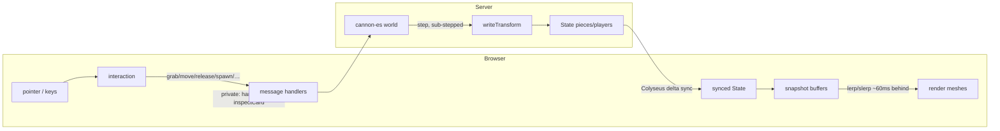

# Code Reference

A map of every module, data structure, and key function. For the *why*, see
`ARCHITECTURE.md`; this is the *what* — the API surface.

The codebase:

| File | Runtime | Role |
|------|---------|------|
| `shared/pieces.js` | both | Single source of truth: dimensions, masses, colours, dice verts, prop/board registries |
| `server.js` | Node | Authoritative physics + Colyseus rooms + HTTP (auth/rooms/admin) + Postgres |
| `db.js` | Node | Postgres pool + all queries: library, users, rooms, membership |
| `auth.js` | Node | Password hashing (scrypt) + device-token hashing |
| `public/core.js` | browser | Scene/camera/renderer/controls + `CONFIG` & `LIGHTING` tunables |
| `public/graphics.js` | browser | Texture & mesh builders, model loading, `KIND` registry |
| `public/client.js` | browser | Game-table runtime: networking, interaction, seats, render loop |
| `public/{landing,admin,editor-panel}.js` | browser | Lobby, admin console, library-editor UI (HTTP + room) |
| `public/*.html` + `styles.css` | browser | Page shells (table/editor/index/admin) + UI styling |

Client import chain (no cycles): `shared ← core ← graphics ← client`.

---

## Component diagram

```mermaid
classDiagram
    class Shared["shared/pieces.js"] {
        +TABLE {x, z}
        +COLORS {..., team{checker,go,chess}}
        +KINDS {die, card, prop, deck, board}
        +PROPS {shape → mass, collider, render|model, team, tint...}
        +PROP_LIST[] {id, name, team}
        +BOARDS {key → model, modelScale, box}
        +DECK_VISUAL / CARD_ROUND / DIE_RADIUS / DIE_SIDES / BOARD_SIZE
        +deckHeight(count) / dieVerts(sides, r) / timerLive(t, now)
    }
    class Server["server.js"] {
        +SIM config
        +buildWorld() / buildCollider(type,props) / dieShape(sides)
        +buildSimpleDeck() / saveAsset() / saveImageRef()
        +HTTP: /upload /auth/* /rooms/* /host/* /admin/*
        +requireUser / requireAdmin / clientUser
    }
    class Auth["auth.js"] {
        +hashPassword / verifyPassword (scrypt)
        +makeToken / hashToken (device tokens)
    }
    class Db["db.js"] {
        <<Postgres>>
        +library: list/get/insert/update + asset-admin
        +users: createUser/find*/setAdmin/setHostStatus/purgeUser
        +rooms: createRoom/find/list/policy/softDelete/purge
        +members: joinRoom/admit/kick/setRole/listMembers
    }
    class TableRoom {
        <<Colyseus Room>>
        world, state, RANK
        bodies, deckCards, cardData, hands, drafts: Map
        notebooks, shows, pendingInspect: Map
        +onAuth() rank() isAdmin()
        +spawn() update() sendHand() saveDeckById() advanceTurn()
        +sendMembers/broadcastMembers/sendAssetList/closeAndDispose
        +gameplay + library + member handlers
    }
    class EditorRoom {
        <<admin-only>>
        onAuth rejects non-admins
    }
    class Core["public/core.js"] {
        +CONFIG / LIGHTING / clamp
        scene camera renderer controls
    }
    class Graphics["public/graphics.js"] {
        +texture builders (cTex, cardFront, dice, text...)
        +measureGlb/fitModel/measureModel/measureBoard
        +uploadImage/uploadModel/resizeToCanvas
        +mesh builders + KIND registry
    }
    class Client["public/client.js"] {
        room, meshes, buffers, down, inspect, myIsAdmin
        +networking + UI wiring (whoami-gated)
        +interaction (pointer/inspect/wheel/keys)
        +seats/markers + render loop
    }
    class Pages["landing.js · admin.js · editor-panel.js"] {
        +lobby / admin console / library editor UI
        +fetch to the HTTP API
    }
    Shared <.. Server
    Shared <.. Core
    Shared <.. Graphics
    Shared <.. Client
    Core <.. Graphics
    Core <.. Client
    Graphics <.. Client
    Server *-- TableRoom
    TableRoom <|-- EditorRoom
    Server ..> Auth
    Server ..> Db
    TableRoom ..> Db : library / rooms / members
    TableRoom <..> Client : Colyseus sync + messages
    Pages ..> Server : HTTP (auth/rooms/admin)
```

## The core loop (intent up, state down)



---

## `shared/pieces.js` — single source of truth

Pure data + two functions, imported by both sides.

### Constants

- **`TABLE`** `{ x, z }` — half-extents of the play surface.
- **`COLORS`** — every piece colour: `neutralProp`, `cardSide`, `deckEdge`,
  `boardEdge`, `ivory`, `ink`, `felt[dark,light]`, and `team {checker, go,
  chess}` each `[color0, color1]`.
- **`KINDS`** `{ die, card, prop, deck, board }` — physics half `{ mass, shape }`.
  `shape` is `'die'`, `'prop'`, or `{ box:[hx,hy,hz] }`. `mass:0` ⇒ static.
- **`DECK_VISUAL`** / **`CARD_ROUND`** — deck box unit + card corner radius.
- **`PROPS`** `{ shapeId → spec }`. A spec has `mass`, `collider`
  (`{ box:[hx,hy,hz], type? }` — `type` is `sphere`/`cylinder`/`cone`/`flat`,
  omitted = box), and **either** a built-in `render` (`prim`:
  box/sphere/cone/cyl/lens + params) **or** a bundled `model` path with
  `modelScale` (+ optional `modelRot`, `team`, `tintMaterial`, `ownMaterial`,
  `stand`).
- **`PROP_LIST`** `[{ id, name, team? }]` — ordered spawn-picker list;
  `team:true` shows the two-colour toggle, else the colour picker.
- **`BOARDS`** `{ key → { name, model, modelScale, box } }` — built-in model
  boards (colliders precomputed from `worldSize·scale/2`).
- **`BOARD_SIZE`** — target footprint width uploaded `.glb` boards normalize to.
- **`DIE_RADIUS`** `{ sides → r }`, **`DIE_SIDES`** `[4,6,8,10,12,20]`.

### Functions

- **`deckHeight(count) → number`** — clamps deck thickness; used by client visual
  *and* server collider so a flipped deck is solid.
- **`dieVerts(sides, radius?) → number[][] | null`** — polyhedron vertices scaled
  to `radius`; `null` for d6. One input for mesh (client) and collider (server).
- **`timerLive(t, now) → ms`** — the shared timer's current value from its synced
  anchor (`running/mode/base/since`): counts up from `base`, or down toward 0.
  Used by the server handler *and* every client, so the number is never synced tick
  by tick.

---

## `server.js` — authoritative simulation + room

### Config

- **`SIM`** — all physics tuning in one object: gravity, friction/restitution,
  damping, self-righting, `throwCap`, `solverIterations`, `contact`, `step`
  (`fixed`/`maxSub`), and **`cards`** (`colliderThick` — the invisible thicker
  card collider that stabilizes stacks — plus `linDamp`/`angDamp`/`maxThrow`/
  sleep).

### Asset files (disk) + library (Postgres)

The image/model **files** stay on disk; their **metadata** moved to Postgres (see
`db.js` below). Assets are keyed by a row **id**, not a filename slug.

- **`ASSETS_DIR`** = `process.env.ASSETS_DIR || './saved-assets'`, with category
  subfolders `uploads/ decks/ boards/ props/` — **files only** now.
- **`saveAsset(kind, buf, ext) → /assets/<kind>/<name>`** — writes a random-named
  file into a validated category folder (`assetKind`).
- **`saveImageRef(dataURL, kind)`** — an inline `data:` image → a disk file → URL.
- **`isDataURL`**, **`deckRefOk`** — ref validators (kept for the save paths).
  *(The old `slugify` / `metaFile` / `listSaved*` / `boardKindLabel` helpers are
  gone — that logic now lives in `db.js`.)*

### Physics helpers (module scope)

- **`buildCollider(type, props) → CANNON.Shape`** — dice → `dieShape`; boards →
  built-in/uploaded box (by half-height) else procedural `w×d`; props run through
  one shared **`colliderShape`** builder — an uploaded `.glb` passes its measured
  box + a string `props.collider`, a built-in shape passes its authored
  `collider.box` (× `props.scale`) + `collider.type`. Off-centre shapes (flat)
  return `{shape, offset}`, which `spawn` attaches accordingly.
- **`colliderShape(type, hx, hy, hz, opts?)`** — the single builder for prop
  colliders: `box` (default) / `sphere` / `cylinder` / `cone` / `flat` (a thin
  base-offset footprint so pieces slide over it). For cylinder/cone, `opts.sides`
  sets the segment count (`3`/`6`/… → prisms & N-gon pyramids; default `16` = round)
  and `opts.top` a partial top radius (truncated cone). Shared by the uploaded and
  built-in paths, so a new built-in shape is just
  `collider: { box:[...], type:'cylinder', sides:6 }` — no `buildCollider` change.
- **`dieShape(sides)`** — convex hull of `dieVerts`, coplanar triangles merged,
  windings outward. d6 ⇒ box.
- **`buildSimpleDeck()`** — a standard 52-card deck of `rank:…` refs.
- **`buildWorld()`**, **`rnd()`**, **`shuffle()`**.
- Small shared helpers keep the handlers flat: **`clamp`**, **`addWall`** /
  **`cubeCollider`** (world + collider building), **`spawnCardFlat`** /
  **`besideDeck`** / **`addToHand`** (deal/hand placement), **`swapBoard`**,
  **`averagePoint`**.

### Schema (synced state)

- **`Piece`** — `type, owner, props` (strings), `count`, transform
  `x,y,z,qx,qy,qz,qw`. Cosmetic tints ride in the `props` JSON, not the schema:
  `color` (die body / prop tint) and `textColor` (die numbers).
- **`Player`** — `seat, hand`, `name, color, avatar`, **`showing`** (count of
  cards being revealed — the public badge), **`handBack`** (the hand's public back
  image), **`role`** (the per-room owner/gm/helper/player rank).
- **`Timer`** — `running, mode` (`'up'`/`'down'`), `base, since, duration`; the
  synced anchor (`timerLive()` computes the live value).
- **`ScoreRow`** — `label, score`; one scoreboard entry (in the `scores` map).
- **`Whiteboard`** — `enabled, angle, owner, dark`; the shared tilt-up sketch
  surface's *public* state. Strokes themselves are **not** synced — they're sent
  as messages and replayed onto a texture (see the protocol below).
- **`State`** — `pieces`, `players`, `turn`, **`timer`**, **`scores`** (map),
  **`notes`** (GM room notes), **`tableX`/`tableZ`** (table half-extents),
  **`whiteboard`**, **`skybox`** (empty, a `/assets/sky/…` equirect URL, or a
  `{"t":"cube","f":[…6…]}` cubemap descriptor).

### `TableRoom extends Room`

**`onAuth(client, options)`** resolves the device token → user and the room code →
room (via `db`), admits only *admitted* members (an admin gets `gm` in any room),
and returns `{ userId, username, avatar, role, isAdmin }` onto `client.auth`.
Roles rank in **`RANK`** (`player < helper < gm < owner`); **`rank(client)`** and
**`isAdmin(client)`** back the gates.

Private (never-synced) maps: `bodies`, `targets`, `flips`, `deckCards`,
`cardData`, `hands`, `drafts`, **`pendingInspect`** (a drawn-but-unplaced card),
**`notebooks`** (per-player private notes), **`shows`** (an active hold-to-show:
`{ to:Set, cards }`), and **`strokes`** (the whiteboard's stroke history, capped
at `WHITEBOARD_MAX_STROKES`, replayed to late joiners). Module-scope **`LIVE_ROOMS`**
(a Set of live rooms) lets the orphan-cleanup scan see in-play asset references.

Methods: **`spawn(type,pos,props) → id`**, **`update(dt)`** (servo → step →
out-of-bounds net → write), **`updateDeckCollider(id)`**, **`removePiece(id)`**,
**`writeTransform`**, **`sendHand`** (also publishes `handBack`), **`clientBy(sid)`**,
**`stopShow(sid)`**, **`saveDeckById(id,name,ownerId)`** (async — inserts via `db`),
**`advanceTurn`**, **`sendMembers`/`broadcastMembers`** (push the member list to
GMs), **`sendAssetList(client,kind)`** (a library listing, private-inclusive for
admins), **`swapBoard`**, **`saveStateNow`/`scheduleSave`** (persist the room's
durable settings — scoreboard, notes, table size, skybox — now / debounced via
`db.saveRoomState`), **`closeAndDispose`** (broadcast `roomClosed`, then dispose —
invoked by `matchMaker.remoteRoomCall`), `onJoin/onLeave`.

Gameplay handlers (rank-gated): `grab`, `move`, `release`, `flip`, `dealToTable`,
`dealDrag`, `takeCard`, `playCard`, `shuffle`, **`splitDeck`** (deal a deck in
two — original keeps the top half, a new ephemeral deck gets the rest),
**`drawInspect`/`inspectPlace`** (private draw-to-inspect), **`recolor`**
(`{id,color,textColor?}` — tint a die body+numbers or a prop), `spawn` (helper+),
`roll`, `reset` (gm+ — full clear), `nextTurn`, `remove`, `setName`, `setAvatar`,
**`notebook`**, **`handSync`** (re-send my private hand after a reconnect),
**`timer`** (action: `start`/`pause`/`reset`/`set`), **`showStart`/`showStop`**,
**`ping`**. Room settings (gm+, persisted via `scheduleSave`): **`score`**
(scoreboard add/set/clear), **`roomNotes`**, **`tableSize`** (resize the felt),
**`skybox`** (apply a background).

Whiteboard handlers: **`wbEnable`** (raise/lower the surface, gm+),
**`wbClaim`/`wbRelease`** (take/free the single drawing owner), **`wbSet`**
(tilt angle / dark toggle), **`wbStroke`** (one stroke — appended to `strokes`,
capped, and broadcast to everyone else to replay), **`wbClear`** (wipe),
**`wbStrokes`** (a late joiner requests the full history).

Scene & skybox library handlers: **`sceneSave`/`sceneLoad`/`listScenes`** (a whole
table snapshot — pieces + settings — as an admin-curated library asset) and
**`saveSkybox`/`listSkyboxes`** (equirect URL or a 6-face cubemap, admin-curated).

Library handlers (all async, via `db`; keyed on a row **id**): creation —
`deckBegin`/`deckAppend`/`deckFinish`, `saveDeck`, `saveBoard`, `saveProp` — is
**admin-only** and stamps `owner_id` + private; `loadDeck`/
`loadBoard` and the `listDecks`/`listBoards`/`listProps` listings are
**visibility-gated** (public for GMs/helpers, everything for admins); the admin
curation verbs are `assetPublic`/`assetRename`/`assetDelete`.

Member-management handlers (gm+, keyed on the DB room): `members` (send the list),
`admit`, `kick` (also disconnects the live client), `setRole` (owner is
untouchable; managing a GM is owner-only).

On join the room also sends each client **`whoami`** (`{ isAdmin }`), which the
client uses to hide creation UI from non-admins.

### `EditorRoom extends TableRoom`

The library **editor** — the same engine with an admin-only `onAuth` (non-admins
rejected) that seats the admin at `owner` role with `isAdmin`. It has no DB room
row, so `roomId` is null and the member-management handlers no-op; it's a shared
admin sandbox for building and testing library assets live. Registered as the
`editor` room type (`table` stays `filterBy(['code'])`).

### HTTP (Express)

- `express.static` for `public/`, `/shared`; **`/assets`** serves category files
  but a guard 404s any `.json` (metadata stays private).
- **Uploads:** `POST /upload?kind=` (one resized image → `{ url }`),
  `POST /upload-model?kind=props` (a raw `.glb` → `{ url }`).
- **Auth:** `POST /auth/signup` (with a password → host, pending approval; without
  → passwordless player), `POST /auth/login` (rotates the device token),
  `POST /auth/token` (resolve a token → current user). `requireUser` is the
  Bearer-token guard; `clientUser` is the safe projection sent to clients
  (`isAdmin`, `canOwnRooms`, `hostStatus`, `hasPassword`).
- **Rooms:** `GET /rooms` (your rooms), `POST /rooms` (create — approved-host or
  admin only, with a pending-aware 403), `POST /rooms/join` (join or waitlist by
  code), `PATCH /rooms/:id` (rename / approval — owner or admin), `DELETE
  /rooms/:id` (soft-delete + dispose the live room).
- **Host:** `POST /host/request` (request host access; sets a password first if
  the account is passwordless → `pending`).
- **Admin** (`requireAdmin`): `GET /admin/rooms`, `GET /admin/users`,
  `GET /admin/pending-count`, `POST /admin/rooms/:id/restore`, `DELETE
  /admin/rooms/:id` (purge), `POST /admin/users/:id/admin` (grant/revoke — can't
  revoke your own), `POST /admin/users/:id/host` (approve/reject/revoke),
  `DELETE /admin/users/:id` (purge, cascades owned rooms + memberships),
  **`GET /admin/orphans`** (dry-run: `/assets` files no library row, room, or live
  table references — old enough to be safe), **`POST /admin/orphans/purge`**
  (re-scan, move them to `saved-assets/.trash/`).

---

## `db.js` — Postgres (library · users · rooms)

The connection string comes from **`DATABASE_URL_FILE`** (a path to a secret file,
priority) or **`DATABASE_URL`** — no hardcoded fallback; missing config throws at
startup. For the library, a model's URL is the canonical `file_url` column and the
rest rides in a `props` jsonb bag, spliced back on read; bigint **`id`**s come back
as strings (nullable `owner_id` via the `idOrNull` helper).

**Library.** Assets carry `owner_id` (the creating admin) and `is_public`. List
functions take `{ includePrivate }` (admins pass true; otherwise public-only) and
return the flag:

- **Decks** — `listDecks({includePrivate}) → [{id,name,count,isPublic,ownerId}]`,
  `getDeck(id) → {name,back,fronts,isPublic,ownerId}`,
  `insertDeck({name,back,fronts,ownerId,isPublic}) → id`, `updateDeck(id, {…})`.
- **Boards** — `listBoards({includePrivate}) → [{id,name,kind,isPublic,ownerId}]`,
  `getBoard(id) → {rec,name,isPublic,ownerId}` (`rec` is one of `{board}` /
  `{model,…}` / `{w,d,tex}`), `insertBoard(name, rec, {ownerId,isPublic}) → id`.
- **Props** — `listProps({includePrivate}) → [{id,name,props,isPublic,ownerId}]`,
  `insertProp(name, props, {ownerId,isPublic}) → id`.
- **Scenes** (whole-table snapshots) — `listScenes`, `getScene(id)`,
  `insertScene({name,payload,ownerId,isPublic})`.
- **Skyboxes** — `listSkyboxes`, `insertSkybox({name,url,ownerId,isPublic})`
  (`url` is an equirect `/assets/sky/…` or a cubemap descriptor).
- **Asset admin** (generic over the tables via an `ASSET_TABLE` whitelist,
  `kind ∈ deck|board|prop|scene|sky`) — `setAssetPublic(kind,id,isPublic)`,
  `renameAsset(kind,id,name)`, `deleteAsset(kind,id)`.
- **Orphan cleanup** — `allAssetRefBlobs()` returns every stored row (all asset
  tables + `rooms.skybox`) as JSON strings, the reference set the orphan scan
  greps for `/assets/…` paths.

**Per-room durable state.** A room's non-piece settings survive restarts:
`getRoomState(roomId) → {scoreboard, notes, tableX, tableZ, skybox}` and
`saveRoomState(roomId, {…})` (called by the room's `saveStateNow`/`scheduleSave`).

**Users.** `publicUser` shape: `{id,username,email,avatar,isAdmin,hostStatus,
hasPassword,canOwnRooms}` where `canOwnRooms = host_status='approved' || is_admin`;
`authUser` adds the hashes (used only on the password-verify path).

- `createUser({username,email,passwordHash,loginTokenHash,isAdmin}) → user` (a
  password ⇒ `host_status='pending'`; throws with `err.conflict = 'username' |
  'email'` on a taken field), `findUserByLogin`, `findUserByToken`,
  `findUserById`, `setLoginToken`, `setPassword`, `setUserAvatar`, `listUsers`,
  `setAdmin`, `setHostStatus`, `countPendingHosts` (excludes admins),
  `roomsOwnedBy`, `purgeUser` (one transaction: null-out the user's asset
  ownership, delete their owned rooms, delete the user — cascades memberships).

**Rooms & membership.** `createRoom({ownerId,code,name,requireApproval}) → room`
(atomic room + owner-membership CTE), `findRoomByCode`, `getRoom`,
`listRoomsForUser`, `listRooms({includeDeleted})`, `setRoomPolicy`, `renameRoom`,
`softDeleteRoom`, `restoreRoom`, `purgeRoom`; `joinRoom` (idempotent — a returning
member keeps their standing), `getMembership`, `admitMember`, `kickMember` (hard
delete), `setMemberRole`, `listMembers`.

- **`close()`** — end the pool (for one-off scripts).

List functions swallow errors → `[]`; getters → `null`; inserts/updates throw
(handlers catch).

---

## `auth.js` — credentials (no dependencies)

Node `crypto` only. Passwords: **`hashPassword(pw)`** / **`verifyPassword(pw,
stored)`** — salted scrypt in a `scrypt$salt$hash` string, compared in constant
time. Device tokens (for passwordless players and "remember me"): **`makeToken()`**
mints a 256-bit base64url token; **`hashToken(token)`** sha256-hashes it for
storage and lookup, so a DB leak never exposes a live token.

---

## `public/core.js` — setup + tunables

Exports `scene`, `camera`, `renderer`, `controls`, and the config:

- **`CONFIG`** — client feel, grouped: `grab` (height/scroll), `model.size`,
  `render.delay`, `ranges` (spawn clamps), `inspect`, `marker`, `label` (held-name
  tag), `ping` (attention-ping ring), `input` (click/drag thresholds), `tex`
  (die/board resolution).
- **`LIGHTING`** — `hemi` / `sun` / `env` (three numbers); `dimEnvironment`
  scales the baked `RoomEnvironment` for the env-map strength.
- **`clamp(value, min, max)`**.

---

## `public/graphics.js` — builders (pure)

### Textures → `THREE.CanvasTexture`

- **`cTex(canvas, srgb?)`** — wraps every canvas texture with **max anisotropy**
  (+ colour space) so text/numbers stay sharp. All builders route through it.
  Builders allocate their canvas via a shared **`makeCanvas(w,h)`**, and the
  filtering is centralized in **`maxAnisotropy()`**.
- **`cardFront(rank,suite,color)`** (corner index + centre rank), **`cardBack()`**,
  **`boardTex()`** (procedural checkerboard).
- **`drawNumber` / `digitTexture` / `numberFaceTexture` / `numberLabel`** — die
  numbering (resolution `CONFIG.tex.die`).
- **`splitColorText` / `wrapLines` / `drawWrapped` / `textFaceTexture` /
  `textBackTexture`** — procedural text cards.
- **`resolveTexture(ref)`** (cached) — resolves a card ref: `back`,
  `rank:…`, `text:…`, `tback:…`, or a `data:`/URL image.

### Models & uploads

- **`resizeToCanvas(file,w,h,fit)`** — cover-fit (or stretch) an image onto a
  canvas; **`imgToBlob`** and the avatar path wrap it.
- **`uploadImage(file,…,kind)`** → POST `/upload`; **`uploadModel(file)`** → POST
  `/upload-model`.
- **`measureGlb(url)`** → `{ size, center }` (true loaded bounds). **`fitModel(obj,
  {scale|target})`** — centre at origin + scale (fixed or normalize). **`measureModel`**
  / **`measureBoard`** build on `measureGlb` to return collider boxes.
- The two model-mesh builders (`propMesh`, `boardMesh`) share a single
  **`loadModelGroup`** loader, and image-backed textures a **`loadImageTexture`**.

### Mesh builders + `KIND`

- **`dieMesh` / `convexDie` / `numberedD4`** — numbered dice.
- **`cardMesh`** (rounded, thin, alpha-masked corners), **`deckMesh`**
  (rounded extruded prism), **`boardMesh`** (procedural box **or** a loaded model).
- **`propColor` / `propMat` / `propShapeMesh`** — built-in shape props.
- **`propMesh(p)`** — the dispatcher: loads a `.glb` (built-in fixed scale, or
  custom normalize) with the tint logic (team / full / `tintMaterial` one-slot /
  `ownMaterial`), else builds a shape and applies `props.scale`.
- **`KIND`** `{ die, card, prop, deck, board }` — each `{ mesh, grab, ldrag,
  lclick, rclick }`; the interaction layer dispatches off this, no type switches.

---

## `public/client.js` — runtime

### Networking

Connects to the `table` room — or the admin-only **`editor`** room when
`window.OTT_EDITOR` is set (editor.html), handing the live room to the panel via
`window.onOttRoom`. Reconnect token in `sessionStorage`. State listeners
create/update/remove `meshes` and player UI; also tracks `boardTopY` (for the drop
marker). Direct messages: `hand` → `renderHand`, `dealt` (adopt a dealt card),
`inspectCard` → open draw-to-inspect, `notebook` (restore your private notes),
`showFan` (cards someone is showing you → face-up in their fan), `ping` (spawn an
attention marker), `memberList` → the Members panel (with the pending-join pulse),
`whoami` → sets `myIsAdmin` and toggles `body.not-admin` (hides library-creation
UI), `roomClosed`/`kicked` → the exit screen, `deckList`/`boardList`/`propList`
(library listings, keyed by **id**; also fanned out to the editor panel via
`window.onLibraryList`). **`applyRole`** hides tools by rank (spawn helper+,
reshape/reset/members gm+). Game-play + Room Controls wiring lives here (spawn,
grab/inspect, whiteboard, table size, scene load, skybox apply, plus the
notebook / timer / show-cards panels); asset **creation** and the View Library /
Built-Ins / Skybox pickers now live in `editor-panel.js`, handed the live room via
`window.onOttRoom`. Shared UI helpers: **`byId`/`qs`/`qsa`** (DOM shorthands) and
**`renderSavedList`** (the scenes list). Snapshot buffering runs through
**`snapshot`** (build a timestamped record) and **`applyTransform`** (copy it onto
a mesh), shared by the add, card-rebuild, and render paths.

### Interaction (`meshes`, `buffers`, `down`, `inspect`)

- **`setPointer` / `pickId`** — pointer → NDC → raycast → id (walks up to the
  id-stamped root so nested model meshes pick correctly).
- **`pointerdown/move/up` + `endGesture`** — click vs. drag; dispatch grab/deal/
  click via `KIND`; **wheel** raises/lowers a held piece; the drag plane height is
  the scroll-adjustable grab height, and a translucent ring previews the landing.
  **Middle-click** snaps a held piece's facing, or — with nothing held — drops a
  ping (`sendPing` → raycast to the table).
- **Inspect** — `inspectMesh` parks an enlarged copy in front of the camera;
  double-click a piece to inspect (rotate-drag), double-click a deck to
  draw-to-inspect with F/D/H/R placement.
- **`keydown`** — Delete removes, U toggles keep-upright, S saves a hovered deck
  (each acts on **`heldOrHoveredId`** — the held piece, else whatever's hovered);
  F/D/H/R place a drawn card; **P** drops a ping at the cursor.

### Seats, hands, turns

Seat layout, standing avatar/name markers (with a public **"SHOWING n"** badge
via `makePlayerTexture` when a player is revealing), other players' fanned hands —
face-down using the player's own **`handBack`**, with any **revealed** cards drawn
face-up in the leading fan slots (`refreshFan` + the `revealed` map), height-
staggered to avoid z-fighting. The turn panel, and **`renderHand(cards)`** for
your own bar (left = face-down, right = face-up; also a **select mode** while the
show panel is picking cards). **`nameTag(name,color)`** builds the pill texture
shared by held-piece labels and pings.

### Render loop

Each piece keeps a small `buffers` queue of timestamped snapshots; the loop
renders every piece as it was `CONFIG.render.delay` in the past (lerp/slerp
between the bracketing snapshots), parks the drop-marker ring under a held piece
at the current board's surface height, keeps each held-piece **name tag**
(`heldLabels`) hovering over its mesh, and expands + fades + disposes active
**pings**. One uniform path for held, thrown, and resting pieces.

---

## The lobby & admin pages (standalone)

Plain modules that talk to the HTTP API with `fetch` — no Three.js, no Colyseus.
A shared `api(path, {method, auth, body})` helper attaches the Bearer token and
unwraps errors; the device token lives in `localStorage`.

- **`public/landing.js`** (index.html) — the lobby. `setView('quick'|'auth'|
  'home')` switches between quick-join (passwordless signup + join), login/
  password signup, and the signed-in home. `showHome(user)` renders the room list
  and picks one of three host states from `canOwnRooms` / `hostStatus` (create
  form · pending note · **Request host access** button → `onRequestHost`, which
  prompts for a password if the account is passwordless). Owners get
  rename/approval/close controls; a pending joiner **polls** `/rooms` and
  auto-forwards on admission. Admins see an **Admin** link with a pending-host
  count badge (`updateAdminBadge`).
- **`public/admin.js`** (admin.html) — the admin console. Guards on `/auth/token`
  → `isAdmin`, then renders the rooms table (rename / approval / close / restore /
  purge) and the users table (grant/revoke admin, **approve/reject/revoke host**,
  delete). Admins host implicitly, so they're kept out of the host queue and the
  header's pending badge.
- **`public/editor-panel.js`** (editor.html) — the library-management panel. Rides
  on the game client's room via `window.onOttRoom`, and gets listings through
  `window.onLibraryList` (client.js fans `deckList`/`boardList`/`propList` to it).
  Each asset row shows a public/private badge with **Spawn · Publish/Unpublish ·
  Rename · Delete**, sending `loadDeck`/`loadBoard`/`spawn` and the
  `assetPublic`/`assetRename`/`assetDelete` curation messages.
